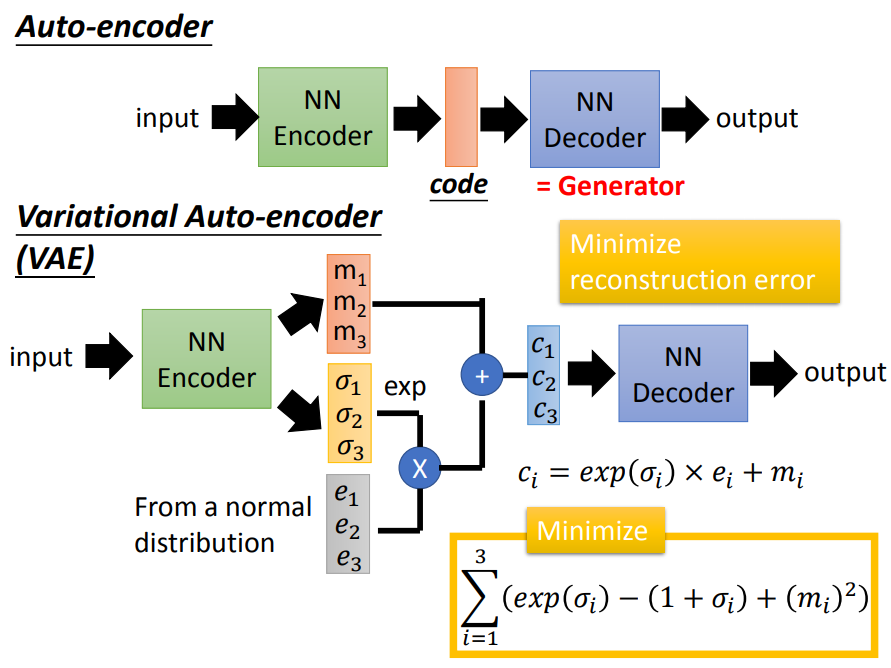
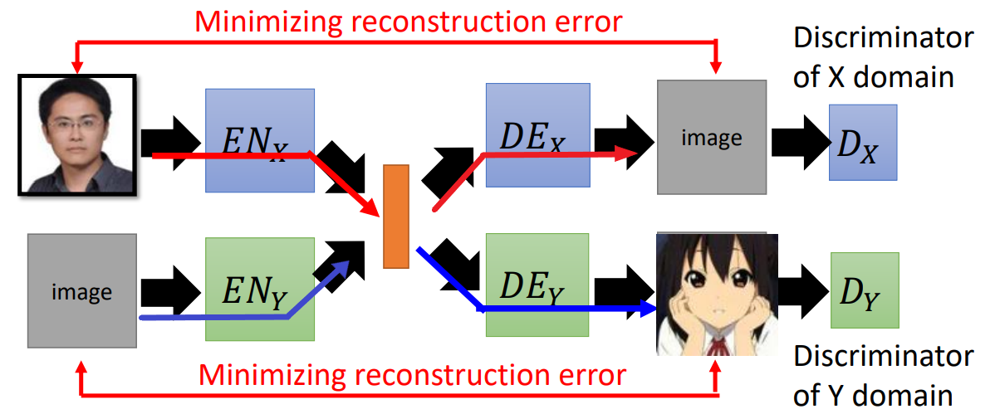
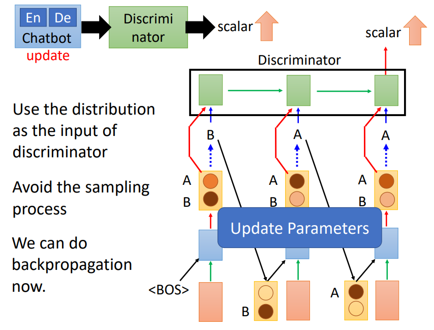

# VAE

> 如何理解 VAE？
>
> 1. [Auto-Encoding Variational Bayes (arxiv.org)](https://arxiv.org/pdf/1312.6114.pdf)
> 2. [Variational Autoencoders Explained (kvfrans.com)](https://kvfrans.com/variational-autoencoders-explained/)
> 3. [VAE (Variational Autoencoder) 的原理 - 博客园 (cnblogs.com)](https://www.cnblogs.com/huangshiyu13/p/6209016.html)
> 4. [花式解释 AutoEncoder 与 VAE - 知乎 (zhihu.com)](https://zhuanlan.zhihu.com/p/27549418)
> 5. [变分自编码器VAE：原来是这么一回事 | 附开源代码 - 知乎 (zhihu.com)](https://zhuanlan.zhihu.com/p/34998569)
> 6. [直观理解 VAE（译文） - 简书 (jianshu.com)](https://www.jianshu.com/p/f8e239d81a67)
> 7. [[学习笔记] 生成模型 —— 变分自编码器 (gwylab.com)](http://www.gwylab.com/note-vae.html)
> 8. [VAE全面理解 (下) - 程序员大本营 (pianshen.com)](https://www.pianshen.com/article/5657478329/)
> 9. 推导：[两个随机向量的高斯分布之间的KL散度 - 知乎 (zhihu.com)](https://zhuanlan.zhihu.com/p/55778595)
> 10. 推导：[条件变分自编码器（推导备注） - 知乎 (zhihu.com)](https://zhuanlan.zhihu.com/p/55760483)
> 11. 推导：[变分自编码器（VAEs） - 知乎 (zhihu.com)](https://zhuanlan.zhihu.com/p/25401928)
> 12. 源码：[bojone/vae: a simple vae and cvae from keras (github.com)](https://github.com/bojone/vae)
>
> 如何理解概率分布？
>
> 1. [采样方法详细解读与代码实现 - CSDN博客](https://blog.csdn.net/bitcarmanlee/article/details/82795137)
>
> 4. [随机变量的概率分布 - 知乎 (zhihu.com)](https://zhuanlan.zhihu.com/p/36368819)
>
> 5. [如何理解图像的概率分布？ - 知乎 (zhihu.com)](https://www.zhihu.com/question/322353956)
>
> 6. 概率分布就是一组概率的集合。
> 7. 随机变量 X 的全部取值所对应概率的集合称为 X 的概率分布。
> 8. 随机变量的取值为实数。
> 9. 随机向量：每一维度都是一个随机变量。

## 理解一

AutoEncoder 本质上就是一种储存已知图片的网络，我们无法从中产生任何未知的东西。因为我们不能随意产生合理的潜在变量，合理的潜在变量都是编码器从原始图片中产生的。也就是说，解码器的输入都是编码器对原始图片所生成的潜在变量，这个潜在变量是和原始图片一一对应的，因此训练出来的解码器也只能用于生成原始图片，而不能生成其他任意图片。如果用非原始图片的潜在向量输入解码器，可能生成的图片什么也不像。

而 VAE 是一种产生式模型，因此可以生成任意的图片。其原理特别简单，就是对编码器添加约束，强迫它产生服从单位高斯分布（标准正态分布）的潜在变量。由于这个原因，原始图片经过编码器处理后的潜在向量就会服从标准正态分布，那么对于解码器来说，它就是学习到了从任意服从标准正态分布的潜在向量中产生类似于原始图片的其他任意图片。这样，我们只要给解码器任意一个符合标准正态分布的随机潜在向量，它就能够生成我们想要的任意图片，从而不再需要给它原始图片的编码来产生图片。

对于 VAE 来说，我们关注的就是如何在重构图片的精确度和单位高斯分布的拟合度进行权衡。实际上，我们可以让网络自己去决定这种权衡，即把这两者相加起来同时作为网络的损失函数。一方面是图片的重构误差，我们可以用均方误差来度量；另一方面，我们可以用 KL 散度来度量潜在变量的分布和单位高斯分布的差异。


为了优化 KL 散度，VAE 应用了重新参数化的技巧：不像标准自编码器那样产生仅产生一个实数值向量，VAE 的编码器会产生两个向量，分别为均值向量和标准差向量。



此时，解码器所需要的潜在变量就可以从标准差向量中采样并加上均值向量来得到。


由此，我们可以这样来计算 KL 散度：

```python
# z_mean and z_stddev are two vectors generated by encoder network
latent_loss = 0.5 * tf.reduce_sum(tf.square(z_mean) + tf.square(z_stddev) - tf.log(tf.square(z_stddev)) - 1, 1)
```

## 理解二

1. VAE 的目的

   将隐空间的分布编码成标准正态分布（也就是从已知的部分数据中生成符合标准正态分布的数据集）。这样，从标准正态分布随机采样一个 code 都可以生成有意义的图片。

2. VAE 的做法

   ==每个数据都被编码成一种正态分布==，那么根据高斯混合模型，隐空间的分布就是这些编码后得到的分布的叠加。因此，只要每个数据被编码后的分布都限制为标准正态分布，那么叠加后所得到的隐空间的分布也就是一个标准正态分布：

   $p(Z)=\sum_{X} p(Z \mid X) p(X)=\sum_{X} \mathcal{N}(0, I) p(X)=\mathcal{N}(0, I) \sum_{X} p(X)=\mathcal{N}(0, I)$​

   （P(Z) 表示隐空间，P(X) 表示输入数据，P(Z|X) 表示由输入数据编码得到的分布）

> 在 AE 模型中，每个数据都被编码成一个隐向量，因此隐空间的分布就由这些数据对应的隐向量所表示的各个点组成。隐空间的分布就是解码器所能够接收的输入，因为不在隐空间上的数据点在训练时解码器根本就没有接触过，解码器能够拟合的就只有隐空间上的那些数据点，所以 AE 模型训练出来的解码器就只能解码已知数据点，而无法凭空创造未知的数据点。而 VAE 把每个数据都编码成一种分布，这样的话，隐空间就是一片连续的区域，而不是一个个数据点，因此在已知数据点之外的数据点也能够作为解码器的输入。
>
> VAE 中从编码后的分布中采样得到的隐向量就是随机向量的一个取值，而且 VAE 要求这个随机向量的概率分布满足标准正态分布。

3. 损失函数

   ① 为了生成有意义的图片，要求重构误差小：将解码器的输出与输入数据做差方误差。

   ② 为了每个数据被编码后的分布都限制为标准正态分布，要求被编码后的分布与标准正态分布的 KL 散度尽量小（由于编码器直接编码得到目标分布的方差和均值，因此可以和标准正态分布的方差 1 和均值 0 直接做 KL 散度）：$K L\left(N\left(\mu, \sigma^{2}\right) \| N(0,1)\right)=\frac{1}{2}\left(-\log \sigma^{2}+\mu^{2}+\sigma^{2}-1\right)$

4. 解码器的输入

   正常的做法是从编码得到的分布中随机采样一个隐向量作为输入，但随机采样这个过程是无法求偏导的，也就无法进行梯度下降。因此采用了重参数的技巧，即编码器直接产生目标分布的方差向量 σ  和均值向量 μ，将 $e^σ·x+μ$ （x 为单位高斯分布中随机采样的一个向量，也可以看成是一种噪声，用于加强模型的鲁棒性；σ 用 $e^σ$ 替换是为了避免产生负值）作为采样的结果。

5. VAE 中的对抗

   重构为了生成和原来一模一样的图片，要求没有噪声，也就是直接将均值向量作为隐向量（这就是 AE 的做法）；KL loss 要求有高斯噪声，这样编码出来的分布才不会是一个点（即方差不会等于 0）。

## 理解三

纯数学推导。

VAE 的目的就是让编码器编码得到的隐向量的所处空间的分布为一个标准正态分布，这样就可以从该分布中随机采样来生成图片。为了达到这个目的，VAE 的做法就是先假定隐空间的分布为一个标准正态分布，然后==让编码器编码得到的隐向量的条件概率分布 q(z|x) 去逼近实际的条件概率分布 p(z|x)==，在这个不断逼近的过程中，就可以让隐空间不断接近标准正态分布。

假设前提：① p(x) 为输入数据的概率分布，是已知且固定的；② q(z|x) 对应编码器，是在输入数据为 x 的条件下产生的隐向量 z 的概率分布；③ p(z|x) 是实际隐向量的条件概率分布。

1. 将 q(z|x) 等价代入 $\log p(x)$ 中可以推导出如下式子：

   $\begin{aligned}
   \log p(x) &=\int q(z \mid x) \log p(x) d z \\
   &=\int q(z \mid x) \log \frac{p(x, z)}{p(z \mid x)} d z \\
   &=\int q(z \mid x) \log \frac{p(x, z)}{q(z \mid x)} \frac{q(z \mid x)}{p(z \mid x)} d z \\
   &=\int q(z \mid x) \log \frac{p(x, z)}{q(z \mid x)} d z+\int q(z \mid x) \log \frac{q(z \mid x)}{p(z \mid x)} d z \\
   &={\color{Red} \int q(z \mid x) \log \frac{p(x, z)}{q(z \mid x)} d z} + {\color{Green} K L(q(z \mid x) \| p(z \mid x))}  \end{aligned}$​​​

2. VAE 的目的是让编码器编码得到的分布 q(z|x) 尽量接近实际分布 p(z|x)，也就是让上述式子中的绿色部分（即编码分布 q(z|x) 和实际分布 p(z|x) 的 KL 散度）尽量小。由于 p(x) 是固定的，因此为了让这部分尽量小，就得让红色部分尽量大。

3. 用字母 L 表示红色部分进行如下推导：

   $\begin{aligned}
   L &=\int q(z \mid x) \log \frac{p(x \mid z) p(z)}{q(z \mid x)} d z \\
   &=\int q(z \mid x) \log \frac{p(z)}{q(z \mid x)} d z+\int q(z \mid x) \log p(x \mid z) d z \\
   &={\color{Red} -K L(q(z \mid x) \| p(z)) d z} +{\color{Green} \int q(z \mid x) \log p(x \mid z) d z} 
   \end{aligned}$​

4. 在上述式子的红色部分中，p(z) 表示的就是隐空间的分布，假定它是一个标准正态分布。为了让 L 尽量大，就需要让红色部分的式子接近 0，即让 q(z|x) 的分布接近标准正态分布（这部分对应于 "理解二" 中损失函数的第二点）；还需要让绿色部分的式子尽量大，其实这部分对应的就是解码器，它的含义就是让重构图片尽量接近原图（这部分对应于 "理解二" 中损失函数的第一点）。

5. 综上所述，VAE 的做法就是 ① 让编码器编码得到隐向量的条件概率分布尽量接近标准正态分布；② 让解码器重构的图片尽量接近原图。通过这两个步骤，就可以得到一个无限逼近实际的隐向量的条件概率分布，而且这个分布是一个标准正态分布。

6. 但这不是我们想要的，因为我们想要的是隐空间的分布是标准正态分布，虽然我们假定它是标准正态分布，但实际上它是不是呢？其实隐空间的分布就是每个隐向量的条件概率分布的叠加：

   $p(z)=\sum_{x} p(z \mid x) p(x)=\sum_{x} \mathcal{N}(0, I) p(x)=\mathcal{N}(0, I) \sum_{x} p(x)=\mathcal{N}(0, I)$​

   由此可以得出，只要让每个隐向量的条件概率分布接近标准正态分布，那么得到的隐空间的分布就是一个标准正态分布。因此答案是肯定的。

## CVAE


CVAE 与 VAE 不同的地方就是每个输入数据被编码后的分布不再是一个标准正态分布，而是一个方差为 1，均值由类别信息 Y 决定的高斯分布，其他步骤不变（这只是其中的一种实现）。这样的话，通过叠加后得到的隐空间的分布就不是一个标准正态分布了（而是一个复杂的高斯混合模型），当我们想要生成某个数据时，就不是从标准正态分布中随机选择隐向量了，而是先选取一个方差为 1，均值为某个值的高斯分布，然后再从这个分布中随机选择隐向量。

均值到底是什么由我们决定。例如数字 9 这类图像的数据被编码后的分布的均值为 a（由数字 9 这个标签通过训练得到的），而数字 8 和数字 7 对应的分别是是 b 和 c。那么当我们想要生成的图像是数字 9 这类图像时，我们就应该把均值设为 a，如果想要生成的是数字 8 或 7，则应该设置均值为 b 或 c。

因此 CVAE 的目的就是让我们可以主动控制想要生成的图像是哪种类别的。

# GAN

## GAN 的直观想法

GAN 包含两部分：Generator 和 Discriminator。

- Generator：输入低维向量，生成图片（高维向量）

  

- Discriminator：输入图片，判断图片是否真实（即判断是否为 Generator 产生的）

  

Generator 和 Discriminator 在对抗中相互成长：Generator 的目的是通过不断地优化，使得自身产生的图片可以让 Discriminator 分辨不出真假；Discriminator 的目的是通过不断地优化，使得自身可以分辨出输入的图片是否为 Generator 产生的。（也可以将它们比喻为师生关系）


**GAN 训练的步骤**


**GAN 训练的算法流程**


## 什么是结构化学习？

 

GAN 就是结构化学习的一种实现方法。

## 为什么要一起训练

Generator 和 Discriminator 分别单独训练的情况：

- VAE 是 Generator 的一种实现自我训练（即不需要 Discriminator）的方法。但采用 Generator 自训练的方式来产生图片会有一个缺陷：如果 Generator 生成的是图片，那么图片的每个像素点之间必定有着重要的关联，但 Generator 无法很好地捕捉到这种关联性，除非增加网络的深度（Generator 最后一层 layer 的神经元数目等于生成图片的像素数目，这些神经元各自产生对应的像素值，相互间并不会产生联系，因此为了让这些神经元之间能够交流，就只能多增加几层 layer）。而 Generator 的优势就是很容易产生图片。
- Discriminator 也可以用来生成图片：穷举所有的图片让 Discriminator 进行判断，然后将那些 Discriminator 认为好的图片作为生成的结果进行输出。此时训练 Discriminator 的方法就是：① 首先采样固定的正样本，以及随机产生一些负样本，用这两种样本对 Discriminator 进行训练；② 使用训练后的 Discriminator 生成新的负样本，与之前的正样本一起对 Discriminator 继续进行训练；③ 重复步骤 2 直到生成的负样本和正样本的分布一样。因此，采用 Discriminator 自训练的方式来产生图片的缺陷就是难以生成图片，因为实现 "穷举" 这个过程几乎不可完成。而 Discriminator 的优势就是可以很好地考虑像素点之间的关联，因为它每次接收的是完整的一张图片，可以直接从整体上观察每一个像素点。


下面就是 Discriminator 自训练这种方式在每次训练后得到的分值分布示例图：红线表示分值分布，蓝色表示负样本分布，绿线表示正样本分布。Discriminator 的目的就是让分值分布中处于负样本的地方分值低，处于正样本的地方的分值高。随着每次从训练后的 Discriminator 中采样负样本，Discriminator 就会不断把非正样本的地方的分值给拉低，直到采样的负样本和正样本的分布一致。这就说明了为什么 Discriminator  可以很好地表示真实图片的分布，同时还说明了 Discriminator 随着训练时间越长效果越显著的原因。


将 Generator（易生成图片，但无大局观） 和 Discriminator（有大局观，但难以生成图片） 放在一起训练，就可以很好地相互利用彼此的优势，并消除对方的缺陷。这也就是 GAN 相比于 VAE 生成的图片要更清晰的原因。

## 从概率分布理解 GAN

> GAN 的目的是用一个复杂的分布去逼近真实分布。具体做法是 ① 用 Generator 产生复杂的随机分布 $P_g$；② 通过训练 Discriminator 来衡量 $P_g$ 和真实分布 $P_t$​​ 之间的差距 L；③ 通过训练 Generator 来缩小差距 L，差距越小，$P_g$ 就越接近 $P_t$​。

我们有关于动漫人物头像图片的数据集，这个数据集中的图片满足一种分布 $P_{data}(x)$，我们可以从这个分布中采样图片（也就是从数据集中随机选取图片），但我们无法得知这个分布的具体表达式。而我们的目的就是得到 $P_{data}(x)$​​ 的具体表达式。

现在我们有一个概率分布 $P_{G}(x,θ)$​，这个概率分布由参数 $θ$​ 操控（比如高斯混合分布，我们可以用均值和方差这两种参数来调整分布），我们要做的就是通过调整参数，使得这个概率分布逼近数据集的分布。具体的做法就是从数据集中采样一些数据 $x$​ 出来，然后用 $P_{G}(x,θ)$​ 来计算若采用 $P_{G}(x,θ)$​ 来产生这些数据的概率 L（即似然值），接着通过调整参数 $θ$​，让这个概率 L 最大化（这个最大化的过程就是极大似然，也就是 $P_{G}(x,θ)$​ 逼近 $P_{data}(x)$​ 的过程）。


> 为什么最大化似然值 L 就是在逼近 $P_{data}(x)$​？
>
> 

如果我们假定 $P_{G}(x,θ)$ 是高斯混合模型（VAE 就是这种做法），那么我们就可以很好地计算出采样数据的似然值。但实际情况是，我们希望 $P_{G}(x,θ)$ 是比高斯混合模型更复杂的模型（比如神经网络），这样逼近出来的分布才会更接近数据集的分布，但更复杂的模型的缺陷就是无法计算出采样数据的似然值。

GAN 的做法是通过一个神经网络（即 Generator）将一个简单的分布转换成极为复杂的分布 $P_G$，然后用这个极为复杂的分布去逼近数据集的分布 $P_{data}$，即最小化 $P_G$ 和 $P_{data}$ 之间的散度 $Div$。此时存在一个问题：我们并不知道 $P_G$​ 长什么样子，因此也就无法直接使用极大似然（或最小化 KL 散度）的方法求解，而且即使知道它的样子，我们也很难求出似然值。​


为了解决这个问题，GAN 的做法就是训练另一个神经网络（即 Discriminator），而这个网络训练的结果就是 $P_G$​ 和 $P_{data}$​ 之间的散度 $Div$​。具体的方法就是分别从 $P_G$​ 和 $P_{data}$​ 中采样数据，然后通过训练让 Discriminator 可以最好地分辨出采样数据是来自于 $P_G$​ 还是 $P_{data}$​，它的 loss 就可以定义为下图中的 V(G,D)，而训练得到的最大 loss  （梯度上升）实际上就是 $P_G$​ 和 $P_{data}$​​ 之间的 JS 散度。


> 为什么 Discriminator 的最大 loss 就是 $P_G$​ 和 $P_{data}$​ 之间的 JS 散度？
>
> ① 直观理解：$P_G$ 和 $P_{data}$ 之间的差距越小，即分布越相近，则它们各自采样的数据对于 Discriminator 来说就越难分辨。
>
> 
>
> ② 公式推导：
>
> 1. 固定住G，通过调整 D 的参数最大化 V(G,D)：
>
>     
>
> 2. 由于 D(x) 可以是任意的函式，因此我们可以假定 D(x) 是一个分段函式，在该分段函式中，每一个 x 都单独对应一个函式 D(x)。那么我们可以针对每一个给定的 x，去求该 x 对应的最优 D*：
>
>     
>
> 3. 将最优的 D* 代回 V(G,V)：
>
>     
>
> 4. 由上式可知，最优 D* 对应的 loss（V(G,D*)）就是 $P_G$​ 和 $P_{data}$​ 之间的 JS 散度。

到此，我们可以知道两个事实：① 用 Generator 来产生复杂的分布去逼近真实分布；② 用 Discriminator 的最优 loss 来衡量两个分布间的差距。那么我们现在要做的事情就是通过调整 Generator 让 Discriminator 的最优 loss 接近最小，即 $G^*=\arg \min_G \max_D V(G,V)$。具体的做法就是 ① 固定住 Generator，训练 Discriminator 来得到两个分布间的 JS 散度；② 固定住 Discriminator，训练 Generator 来缩小由步骤 1 得到的 JS 散度；③ 不断交替执行步骤 1 和 2。


重新理解 GAN 的算法流程：

1. 训练 D 时无法真正得到最优的 D；
2.  一次迭代中，应训练多次 D，而仅训练一次 G；
3. 训练 D 时，损失函式仅保留后项（因为前项与 G 无关，也因此仅须从 G 采样数据来进行训练）。


实际训练 G 时的 loss function：


> 1. 为什么要轮流交替，不能一次到位吗？
>
>    G 在多次微小改变后，V(G,D) 可能不会改变非常多，此时 D 还是最优的那个。但当 G 改变较大后，D 可能就不再是最优的那个了（原因参考注释 2），所以就需要重新计算最优的那个 D，此时再对 G 进行梯度下降时所计算的微分才会是正确的。因此，我们就需要不断轮流交替执行步骤 1 和步骤 2，以确保执行步骤 2 对 G 进行更新时所计算的微分始终是正确的。
>
>    也就是说，步骤 1 的目的是为了找到正确的那个微分对象 D，步骤 2 的目的就是根据这个正确的微分去更新 G 的参数，当 G 改变过多时，就需要重新确定微分对象 D，因此就需要重复步骤 1，然后再接着进行步骤 2。其中，步骤 1 在更新 D 时应该改变到底，使得可以找到最优的那个 D，而步骤 2 在更新 G 时不能改变太多，防止微分对象不再是最优的那个。
>
> 2. 如何计算含有 max 的函式的微分？
>
>    分段微分：当 x 的取值在第一条黑色虚线左边的区域内，则微分的对象就是 $f_1(x)$；进行一次梯度下降后，x 的取值变成了在第一条黑色虚线右边的区域内，则微分的对象就是 $f_2(x)$。也就是说，想要计算含有 max 的函式的微分，就得先根据 x 的取值范围弄清楚微分的对象是什么，然后直接对该对象进行微分即可，并且当 x 的取值范围改变后，就需要重新确定微分的对象，然后再重新计算微分。
>
>    
>
> 3. 如何理解数据分布？
>
>    数据可以理解为空间上的点，因此数据的分布可以用空间上点的位置（空间分布）来描述，但也可以用概率分布来描述。用概率分布来描述就是指数据处于空间上每个点的位置的概率，一般来说，概率不是零的点就是数据实际分布的位置。从分布中采样数据，一方面可以理解为在数据的空间分布上随机均匀地选取一个点作为数据，另一方面可以理解为在数据的概率分布上按照每个点的概率来选取一个点来作为数据。比如关于动漫人物头像图片的概率分布：
>
>    

## 损失函数的理解

在损失函数中：

$p_t(x)$​：采样数据来自于真实分布的概率。

$p_g(x)$：采样数据来自于生成分布的概率。


# CGAN

CGAN 就是一种用 condition 控制 generator 产生特定数据的 GAN 模型。

## text2image

text2image 是用文本操控所生成图片样式的 CGAN 模型。

1. 用传统的监督学习来完成

输入文本，生成相应的图片，且要求该图片与文本对应的真实图片尽量接近。缺陷：相同的文本可能对应多种类型的图片（例如 "火车" 这个文本对应有正面、侧面、颜色不同的火车），这样生成的图片就是这些图片的平均，从而让生成的图片模糊不清。


2. 用 CGAN 来完成

Generator 输入文本 + 分布，生成相应的图片；Discriminator 输入文本 + 采样图片，对其进行判别估分 (图片真实且和文本匹配得高分，图片是生成的得低分，图片和文本不匹配得低分)。


CGAN 的 Discriminator 的两种设计：


## StackGAN

StackGAN 也是一种 GCAN，但它生成图片的过程是分段进行的，即先用一个 Generator 根据 conditional text 生成比较小的图，然后再用另一个 Generator 根据 conditional text 和这个比较小的图去生成更大的图，如果生成的图片还是不够大，则可以继续迭代这个过程，直到生成的图片足够大，而且每次用不同的 Generator 生成图片时，都会用相应的 Discriminator 去评估生成图片的好坏。在训练时，这些 Generator 都是叠加在一起训练的，即先训练第一个 Generator，然后叠加第二个 Generator 同时进行训练，接着再叠加更大的 Generator 一起训练。


## image2image

image2image：用图片作为条件控制 Generator 产生特定的图片。

1. 用传统的监督学习来训练

输入条件图片，生成相应的图片，且要求该图片与文本对应的真实图片尽量接近。缺陷：相同的条件图片可能对应多种类型的图片，因此生成的图片就是这些图片的平均，从而让生成的图片模糊不清。


2. 用 CGAN 来完成

Generator 输入条件图片 + 分布，生成相应的图片；Discriminator 输入条件图片 + 采样图片，对其进行判别估分 (图片越清晰且与条件图片越匹配则得到越高分)。存在缺陷：因为 Discriminator 只是要求生成图片要清晰，所以生成图片可能会存在一些奇怪的东西。解决方法：额外要求生成图片与真实图片尽量接近。


由于生成的图片可能很大，因此在用 Discriminator 进行判别时，它就需要完全输入整张图片来进行检查，这就会导致 Discriminator 的参数非常多，进而容易产生过拟合等情况。为了解决这个问题，有人提出 Patch GAN 的方法，即让 Discriminator 每次只检查图片的某一区域，也就是让 Discriminator 仅针对图片的一小片区域进行评分，这样的话，Discriminator 的参数就可以大大减小。


## Speech Enhancement

Speech Enhancement：通过 GAN 消除声音信号中的杂讯，从而让语音识别系统可以更准确地识别或让人可以更容易听清内容。

1. 用传统监督方法实现：准备大量清晰的声音数据，然后将这些声音加入杂讯作为样本。训练 Generator 时，输入有杂讯的声音，生成相应的声音，且要求生成的声音与清晰的声音尽量接近。此外，由于声音数据和图片数据比较相似，因此可以直接套用 image2image 的架构来使用。缺陷：比较模糊。

   

2. 用 CGAN 来实现：只需要在传统方法上增加 Discriminator。Discriminator 输入有杂讯的声音作为条件，同时输入 Generator 生成的声音，然后对它们进行评分（生成声音越清晰且对应内容和有杂讯的声音的内容越相同则得越高分）。

   

## Video Generation

用 CGAN 来生成视频。

对于 Generator：输入一段视频，让 Generator 预测下一帧，且要求生成的帧和真实的帧尽量一致。

对于 Discriminator：将输入 Generator 的这段视频与 Generator 生成的帧拼接成新的视频输入到 Discriminator，让 Discriminator 判断这段视频合不合理。


# Unsupervised CGAN

## Style  transfer

将 Unsupervised CGAN 用于 Style  transfer 有两种方法：

 

### Direct transformation

这种方法的 input 和 output 不能改变太大, 一般改变的是图片的颜色或纹理（画风）。具体思路为：


1. 假设要将风格 a 的图片转换成风格 b, 事先分别准备大量风格 a 和风格 b 的图片。
2. 对于 Generator：输入风格 a 的图片, 输出风格 b 的图片。在训练时, 要求生成的图片能够尽量欺骗 Discriminator 说这是风格 b 的图片。
3. 对于 Discriminator：输入一张图片, 输出这张图片是不是风格 b 的图片。在训练时, 用大量风格 b 的图片作为输入, 使得 Discriminator 具有识别风格 b 的图片的能力。
4. 缺陷：Generator 生成的图片可能与输入无关。

缺陷的解决方法：

1. 无视这个问题。因为一般情况下, 如果对 Generator 没有什么要求且网络比较浅, 则 Generator 更倾向于生成和输入差不多的图片。

2. 将 Generator 输入和输出的图片分别输入到两个预训练好的 Encoder 中, 产生相应的两个 Embedding。在训练 Generator 时, 要求这两个 Embedding 尽量相近。

   

3. CycleGAN：增加一个 Generator 用于将初始 Generator 生成的风格 b 的图片转换成风格 a 的图片, 且要求这个图片和输入到初始 Generator 的图片尽量接近。CycleGAN 还可以进行双向训练, 即同时用相同的两个 Generator 进行两个方向上的转换：(风格 a ->风格 b -> 风格 a) + (风格 b ->风格 a -> 风格 b)。缺陷：初始 Generator 生成的风格 b 的图片可能会隐藏原图中的某些信息, 这些信息并不是被删除了, 只是被藏在了人看不见的地方。

   

   

4. StarGAN：对于 Discriminator, 输入图片, 输出该图片是否真实以及所属风格类型; 对于 Generator, 输入图片和想要转换的目标风格, 输出目标风格类型的图片, 在训练时, ① 要求生成的图片能够欺骗 Discriminator 说出这是目标风格类型的且真实的图片, ② 还需要将生成的图片和原图片的风格输入回 Generator 来生成原风格类型的图片并要求和原图尽量接近。优点：可以仅用一个 Generator 就完成多种风格类型的转换。

   

### Project to common space

基本思想：将不同风格的图片嵌入到同一个向量空间中, 这个向量的不同维度就代表了图片的不同属性。在进行风格转换时, 先将图片嵌入为向量, 然后再用其它风格的解码器将向量转化为图片。具体思路为：



1. 假设有两种风格的图片。
2. 针对每种风格都有相应的一个 Generator 和 Discriminator, 其中每个 Generator 都是一个 AutoEncoder。
3. 在 Generator 中, 先用一个 Encoder 将输入的图片嵌入为 Vector, 然后再用一个 Decoder 将这个 Vector 解码为原图片。在训练时，要求解码生成的图片和输入的图片尽量接近。而 Discriminator 用于判断对应 Generator 生成的图片是否真实, 其作用就是用于解决 AutoEncoder 生成图片比较模糊的问题。
4. 训练完成后, 如果将某个 Generator 中的 Decoder 替换为其它 Generator 的 Decoder, 则可以将这个 Generator 的输入图片转化为其它 Generator 对应的风格的图片。
5. 上述的方法就叫做 VAE-GAN。
6. 缺陷：由于每个 Generator 中的 AE 都是分开单独训练的, 因此每个 Generator 中的 Encoder 都会把输入图片单独映射到不同的空间上, 这就会导致某个 Generator 用另一个 Generator 的解码器进行解码时所生成的图片与输入图片毫无关联。比如输入一个男性真人头像, 然后用动漫人物头像的 Decoder 进行解码, 得到的可能是一个女性的动漫头像。

缺陷的解决方法：

1. 共享参数。让不同 Generator 的 Encoder 和 Decoder 的某些层的参数保持一致, 比如让 Encoder 末尾几层进行共享（前面不同参数的层用于区分不同风格, 后面相同参数的层用于将图片嵌入到相同空间中）以及让 Decoder 头几层进行共享。有一个极端情况是, 让所有 Encoder 都一样, 而输入图片的不同风格通过输入一个 tag 来判断。

   

2. 增加风格识别的 Discriminator。这个 Discriminator 用于判断 Encoder 产生的 Vector 是属于哪个风格的, 而 Encoder 在训练时要做的事情就是欺骗 Discriminator, 让 Discriminator 无法区分其产生的 Vector 是属于哪个风格的。当 Discriminator 无法进行区分时, 就意味着不同 Encoder 产生的 Vector 的不同维度所代表的含义都是相同的。

   

3. Cycle Consistency。将 Generator X 的 Encoder 产生的 Vector 用 Generator Y 的 Decoder 解码, 解码得到的图片输入到 Generator Y 的 Encoder, 让其产生另一个的 Vector, 将这个 Vector 输入到 Generator X 的Decoder 解码, 要求解码生成的图片与最初输入到 Generator X 的图片尽量接近。

   

4. Semantic Consistency。将 Generator X 的 Encoder 产生的 Vector 用 Generator Y 的 Decoder 解码, 解码得到的图片输入到 Generator Y 的 Encoder, 让其产生另一个的 Vector, 要求这个 Vector 和之前产生的 Vector 尽量接近。

   

## Voice Conversion

与风格转换的原理相同, 可以将 Unsupervised CGAN 应用于声音转换。

# fGAN

General Framework of GAN：用于任意修改 GAN 中 Discriminator 衡量 Generator 产生的分布和真实分布之间的差距的散度。基本原理如下：

1. 定义 f-divergence：

   

2.  f-divergence 的取值必定大于等于 0, 且仅当分布 P 和 Q 相同时取零：

   

3. 当 f-divergence 中的 f 取不同的函式时, f-divergence 就会转换成其它类型的散度：

   

4. 用 f-divergence 的式子作为 GAN 的 Discriminator 的 Objective function：

   （注意, f* 为函式 f 的共轭函式, 如注释所示）

   

   其中, t 的取值就是 Discriminator 输出 D(x), 而散度的取值必定大于等于当 t 等于某个 D(x) 时右式的结果（如下所示）, 并且当 D 是最优的那个时（也就是让右式的结果取得最大的 D）, 右式的结果就可以近似逼近散度的真实值（如上 "≈" 右边的式子所示）。

   

5. 当 f-divergence 中的 f 取不同类型的散度所对应的函式时, f-divergence 就会变成其它类型的散度, 进而让 Discriminator 可以用其它类型的散度来衡量两个分布的差距。而且, 想要变更散度类型, 实际上要做的事情就是替换 f\* 就行了（如下所示）。

   

不同散度对应的 Objective function、f、f\*：


fGAN 的应用：解决由散度类型选择不正确引起的 mode collapse 和 mode dropping 问题。


mode collapse：GAN 训练迭代非常多次后, 出现 Generator 的分布要比真实分布小且集中的情况, 这会导致 Generator 生成大量重复的图片。

mode dropping：不管 GAN 训练迭代多少次, Generator 的分布都只会固定集中在真实分布的其中一簇区域内。

> 每个凸函数 f 均有一个对应的共轭函数 f\*：$f^*(t)=max_{x∈dom(f)}{xt-f(x)}$。此外, f\* 也是凸函数, 因此 f\* 也有对应的共轭函式, 而且这个共轭函式就是 f, 即  (f\*)\* = f。
>
> 如何求 f* 的值？
>
> 1. 给定 t, 穷举每一个 x, 取其中最大的作为结果：
>
>    
>
> 2. 穷举每个 x 对应的函式 xt-f(x), 取最上面的边缘曲线作为 f*：
>
>    
>
> 3. 将 t 看作常数, 直接计算出 g(x)=xt-f(x) 取得最大值时 x 的取值, 然后代回 g(x) 作为 f* 的结果：
>
>    

# Improving GAN

提出问题：原始的 GAN 使用 JS 散度来衡量 Generator 分布和真实分布之间的差距。这会造成一个问题：只要两个分布之间不存在重叠, 那么它们之间的 JS 散度永远都是 log2, 这就会让 Generator 很困惑, 因为它被训练多少次都无法让 JS 散度减少。


此外, 在大多数情况下, 两个分布不会重叠, 原因：① Generator 分布和真实分布都是高维空间下的低维流形, 这使得两者之间的重叠可以忽略不计; ② 即使两者的分布具有重叠, 但也几乎无法从两者采样出相同的数据, 只要采样出来的数据不相同, 对于 JS 散度来说, 它们就是不重叠的两个分布。


下面是这个问题的一些解决方法。

## LSGAN

Least Square GAN：用线性回归激活函数代替 sigmoid 激活函数。

理解：原始 GAN 的 Discriminator 的 output 通过 sigmoid 进行激活, 在这个基础上, 如果两个分布之间没有重叠, 那么出现的情况就是, Generator 分布部分得到的分值就是等于 0 的一条水平直线, 真实分布部分得到的分值就是等于 1 的一条水平直线, 这对于 Generator 来说, 它在梯度下降时计算得到的梯度就是 0。

解决方法：① 让 Discriminator 训练得不要太好, 从而使两个分布得到的分值曲线保留有一些斜率; ② 采用 Least Square GAN 的方法（理由和 ① 一样）。


## WGAN

Wasserstein GAN：用 wasserstein distance 代替 JS 散度来衡量两个分布之间的差距。

### wasserstein distance

假设要衡量 P 和 Q 两个分布之间的距离。wasserstein distance 的做法就是把 P（或Q）进行搬运, 当把 P（或Q） 搬得和 Q（或P）一样时, 这搬运过程所走的平均距离就是 P 和 Q 之间的差距。

但实际情况下, 搬运的方案（称为 moving plan）有非常多, 而且不同的搬运方案所得到的平均距离很可能不同, 这时就采用其中最小的平均距离作为 wasserstein distance。


一个搬运方案可以看成一个矩阵, 矩阵中的每个元素的值可以看作是纵轴对应的分布需要搬多少东西到横轴对应分布的位置上（反过来也是一样的）。因此, 一个搬运方案的平均距离就被定义为纵轴每个值搬运到横轴每个位置上的量与此次搬运的距离的乘积的总和。


wasserstein distance 对于 JS 散度的优势： 只要两个分布不重叠, 那么 JS 散度的值就永远是 log2, 但对于 wasserstein distance 来说, 只要两个分布之间的距离不同和形状不同, 那么 wasserstein distance 就不一样。


### 如何改进？

怎么让 Discriminator 训练后得到的 loss 就是 wasserstein distance 呢？

首先将 Discriminator 的 Objective function 改写成如下的式子, 然后限制 Discriminator 这个网络所对应的 function 为 1-Lipschitz 函式。经过这两个修改, 就可以让 Discriminator 训练后得到的 loss 就是 wasserstein distance。


> 什么是 lipschitz function？
>
> lipschitz 就是指函式值的变化不能大于输入值变化的 k 倍。也就是说, input 变化时, output 的变化不能太大。实际上就是让函式两点之间的斜率有所限制。有了这个限制，就可以让函式的曲线变得平滑。
>
> 如果我们让 k=1, 那么就是 1-Lipschitz 函式。
>
> 

如何让 Discriminator 做到 1-Lipschitz？

#### Weight Clipping


#### Improved WGAN (WGAN-GP)

在上述的 Objective function 后面增加一项（被红线划掉的）, 该项表示任意 x 处的斜率都不能大于 1, 如果大于 1, 则会受到惩罚。在实际情况下, 不可能限制所有 x 处的斜率, 因为 x 太多了, 因此我们只能随机采样某些区域内的 x 进行限制, 因此将新增项改为黑色箭头所指的式子。


如何采样 x 呢？一个做法是在 $P_G$ 和 $P_{data}$ 上随机采样两点, 然后在这两点之间随机采样一点作为 x。为什么？因为这部分区域的 x 属于 $P_G$ 向 $P_{data}$ 过渡的区域, 他们可以很好地影响 $P_G$ 如何搬移到 $P_{data}$ 上。


更进一步：将新增项进一步修改为如下所示地式子, 这个式子表示希望所有被采样的 x 处的斜率都接近 1。原因：这么做让实验的表现更好了。


#### Spectrum Norm


### 算法实现

相比于原始 GAN 需要做的修改：

1. 修改 Discriminator 的 Objective function;
2. 去除 Discriminator 对于输出的 sigmoid 激活函数;
3. 在 Discriminator 的 Objective function 的后面增加用于限制 Discriminator 为 1-Lipschitz 的项;
4. 修改 Generator 的 Objective function。


## EBGAN

用 AutoEncoder 作为 Discriminator 的架构。

好处：仅需要用真实数据进行训练, 而且因为不需要 Generator 的数据, 所以可以进行预训练。


需要注意的地方：在 EBGAN 中, 因为 Discriminator 的目的是让 real data 的分值尽量大, 而让 generator data 的分值尽量小, 总的来说就是让 Objective function 的 value 尽量大, 所以可能会出现一种情况：给任意输入的图片的分值都很低, 因为 real data 的部分不多, 所以可以牺牲掉, 只要让所有输入的给以低分, 就可以得到一个很高的 Objective function 的 value。

解决方法：限制 generator data 的分值, 仅仅让它低于某一界限就可以了。


## LSGAN

在通常的 GAN 中, 都是让 real data 的分值尽量高, 而让 generator data 的分值尽量低。但在 Loss-sensitive GAN 的做法中, 首先评估一下 generator data, 如果已经 generator data 已经很接近 real data 了, 则应该给它一个比较高的低分, 如果 generator data 与 real data 还是很远, 则应该给它一个很低的低分。


# Feature Extraction

## InfoGAN

InfoGAN：让 Generator input 的 vector 各个维度的含义明确。

InfoGAN 的做法：


1. 让 Generator input 的 vector Z 分为两个更小的 vector：比如把前几维看作是 vector C, 后几维看成 vector Z'。InfoGAN 的目的就是通过训练可以让 C 的各个维度代表了 Generator 生成的图片的某些特征, 改变这些维度可以给生成图片带来明确的影响; 而 Z' 表示一些随机的东西, 它的各个维度是无法被解释的, 即无法明确知道改变这些维度会给生成图片带来什么影响, 因此 Z' 是 InfoGAN 不关心的部分。
2. Discriminator 的任务是判断 Generator 生成的图片真不真实, 它的作用一方面是让图片清晰, 另一方面是避免 Generator 通过直接把 C 的信息复制到生成图片上来迷惑 Classifier。
3. Classifier 的任务是从 Generator 生成的图片反推出 C。
4. InfoGAN 的想法是：Generator 只有通过学习让 C 的各个维度可以明确影响生成图片的某种具体特征, 那么 Classifier 才能根据生成图片的特征推算出 C 的各个维度的值; 如果 Generator 学不到如何让 C 的各个维度对生成图片有明确影响, 那么 Classifier 也就无法反推出 C。也就是说, 一开始的 C 的各个维度并没有含义, 而是通过学习让它具有了含义。

## VAE-GAN

用 GAN 来强化 VAE, 或者说用 VAE 来强化 GAN。

从用 GAN 来强化 VAE 的角度来看：在 VAE 后面添加一个 Discriminator, 让这个 Discriminator 判断生成图片是否真实, 而同时 VAE 增加了欺骗 Discriminator 的任务, 这个做法的目的就是为了解决 VAE 的缺陷, 即生成图片不清晰。

从用 VAE 来强化 GAN 的角度来看：在 GAN 前面增加了一个 Encoder, 这个做法可以让 GAN 从一开始就知道如何生成图片, 因为它的目标不仅是要欺骗 Discriminator, 还要把图片进行还原。


算法流程：

1. 更新 Encoder 的目标是 ① 减少重构误差; ② 让 code 的分布尽量接近高斯分布。
2. 更新 Decoder 的目标是 ① 减少重构误差; ② 欺骗 Discriminator。
3. 更新 Discriminator 的目标是 ① 增加真实图片的分数; ② 减少生成图片和重构图片的分数。


改进 Discriminator：让 Discriminator 不仅识别图片是否真实, 还要让 Discriminator 分辨输入图片是重构的, 还是生成的。而 Generator 目的就是欺骗 Discriminator, 让其同时认为重构图片和生成图片都是真实的。


## BiGAN

BiGAN 的方法：

1. 将 AutoEncoder 的 Encoder 和 Decoder 分开单独运作;
2. Encoder 用于将真实图片编码成 code;
3. Decoder 用于将随机 ceode 解码成生成图片;
4. Discriminator：输入 code 和 image, 判断这一对输入是来自于 Encoder（真实的）, 还是来自于 Decoder（生成的）。


算法流程：

1. 更新 Discriminator 的目标是 ① 增加来自于 Encoder 的 pair 的分数; ② 减少来自于 Decoder 的 pair 的分数;
2. 同时训练 Encoder 和 Decoder, 目标是 ① 减少来自于 Encoder 的 pair 的分数; ② 增加来自于 Decoder 的 pair 的分数。


算法原理：Discriminator 用来衡量 Encoder 和 Decoder 的两个 pair 对应分布之间的差距, 通过缩小这个差距, 就可以让这两个分布越来越接近。也就是说, BiGAN 的目的和原始 GAN 是一样的, 也就是让生成分布尽量接近真实分布。

算法对比：BiGAN 的做法相当于训练两个互为反向的 AutoEncoder。但不同的是, BiGAN 的做法更容易捕捉语义关系, 比如把一只鸟的图片输入进去, 生成的图片会是另一只鸟, 即鸟的语义不变, 但图片会变化; 而普通的 AutoEncoder 生成的图片会保持和原图一致, 但相比于 BiGAN 会更加模糊。

## Triple GAN

1. Generator：输入随机分布 $Z_g$ 和 标签 $Y_g$, 生成图片 $X_g$。
2. Discriminator：输入标签和对应图片, 分辨图片是否真实且和标签匹配。
3. Classifier：输入图片, 输出对应的标签。
4. 用 Generator 生成的图片和标签以及真实图片和标签去训练 Classifier。
5. 用 Classifier 生成的标签和图片、Generator 生成的图片和标签、真实图片和标签去训练 Discriminator。
6. 通过欺骗 Discriminator 来训练 Generator。
7. Triple GAN 是一个半监督方法, 可以通过 Classifier 生成更多的图片和标签对去训练 Discriminator。


## Domain-adversarial training

Domain-adversarial training 用于提取图片的特征。

1. feature extractor（Generator）：用于抽取图片的特征向量;
2. domain classifier（Discriminator）：用于判断输入的特征向量属于哪个 domain;
3. label predictor（Discriminator）：用于判断输入的特征向量属于哪个 label。


举例说明：抽取语音的特征, 比如抽取文本特征。

1. Phonetic Encoder 用于提取语音中的文本特征, 它要做的就是欺骗 Speaker Classifier, 让它认为 Phonetic Encoder 产生的两个语音特征是同一个人说的。
2. Speaker Classifier：用于分辨输入的两个语音特征是同一个人说的, 还是不同的人说的。
3. 只要 Phonetic Encoder 可以欺骗 Speaker Classifier, 那就说明它所抽取的特征中不包含语者的特征, 因为不包含这个特征, 所以 Speaker Classifier 就无法进行分辨。


# Application

## Photo Editing

### 反推 code

目的：输入一张图片 $x^T$, 返回这张图片的 code（Embedding）。

方法一：通过调整 z, 希望得到这个 z 生成的图片 G(z) 和目标图片 $x^T$ 的误差（可通过另一个网络或 pixel-wise 的方法来得到）最小, 则这个 z 就是图片 $x^T$ 对应的 code。


方法二：AE+GAN。训练 Encoder, 使得输入某张图片可以返回响应的 code, 将已经训练好的 Generator 作为 Decoder, 其中 Encode 的初始参数可以直接使用 Discriminator 的参数。


方法三：结合方法一和二。将方法二的结果作为方法一的初始化参数。

### 如何修图

方法一：找到图片的每种特征的代表 code, 用这些 code 之间的差作为修图的增量。比如将短发调整为短发, 首先采样出大量长发图片和短发图片的 code, 然后用它们的平均作为长发特征和短发特征的代表 code, 将这两个 code 的差作为 $z_{long}$。若我们有一张短发的图片, 用它的 code 加上 $z_{long}$ 就可以得到它对应的长发图片的 code, 输入 Generator 就可以得到修图后的结果。


方法二：通过 optimization 的方法来求解。


### super resolution

高清化图片。具体方法和 CGAN 一样, 希望输入模糊的图片, 产生高清的图片, 为了做到这点, 我们只需要收集大量高清的图片和对应模糊的图片（将高清图片模糊化即可得到）作为 pair 去训练 GAN。

### image completion

修补图片空白。具体方法和 CGAN 一样, 希望输入残缺的图片, 产生完整的图片, 为了做到这点, 我们只需要收集大量完整的图片和对应残缺的图片（将完整图片扣掉一部分即可得到）作为 pair 去训练 GAN。


# Sequence Generation

## Conditional

### 传统 seq2seq 的方法

RNN+AutoEncoder


缺陷：训练数据是一对句子, 训练的目的是输入上一个句子, 使得输出这对句子中的下一个句子的似然值最大。因此, 会出现这样一个问题, 即使输出的句子与输入的句子很匹配, 但由于和训练时所对应的句子不相似, 模型会认为输出的句子不好; 但当输出的句子与输入的句子很不匹配, 但由于和训练时所对应的句子较相似, 模型会认为输出的句子较好。


### RL 的方法

同样用 AutoEncoder 作为 ChatBot, 输入一个句子, 输出作为回应的下一句。同时用人作为鉴别器，输入 AutoEncoder 的 input 和 output，输出 reward，如果 output 与 input 相匹配，则给高的 reward，反之给予低的 reward。在训练时，让 ChatBot 和人进行对话，并让人对 ChatBot 回应的句子进行评分（即 reward），而 ChatBot （相当于 Policy network，采用 Policy Gradient 来进行反向传递）的目标就是尽量获得高的 reward。

但这个方法本身也会有一个缺陷：需要人参与。


> Policy Gradient：采用最大化 reward 来代替最小化 loss 来进行反向传递。
>
> 
>
> [蒙特卡罗树搜索算法](https://www.bilibili.com/video/BV1JD4y1Q7mV?from=search&seid=13664852191139097487&spm_id_from=333.337.0.0)：通过四个步骤（选择、扩展、模拟、反向传播）的不断迭代来决定下一步的决策。
>
> - 选择：选择UCB值高的结点作为当前结点；
> - 扩展：若当前结点已被访问过，则进行扩展；
> - 模拟：若当前结点没有被访问过，则进行随机模拟，以获取该结点的参数值；
> - 反向传播：在模拟结束后进行一次反向传播更新祖先结点的参数值。
>
> [Aplha-Beta 剪枝算法]([Alpha-Beta剪枝算法(极大极小算法-人工智能)_哔哩哔哩_bilibili](https://www.bilibili.com/video/av91898135))：用于减少搜索树的遍历次数。

### GAN 的方法


缺陷：由于 Generation 是一个 Rnn, 输出的句子中的每个词都是通过 sample 产生的（对于 Discriminator 来说, 就是接收了一个随机的输入）, 因此无法直接进行反向传递。

- 解决方法一

直接将 Generation 输出的 word distribution 作为 Discriminator 的输入。存在问题：由于训练 Discriminator 时, 真实标签采用 one-hot encoding, 而 Geneartor 的输出是 distribution, 因此 Discriminator 学到的可能是凡是某一维度为 1, 其它维度为 0 的向量就是真实的, 而其它的就是生成的, 从而让 Discriminator 失去了辨别真假的能力。解决方法：采用 WGAN。



- 解决方法二

将 Discriminator 的输出作为 reward, 用 Policy Gradient 的方式来训练 Generator（将 Discriminator 从传向传递中移除）。要实现这个方法, 只需要将 RL 方法中的人换成 Discriminator 就可以了。


进一步提升：Discriminator 是对整个句子评价来产生 reward 的, 这会导致一个问题, 如果某个句子整体来说是不好的, 那么 Generator 会选择让句子中所有单词出现的概率都减小, 但若该句子中某些单词是不错的, 它还是会因此而被减少出现的概率。所以有一个更好的做法是让 Discriminator 对每一个词都进行评价, 让 Generator 可以针对每个词的概率来进行反向传递（整体 reward 的计算修改为下图所示的样子）。


## Unsupervised Conditional

### Text Style Transfer

- 可以直接使用 Cycle GAN 来实现,：


但有一个问题：Generator 的 output 是 discrete distribution, 需要一个 sample 的过程来产生句子, 因此与其它 Generator 或 Discriminator 相连时无法进行反向传递。

解决办法：让 Generator 直接输出每个词的 embedding。


- 另一种实现方法：


### Abstractive Summerization

> Distractive Summerization：输入一篇文章, 模型对文章中的每个句子进行判断, 然后将其中被认为是重要的句子组合起来作为摘要。
>
> Abstractive Summerization：文章的摘要由模型产生, 而不是通过抽取文章句子来组合得到的。


# Evaluation

待施工...
