# 神经机器翻译

在神经机器翻译中，词串被表示成实数向量，即分布式向量表示。这样，翻译过程并不是在离散化的单词和短语上进行，而是在实数向量空间上计算。机器翻译可以被看作一个序列到另一个序列的转化。在神经机器翻译中，序列到序列的转化过程可以由编码器-解码器（Encoder-Decoder）框架实现。其中，编码器把源语言序列进行编码，并提取源语言中的信息进行分布式表示，之后解码器再把这种信息转换为另一种语言的表达。

首先，通过编码器，源语言序列“我对你感到满意”经过多层神经网络编码生成一个向量表示，即图中的向量（0.2，-1，6，5，0.7，-2）。再将该向量作为输入送到解码器中，解码器把这个向量解码成目标语言序列。注意，目标语言序列的生成是逐词进行的（虽然图中展示的是解码器一次生成了整个序列，但是在具体实现时是由左至右逐个单词地生成目标语译文），产生某个词的时候依赖之前生成的目标语言的历史信息，直到产生句子结束符为止。

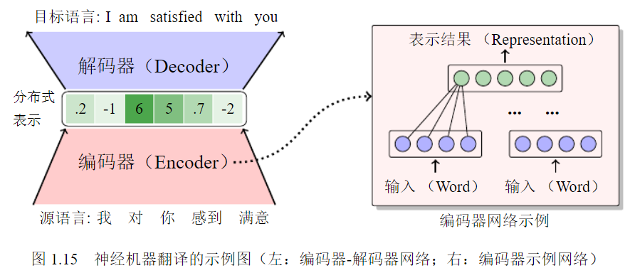

神经机器翻译存在的挑战：

1. 虽然脱离了特征工程，但神经网络的结构需要人工设计，即使设计好结构，系统的调优、超参数的设置等仍然依赖大量的实验。
2. 神经机器翻译现在缺乏可解释性，其过程和人的认知差异很大，通过人的先验知识干预的程度差。
3. 神经机器翻译对数据的依赖很大，数据规模、质量对性能都有很大影响，特别是在数据稀缺的情况下，充分训练神经网络很有挑战性。

# 相关会议

1. AACL，全称 Conference of the Asia-Pacific Chapter of the Association for Computational Linguistics，为国际权威组织计算语言学会（Association for Computational Linguistics，ACL）亚太地区分会。2020 年会议首次召开，是亚洲地区自然语言处理领域最具影响力的会议之一。
2. AAMT，全称 Asia-Pacific Association for Machine Translation Annual Conference，为亚洲-太平洋地区机器翻译协会举办的年会，旨在推进亚洲及泛太平洋地区机器翻译的研究和产业化。特别是对亚洲国家语言的机器翻译研究有很好的促进，因此也成为了该地区十分受关注的会议之一。
3. ACL，全称 Annual Conference of the Association for Computational Linguistics，是自然语言处理领域最高级别的会议。由计算语言学会组织，每年举办一次，主题涵盖计算语言学的所有方向。
4. AMTA，全称 Biennial Conference of the Association for Machine Translation in the Americas，美国机器翻译协会组织的会议，每两年举办一次。AMTA 会议汇聚了学术界、产业界和政府的研究人员、开发人员和用户，让工业界和学术界进行交流。
5. CCL，全称 China National Conference on Computational Linguistics，中文为中国计算语言学大会。中国计算语言学大会创办于 1991 年，由中国中文信息学会计算语言学专业委员会负责组织。经过 20 余年的发展，中国计算语言学大会已成为国内自然语言处理领域权威性最高、规模和影响最大的学术会议。作为中国中文信息学会（国内一级学会）的旗舰会议，CCL 聚焦于中国境内各类语言的智能计算和信息处理，为研讨和传播计算语言学最新学术和技术成果提供了最广泛的高层次交流平台。
6. CCMT，全称 China Conference on Machine Translation，中国机器翻译研讨会，由中国中文信息学会主办，旨在为国内外机器翻译界同行提供一个平台，促进中国机器翻译事业。CCMT 不仅是国内机器翻译领域最具影响力、最权威的学术和评测活动，而且也代表着汉语与民族语言翻译技术的最高水准，对民族语言技术发展具有重要意义。
7. COLING，全称 International Conference on Computational Linguistics，自然语言处理老牌顶级会议之一。该会议始于 1965 年，是由 ICCL 国际计算语言学委员会主办。
8. EACL，全称 Conference of the European Chapter of the Association for Computational Linguistics，为 ACL 欧洲分会，虽然在欧洲召开，会议也吸引了全世界的大量学者投稿并参会。
9. EAMT，全称 Annual Conference of the European Association for Machine Translation，欧洲机器翻译协会的年会。该会议汇聚了欧洲机器翻译研究、产业化等方面的成果，同时也吸引了世界范围的关注。
10. EMNLP，全称 Conference on Empirical Methods in Natural Language Processing，自然语言处理另一个顶级会议之一，由 ACL 当中对语言数据和经验方法有特殊兴趣的团体主办，始于 1996 年。会议比较偏重于方法和经验性结果。
11. MT Summit，全称 Machine Translation Summit，是机器翻译领域的重要峰会。该会议的特色是与产业结合，在探讨机器翻译技术问题的同时，更多的关注机器翻译的应用落地工作，因此备受产业界关注。该会议每两年举办一次，通常由欧洲机器翻译协会（The European Association for Machine Translation，EAMT）、美国机器翻译协会（The Association for Machine Translation in the Americas，AMTA）、亚洲-太平洋地区机器翻译协会（Asia-Pacific Association for Machine Translation，AAMT）举办。
12. NAACL，全称 Annual Conference of the North American Chapter of the Association for Computational Linguistics，为 ACL 北美分会，在自然语言处理领域也属于顶级会议，每年会选择一个北美城市召开会议。
13. NLPCC，全称 CCF International Conference on Natural Language Processing and Chinese Computing。NLPCC 是由中国计算机学会（CCF）主办的 CCF 中文信息技术专业委员会年度学术会议, 专注于自然语言处理及中文处理领域的研究和应用创新。会议自 2012 年开始举办，主要活动有主题演讲、论文报告、技术测评等多种形式。
14. WMT，全称 Conference on Machine Translation，前身为 Workshop on Statistical Machine Translation。机器翻译领域一年一度的国际会议。其举办的机器翻译评测是国际公认的顶级机器翻译赛事之一。

除了会议之外，《中文信息学报》、Computational Linguistics、Machine Translation、Transactions of the Association for Computational Linguistics、IEEE/ACM Transactions on Audio, Speech, and Language Processing、ACM Transactions on Asian and Low Resource Language Information Processing、Natural Language Engineering 等期刊也发表了许多与机器翻译相关的重要论文。

# 莫烦NLP

## 预备知识

1. 计算机能够读懂语言的前提是：这种语言是一种可计算的物体，这意味着我们需要找到一种方式将我们熟知的中文、英文和各种外文转化成数字形式。

2. 计算机之所以能看懂字里行间的感情，理解文字，处理文字，并不是因为它理解的我们普罗万象的人类语言，而是它将语言或者词汇归类到了一个正确的位置上。计算机对词语的理解，其实是计算机对空间及位置的理解。不管是图片、文章、句子、词语、声音，只要是能被数值化，被投射到某个空间中，计算机都能把它们按相似度聚集起来。

3. 搜索引擎的工作原理

   对于某个网页，站长可以选择主动将网页告诉搜索引擎，也可以等待"蜘蛛"来进行爬取。爬取的网页会被搜索引擎分析，然后挑选出重点信息（比如标题、正文等），并将这些信息给予不同权重后进行存储。每个被爬取的网页会提前被构建成索引存储在数据库中，在用户进行搜索时，搜索引擎只会在数据库中进行搜索。

   搜索的方法是倒排索引技术。倒排索引是一种批量召回技术，它能快速在海量数据中初步召回基本符合要求的文章。假设你手上有100篇材料，这时有人找你咨询问题，你会怎么在这100篇材料中找到合适的内容？

   方法1：一篇一篇地阅读，找到所有包含合适内容的材料，然后返回给提问者。这种方法需要在每次搜索时，都对所有材料进行一次阅读，然后在材料中找到关键词，并筛选出材料，效率非常差。

   方法2：在第一次拿到所有材料时，把它们通读一遍，然后构建关键词和文章的对应关系。当用户在搜索特定词时，就会直接返回这个关键词索引下的文章列表。先构造索引的好处就是能够将这种索引，放在后续的搜索中复用，搜索也就变成了一种词语匹配加返回索引材料的过程。

   这里的方式1是正排索引，方式2是倒排索引。但当处理的是海量数据时，通过倒排索引找到的文章依旧是海量的。所以现在我们就需要对这些初步召回的文章进行排序操作，仅选取排名靠前的文章列表进行展示。处理匹配排序的最有名算法就是TF-IDF。

   TF表示词频，IDF表示逆文本频率指数，TF-IDF就是将这两者结合起来，形成对某个文章的数字描述（即该文章中所有词的tf与idf的乘积所构成的一串数字，相当于embedding向量），当搜索时，将搜索关键词也通过TF-IDF的方式计算出它的数字描述，然后比较搜索关键词的数字描述和哪些文章的数字描述比较接近，将最接近的文章进行返回即可。

   ElasticSearch就是基于TF-IDF算法的集群版搜索引擎。

4. 多模态搜索

   用模型从非文字信息中提取计算机能够识别的数字信息，当用户用文字搜索时，将搜索的文字内容转换成模型能识别的数字内容，然后再和之前存储的图片、视频等数字信息进行匹配，对比两种数字之间的关联性，然后找到最相近的内容。这种搜索就叫作多模态搜索。

   多模态搜索并不仅限于文字搜图片视频，它还能颠倒过来，用图片搜图片，图片搜视频等，因为在深度学习看来，只要它们能被转换成统一的数字形态，就能够通过对比相似性来进行搜索。

## Seq2seq

> 参考文章：
>
> 1. [Sequence to Sequence Learning with Neural Networks](https://papers.nips.cc/paper/2014/file/a14ac55a4f27472c5d894ec1c3c743d2-Paper.pdf)
> 2. [Learning Phrase Representations using RNN Encoder–Decoder for Statistical Machine Translation](https://arxiv.org/pdf/1406.1078.pdf)
> 3. [RNN Encoder–Decoder - 知乎 (zhihu.com)](https://zhuanlan.zhihu.com/p/302796786)
> 4. [两种常见Seq2Seq的原理及公式 - 知乎 (zhihu.com)](https://zhuanlan.zhihu.com/p/70880679)
> 5. [tensorflow-seq2seq-tutorials - github](https://github.com/ematvey/tensorflow-seq2seq-tutorials)

计算机通过 w2v 拿到对词语的向量化理解，我们要怎么使用，才能把它变成对句子的理解呢？也就是说，我们需要找到一种方法，将这些离散的词向量，加工成句向量。

有一种简单粗暴的方法，即直接将所有词向量相加怎么样？也不是不行，不过这依旧是在词向量的空间上理解句子。如果句子和词语是有本质区别的事物，那么他们所属的空间应该也不同，直接使用加法，没有办法创造出一个全新的空间。那我们还能怎么办？用乘法？这说对了一半，我们的确可以用乘法来转移空间属性，比如使用线性代数的方法，让一个空间的向量在另一个空间以不同形式来表达。而我们现在最常见的方案就是使用神经网络来做这样复杂的"乘法运算"，这个运算也通常被叫做 encoding 编码。这个过程类似于压缩，将大量复杂的信息压缩成少量经典的信息，通过这个途径找到信息的精华部分。

一个人说话是存在顺序信息的，如果将词语的顺序颠倒，我们可能会得到完全不同的信息，可见我们的模型必须要将顺序信息完全考虑起来，而循环神经网络恰好最擅长做这件事情。循环神经网络在词向量上，从前到后一个个词语地阅读，阅读完整句后，模型就拥有了对这句话整体的理解，也就有能力产生出一个基于整句理解的向量，encoding 句向量的过程也就顺理成章地完成了。

那么有了这个句子的理解，我们又能干嘛呢？与 encoding 对应的，还有一个叫 decoding 的过程。如果说 encoding 是压缩编码，那么 decoding 就是解压解码。与传统的压缩解压不同，我们不仅能解压出原始的文件，我们还能基于这种计算机压缩过的理解，转化成更多数字化形式，比如根据这个句向量地理解生成机器人下一轮地对话、生成一张爱心图案或判断这句话是否为积极状态等等。

上述过程总结起来就是：通过循环神经网络 encoding 的过程，拿到对句子的理解（即句向量），然后用另一个循环神经网络作为 Decoder 解码器，基于句向量生成下文。简而言之，Encoder 负责理解上文，Decoder 负责思考怎么样在理解的句子的基础上做任务。这一套方法就是在自然语言处理中风靡一时的Seq2Seq框架。

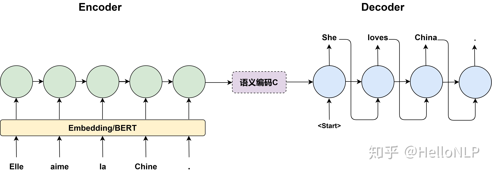

> 思想：在研究 RNN 模型时，最重要的就是搞清楚每一时间步的输出由哪些变量决定，以及这些变量之间的计算过程。
>
> 在本文的 seq2seq 模型（RNN Encoder–Decoder）中：
>
> （参考文章[Seq2Seq模型 - 简书 (jianshu.com)](https://www.jianshu.com/p/0a32ae3b8090)）
>
> 1. Encoder：每一个时间步的输出由上一时间步的隐状态（第一个时间步为随机初始化的一个隐状态）和输入到当前时间步的词向量决定。最后一个时间步的隐状态和输出共同作为句子的理解，称为语义编码向量（或句向量）。
> 2. Decoder：每一个时间步的输出由上一时间步的隐状态（第一个时间步为Encoder 输出的句向量）和上一时间步输出的词（第一个时间步为开始符"[GO]"）决定。当某个时间步输出的词为结束符"[EOS]"时，表示翻译结束，Decoder停止工作，该时间步作为最后一个时间步。所有时间步输出的词作为翻译的结果。

向量表示是深度学习成功的关键。对句子的理解，就是在多维空间中给这个句子安排一个合适的位置，每一个空间上的点就代表了计算机对事物的某种理解。我们将这种空间上的信息转换成其他信息，就能完成对这个句子理解后的应用了。

Seq2seq 在训练时和预测时的 decoder 有所不同：

1. 训练时 decoder 的过程：每一时间步的输入都是 true label，使得不管在训练时有没有预测错，下一步 decoding 的输入都是正确的（就像小孩学走路，当他摔倒了，父母帮他扶起来。这样可以让小孩学得更快，但缺乏自我纠正错误的能力）。

   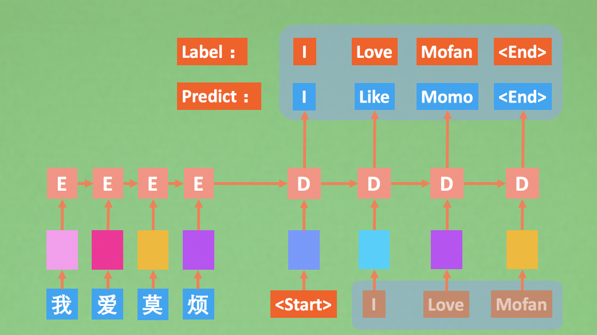

2. 预测时 decoder 的过程：下一步的预测均基于 decoder 上一步的预测，而不是 true label（就像小孩学走路，当他摔倒了，让他自己重新站起来。这种方法可以让小孩具有自我纠正错误的能力，但需要消耗较大的计算资源，而且学得也比较慢）。

   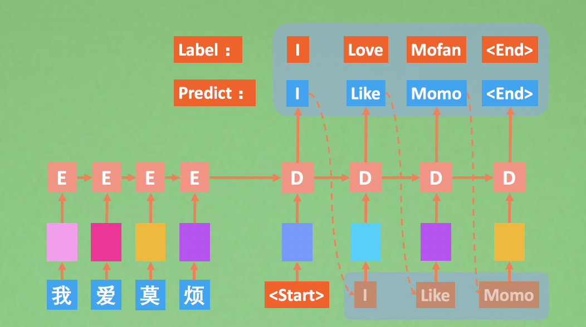

Seq2seq 可以用下图所示的 Beam search 的预测方式代替 GreedyEmbeddingSampler 的预测方式。

> Beam search算法的理解：[Seq2Seq中的beam search算法 - 知乎 (zhihu.com)](https://zhuanlan.zhihu.com/p/36029811?group_id=972420376412762112)

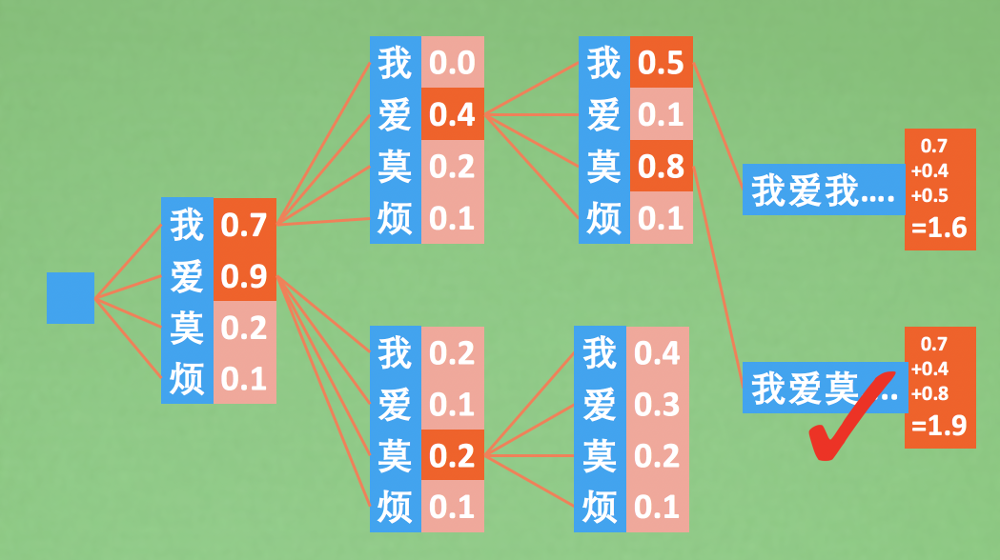

## 用cnn实现Seq2seq

> 参考文章：[Convolutional Neural Networks for Sentence Classification]([1408.5882.pdf (arxiv.org)](https://arxiv.org/pdf/1408.5882.pdf))

用 cnn 实现 Seq2seq 实际上仅仅是在 encoder 方面做出了改变，decoder 部分还是和原来的一样。也就是说，使用 cnn 模型仅仅是为了用 cnn 的角度去获取对句子的理解（即句向量），看看它的这个角度和原始采用 rnn 去理解的角度有什么不一样。

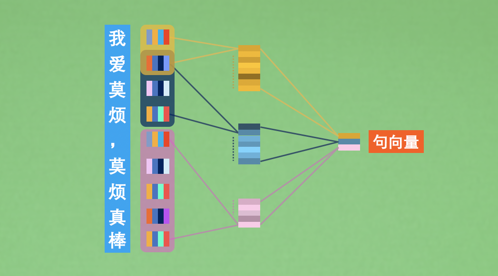

能够用 cnn 模型处理 Seq2seq 的原因在于：将句子中各个词的词向量合并起来后所形成的数据其实和只有一个 chanel 的图像数据完全一致，因此完全可以用卷积核去扫描文本数据，从而获取对句子的理解。

用 cnn 模型处理 Seq2seq 的缺陷：用 cnn 模型处理图像时，图像的数据都是固定长宽的，而文本数据通常是变化的，因此有时候为了可以用 cnn 模型处理文本，需要对文本数据进行裁剪。

用 cnn 模型处理 Seq2seq 的好处：cnn 模型可以进行并行计算，计算效率会比 rnn 模型要快。

## 注意力机制

> 参考文章：
>
> 1. [Effective Approaches to Attention-based Neural Machine Translation](https://arxiv.org/pdf/1508.04025.pdf)⭐
> 2. [NEURAL MACHINE TRANSLATION BY JOINTLY LEARNING TO ALIGN AND TRANSLATE⭐](https://arxiv.org/pdf/1409.0473.pdf)
> 3. [Show, Attend and Tell: Neural Image CaptionGeneration with Visual Attention](http://proceedings.mlr.press/v37/xuc15.pdf)⭐
> 4. [Luong Attention - 知乎 (zhihu.com)](https://zhuanlan.zhihu.com/p/354007474)
> 5. [Bahdanau Attention - 知乎 (zhihu.com)](https://zhuanlan.zhihu.com/p/272662664)
> 6. [Attention 注意力机制介绍 - 简书 (jianshu.com)](https://www.jianshu.com/p/4868162a679b)⭐
> 7. [seq2seq中的两种attention机制 - 知乎 (zhihu.com)](https://zhuanlan.zhihu.com/p/70905983)⭐
> 8. [Bahdanau 和 Luong 两种 Attention 机制的区别 - 知乎 (zhihu.com)](https://zhuanlan.zhihu.com/p/129316415)
> 9. [BahdanauAttention 与 LuongAttention 注意力机制简介 - CSDN博客](https://blog.csdn.net/u010960155/article/details/82853632)
> 10. [Keras 的几种 attention layer 的实现 1 - 知乎 (zhihu.com)](https://zhuanlan.zhihu.com/p/336659232)⭐
> 11. [Keras 的几种 attention layer 的实现 2 - 知乎 (zhihu.com)](https://zhuanlan.zhihu.com/p/337438405)
> 12. [基于注意力的神经机器翻译_官方例子](https://www.tensorflow.org/tutorials/text/nmt_with_attention)⭐
>
> 画龙点睛：在 seq2seq 模型（RNN Encoder–Decoder）中，注意力机制让解码部分可以选择性地使用编码部分的信息。

使用注意力可以让模型关注在更为关键的局部信息上，而忽略那些无效的信息，进而提高信息的处理效率。注意力应用在视觉上，机器可以注意到某一个局部区域，应用在语言上，就是注意到某一个或多个关键词汇。 基于我们不同的任务类型，机器通过注意力获取的词汇区域就有所不同。比如对于一段销售所说的话，男生的注意力模型和女生的注意力模型就有所不同：

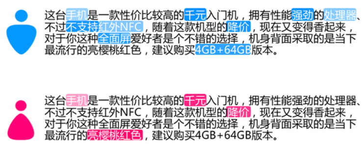

对于男生，他更多注意到的是关于性能和配置的信息，而女生则更注意的是价格和颜色的信息。有了注意力，我们提取我们想要的信息的能力就会被大大增强，并且在获取了这些信息后，我们就可以用它来预测购买意向，或者生成下一句回复销售员的话。拿生成回复来举例：

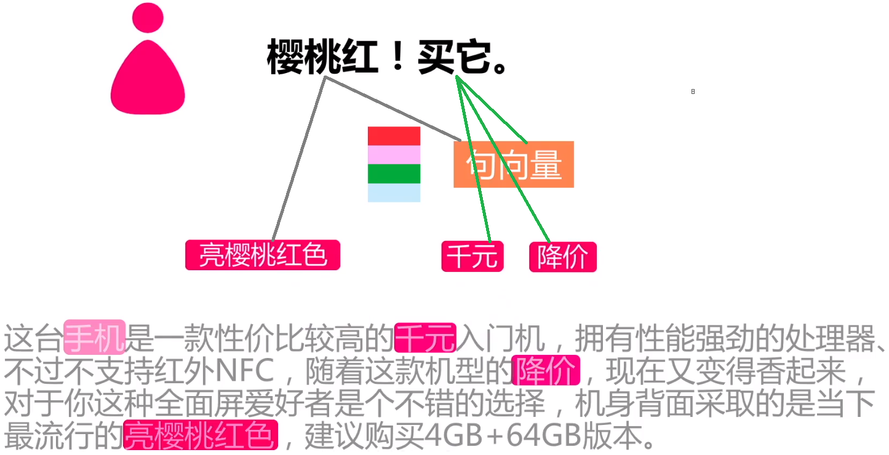

假设我们使用的是女生的注意力模型。首先模型得先通读一下这段文字，毕竟如果没有上下文的信息，模型也不知道究竟要注意些什么。通读完之后，我们可以得到一个关于这句话的理解，也就是句向量。句向量属于全局信息，接着我们通过注意力获取的是局部信息，我们可以将全局信息配合局部信息一起来生成每一个回复的词。比如，女生回复的"樱桃红"可以是注意到的"亮樱桃红色"这句话而回复的，而"买它"则可能是注意到"千元"和"降价"促成的回复。 

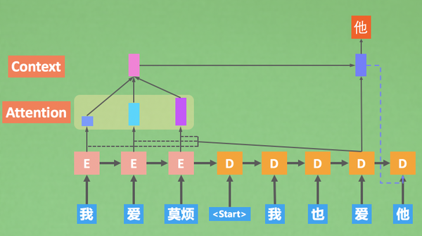

> 与原始 Seq2seq 模型的主要区别：参与到 decoder 中的语义向量不再是由 encoder 最后时间步产生的隐状态和输出构成的静态句向量（静态是指指导 decoder 每一步进行翻译的语义向量都是同一个句向量，不会随着时间的推移而变化），而是由 decoder 每一步的状态与 encoder 所有时刻的状态共同生成的动态语义向量（动态是指指导 decoder 每一步进行翻译的语义向量会随着 decoder 每一步的状态而改变），并且该动态语义向量与 decoder 此时此刻的状态紧密相连（体现出注意力的地方）。
>
> 在 Seq2seq 的 Bahdanau Attention 的模型中：
>
> 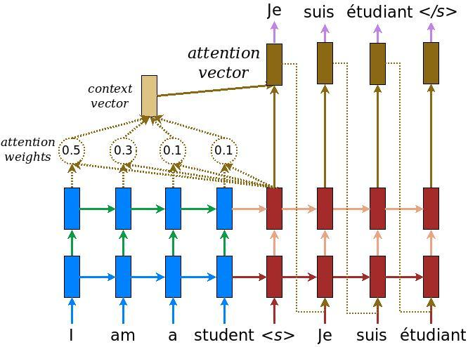
>
> 1. Encoder：每一个时间步的输出由上一时间步的隐状态（初始状态为随机初始化的一个隐状态）和输入到当前时间步的词向量决定。
>
> 2. Decoder：每一时间步$t$的输出由 encoder 所有时刻的隐状态$h_i$、上一时刻的隐状态$s_{t-1}$（初始状态为 encoder 最后一个时间步的状态）和上一时刻的输出$y_{t-1}$（初始输入为开始符"[GO]"）共同决定。
>
> 3. Decoder 每一时间步$t$都要拿着此刻的信息与 encoder 的所有信息做注意力的计算，其计算过程如下（打分 -> 计算语义向量 -> 计算状态 -> 计算输出）：
>
>    ① 得到此刻的匹配分数（权值）：将$s_{t-1}$（称为Query）与 encoder 每一时刻的状态$h_i$（称为Key）进行 match 操作，得到 decoder 此刻对于 encoder 每一时刻的匹配度，对这些匹配度用 softmax 进行归一化处理，得到 decoder 此刻对于 encoder 每一时刻的匹配分数（encoder 的每一时刻等同于被翻译序列中的每一个词，这里的匹配分数就相当于 decoder 此刻所要输出的词对于被翻译序列中的每一个词的重视程度，即注意力度）。计算匹配度的公式有三个（作者提出），如下所示：
>
>    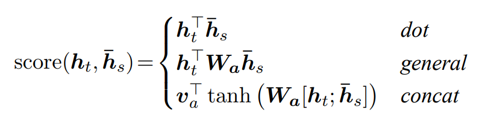 
>
>    ② 得到此刻的语义向量$c_{t}$：将上面得到的匹配分数与 encoder 每一时刻的状态$h_i$（称为Value）进行加权求和，其结果就是 decoder 此刻的语义向量（也可以看成是是上下文向量，该向量用于指导 decoder 此刻如何进行翻译）；
>
>    ③ 计算此刻的状态$s_t$：$s_t$ = tanh(W[$c_{t}$,$s_{t-1}$,$y_{t-1}$])（W为权重参数）
>
>    ④ 计算此刻的输出（翻译结果）$y_t$：$y_t$ = softmax(V[$s_t$])（V为权重参数）
>
> Seq2seq 的 Luong Attention 的模型与 Bahdanau Attention 计算过程完全一致，区别主要在于计算公式和模型结构：
>
> 1. 计算语义向量的不同：
>
>    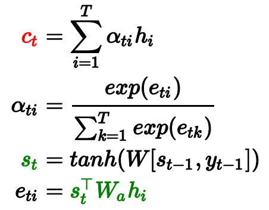 
>
> 2. 计算此刻状态和输出的不同：
>
>    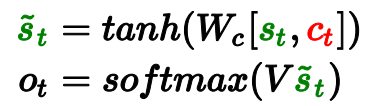 
>
> 3. Bahdanau 的 encoder 为双向 RNN，每一时刻的输出为上下两个 RNN 的状态拼接；Luong 的 encoder 为双层 RNN，每一时刻的输出直接采用上层 RNN 的输出。

可视化举例：在生成不同单词时的注意力分布（纵轴为生成的序列，横轴为源序列）

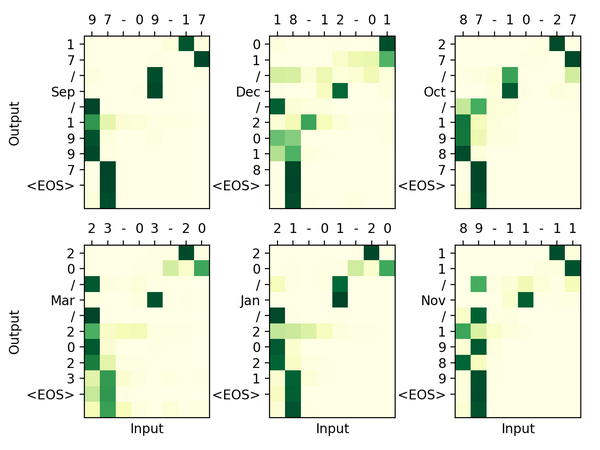

## 注意力的嵌套

>参考文章：
>
>1. [Attention Is All You Need](https://arxiv.org/pdf/1706.03762.pdf)⭐
>2. [The Illustrated Transformer](http://jalammar.github.io/illustrated-transformer/)⭐
>3. [The Illustrated Transformer【译】- CSDN博客](https://blog.csdn.net/yujianmin1990/article/details/85221271)
>4. [图解什么是 Transformer - 简书 (jianshu.com)](https://www.jianshu.com/p/e7d8caa13b21)
>5. [《Attention is All You Need》浅读 - Scientific Spaces](https://spaces.ac.cn/archives/4765)
>6. [【NLP】Transformer 模型原理详解 - 知乎 (zhihu.com)](https://zhuanlan.zhihu.com/p/44121378)
>7. [【经典精读】Transformer 模型深度解读 - 知乎 (zhihu.com)](https://zhuanlan.zhihu.com/p/104393915)
>8. [理解语言的 Transformer 模型 - 官方例子](https://www.tensorflow.org/tutorials/text/transformer)⭐
>9. [Training Tips for the Transformer Model](https://arxiv.org/pdf/1804.00247.pdf)
>10. [Self-Attention with Relative Position Representations](https://arxiv.org/pdf/1803.02155.pdf)
>11. [Image Transformer](https://arxiv.org/pdf/1802.05751.pdf)

Transformer 就是将注意力不断地叠加，即在观察句子得到一层注意力后，继续在这层注意力的基础上观察注意句子，一遍又一遍地注意到句子的不同部分，使得对句子的理解不断升华，提炼出对句子更深层的理解。可见，Transformer 的核心就是注意力的嵌套。Transformer 是一个 Encoder-Decoder 模型，但其内部的框架完全和 RNN Encoder-Decoder 模型完全不同，虽然注意力的叠加也可以应用到 RNN 模型上，但由于时序的原因，RNN 模型不能并行训练，再加上注意力的叠加，训练起来会极其缓慢，因此 RNN 不适合采用注意力叠加的方法，所以 Transformer 也没有采取 RNN layer 来进行训练。Transformer 模型的具体框架如下所示：

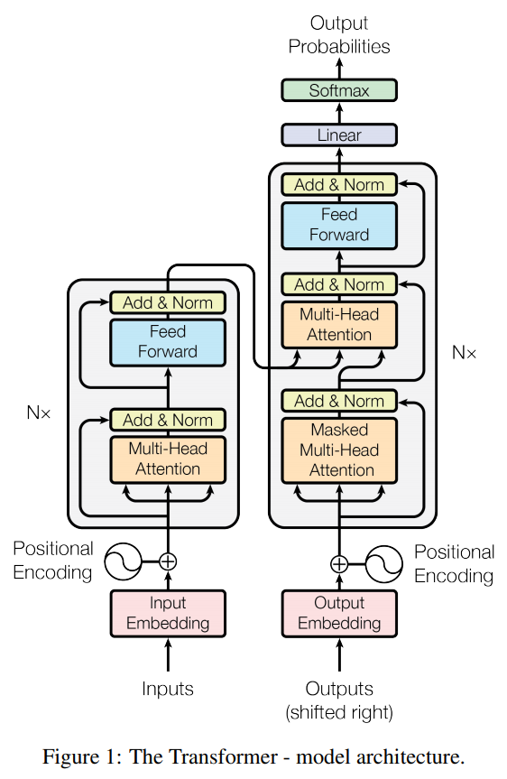

### Transformer 的流程

Transformer 模型由 N 层 Encoder 加上 N 层 Decoder 组成，模型先通过 Encoder 进行 N 次 attention 的叠加（一层 Encoder 就会产生一次 attention），这个叠加后的 attention 就会作为 Encoder 的输出，输出到 Decoder 中，由 Decoder 在这个叠加后的 attention 的基础上继续进行 N 次 attention 的叠加，叠加的结果经过一些处理后，就可以作为词进行输出。

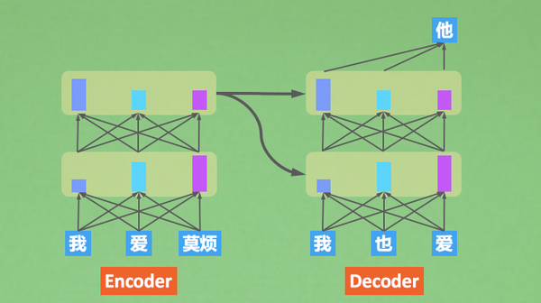

### FFNN layer

在 Transformer 的 Encoder 和 Decoder 的最后都分别增加了 Feed Forward Network，其目的是给 attention output 增加非线性变换，提高模型的表现力。


### 生成注意力的算法

这个算法主要关注三样东西，即 Query（查询向量）、Key（键向量）和 Value（值向量）。Query 表示源序列或生成序列中作为观察者的每一个词，Key 表示源序列或生成序列中每一个词的索引，Value 表示源序列或生成序列中每一个词的关注度。比如我们要用源序列中的某一个词 w 去注意源序列（称为 self-attention）：

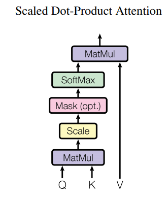

① 用词 w 的 Query 与源序列中每一个词的 Key 做 MatMul 运算，得到词 w 对源序列中每一个词的 attention 分值，这个分值决定了词 w 需要给予源序列中每一个词多少关注度。

② 将这些分值进行 Scale （即除以 Key 长度的平方根）和 SoftMax 计算，即可得到归一化的分数。

③ 将归一化的分数分别与源序列中对应词的 Value 进行相乘得到词 w 对于源序列中每一个词的加权关注度向量（分数越大，则对应词所保留的关注度越大，词 w 对它的注意就越多；分数越小，则对应词所保留的关注度越小，对于词 w 来说就越不起眼）。

④ 将这些加权向量进行求和，即可得到词 w 对应的 self-attention 的输出结果。


下面是多个词同时进行 self-attention 计算的公式：


> 通俗解释：想象这是一个相亲画面，我有我心中喜欢女孩的样子（Query），我会按照这个心目中的形象浏览各种女孩的照片（Key），如果一个女生样貌很像我心中的样子，我就注意这个人， 并安排一段稍微长一点的时间阅读她的详细材料（Value），反之我就安排少一点时间看她的材料。这样我就能将注意力放在我认为满足条件的候选人身上了。 我心中女神的样子就是 Query，我拿着它（Query）去和所有的候选人（Key）做对比，得到一个要注意的程度（attention score）， 根据这个程度判断我要花多久时间去仔细阅读每个候选人的材料（Value）。

另一种关于  self-attention 的解释图：

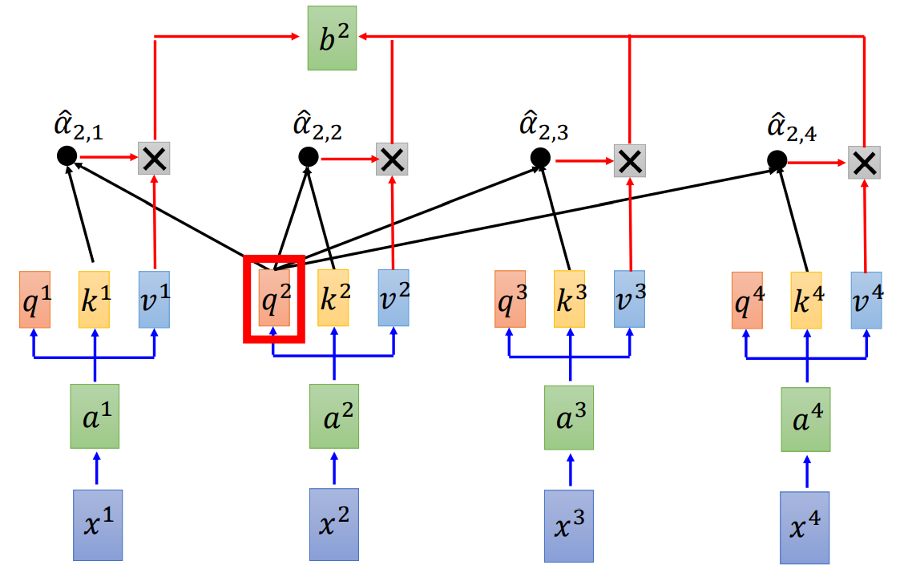

### 三种 attention 层

Transformer 中包含了三种 attention 层：

1. encoder self-attention：以源序列中的每个词作为观察者，计算它们对于源序列的注意力分布。

   其中，Query、Key、Value 由源序列中每个词的词向量分别乘以三个共享的 matrix 得到。

2. decoder self-attention：以生成序列中的每个词作为观察者，计算它们对于生成序列的注意力分布。

   其中，Query、Key、Value 由生成序列中每个词的词向量分别乘以三个共享的 matrix 得到。

3. encoder-decoder attention：以生成序列中的每个词为观察者，计算它们对于源序列的注意力分布。

   其中，Query 由 decoder 输出的 self-attention 向量乘以一个共享的 matrix 得到，Key 和 Value 由 encoder 输出的 self-attention 向量分别乘以两个共享的 matrix 得到。

### Multi-headed 机制

在计算同一层的 attention 时，同时计算多次 attention（采用不同的 matrix 去计算 Q、K 和 V 即可），然后将它们进行汇总得到该层 attention 的输出。（接相亲的例子）这就像我同时找了多个人帮我注意女孩一样，这几个人帮我一轮一轮地观察之后，我在汇总所有人的理解，统一进行判断。这也有点像"三个臭皮匠赛过诸葛亮"的意思。

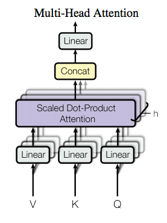

### Positional Encoding

Transformer 本身没有采用 rnn 作为内部结构，那么它是如何理解输入语句中词的顺序呢？Transformer 为每一个词新增了一个位置向量，这些向量遵循某种模式来决定词的位置，然后用这些位置向量加上对应的词向量，则可以为源序列中的每一个词产生一种具有位置关系的向量，用这个向量代替词向量进行训练，即可解决词序问题。

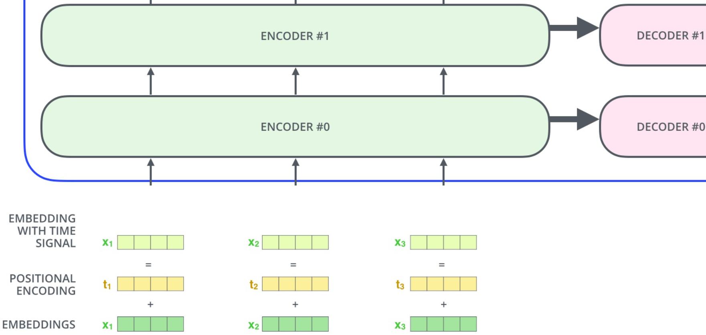

> 参考文章：[Transformer 中的 position embedding - 知乎 (zhihu.com)](https://zhuanlan.zhihu.com/p/166244505)
>
> Positional Encoding 的过程：Embedding input elements x = (x1, . . . , xm) in distributional space as w = (w1, ..., wm). Equiping the model with a sense of order by embedding the absolute position of input elements p = (p1, ..., pm). Both are combined to obtain input element representations e = (w1 + p1, ...., wm + pm).

### Add & Normalize

在 Transformer 的模型中，每层 layer 之间都加入了残差和规范化的计算（即 Add & Normalize layer），其目的就是为了加速模型的训练过程。


某层输出的残差和规范化的计算过程：将该层输出与输入相加的结果进行规范化即可。


### Mask 机制

Mask 的两种作用：

1. padding mask：用于处理非定长序列 ，区分 padding 和非 padding 部分，使得 padding 部分不会参与运算（因为 padding 部分只是为了让所有序列的长度变得一致，但它实际上并不属于序列的一部分，因此需要通过 padding mask，使得 padding 部分不会参与到处理序列的操作当中）。
2. sequence mask：作用是为了让 decoder 不能看到未来的信息。具体来说就是，在时间步 t 时 decoder 的输出应该只依赖于 t 时刻之前的输出，而不能依赖于 t 之后的输出，因此我们需要把 t 之后的信息给隐藏起来。

在 Transformer 中，decoder 的 self-attention 同时需要 padding mask 和 sequence mask（具体实现就是两个 mask 进行相加），而对于其他情况，只需要用 padding mask。原因解释：

1. 因为 decoder 的 self-attention 的输出是作为生成词的输入，该输出应该只包含此刻之前所生成单词的信息（我们不可能在现在观察到未来生成的词），因此 decoder 的 self-attention 需要 sequence mask 来遮盖住未来的输出信息。
2. padding mask 的作用是使得 padding 部分不会参与 attention 的运算，因为 padding 部分本来就不是句子的一部分，它本身就没有理由被计算在内，因此任何 attention 的运算都需要使用 padding mask 来剔除掉  padding 部分的影响。

在 attention 的计算过程中，mask 的执行时机均是在 Q 和 K 进行 MatMul 和 Scale 运算之后 SoftMax 运算之前，具体如下图所示：


==如何进行 padding mask？==

1. 假设 $Q,K^T,QK^T$ 长下面的样子。其中，Q 的每一行（对应 $K^T$ 的每一列）表示一个词，第 3, 4 行（对应 $K^T$ 的第 3, 4 列）为填充的内容（这里用0填充，也可以用其他数值填充），也就是 padding mask 的目标。$QK^T$ 的每一行就对应一个词对于句子的关注分值向量。

   $$Q=\begin{bmatrix}
   1&1&1&1\\
   2&2&2&2\\
   0&0&0&0\\
   0&0&0&0
   \end{bmatrix}
   ,K^T=\begin{bmatrix}
   3&4&0&0\\
   3&4&0&0\\
   3&4&0&0\\
   3&4&0&0
   \end{bmatrix}
   ,QK^T=\begin{bmatrix}
   12&16&0&0\\
   24&32&0&0\\
   0&0&0&0\\
   0&0&0&0
   \end{bmatrix}$$

2. 由上可以知道，Q 的第 3, 4 行和 K 的第 3, 4 列都是需要进行 padding mask 的地方。对 K 的 padding mask 是在 $QK^T$ 计算之后 softmax 之前进行的（用于消除 K 中 padding 部分对于 softmax 的影响），而对 Q 的 padding mask 是在整个 attention 计算完后进行的（用于消除 Q 中 padding 部分经过 attention 计算后产生的无效数据）。但实际上，只需要进行对 K 的 padding mask，而不需要进行对 Q 的 padding mask，因为 Q 的 padding 部分采用 0 来填充，而且在参与后续计算时都是用一整行 0 来进行计算的，因此无论如何计算，它永远都只是一行 0 而已。综上可知，padding mask 只需要在 $QK^T$ 计算之后 softmax 之前进行，且只需要对 K 进行 padding mask。

3. 对于 $K^T$，它的 mask 矩阵为 $mask=\begin{bmatrix}
   1 &1 &0 &0 \\
   1 &1 &0 &0 \\
   1 &1 &0 &0 \\
   1 &1 &0 &0
   \end{bmatrix}$ （元素为0的部分就是 K 的 padding 部分），然后我们用这个 mask 矩阵去和 $QK^T$ 做运算：$QK^T=QK^T−(1−mask)×10^{10}$。这样，在 $QK^T$ 中属于 K 的 padding 部分的元素都会变成一个极其小的数（即 $－10^{10}$），现在再将 $QK^T$ 去做 softmax 运算时，K 的 padding 部分就会被归一化为0，从而不会对非 padding 部分的概率分布产生影响（如果 padding 部分的值较大，则会平摊一部分的概率）。

==如何进行 sequence mask？==

1. sequence mask 的过程和 padding mask 差不多，只不过是把 mask 矩阵换成了下三角全为1的矩阵 $mask=\begin{bmatrix}
   1 &0 &0 &0 \\
   1 &1 &0 &0 \\
   1 &1 &1 &0 \\
   1 &1 &1 &1
   \end{bmatrix}$，然后进行运算 $QK^T=QK^T−(1−mask)×10^{10}$ 即可。这样，在 $QK^T$ 中全为 0 的上三角部分的元素都会变成一个极其小的数（即$－10^{10}$），现在再将 $QK^T$ 去做 softmax 运算时，这些部分就会被归一化为0，从而不会对其他部分的概率分布产生影响。那么当我们将结果中的第一行作为输入去预测生成下一个词时，就没有了第 2, 3, 4 个词的信息，decoder 就只能用第一个词的信息来产生预测。对于其他行作为输入时的情况，都是如此。 

2. sequence mask 和 padding mask 都是在 $QK^T$ 计算之后 softmax 之前进行的，但它们俩之间没有计算的先后顺序，谁先进行都可以，而且也可以将它们的 mask 矩阵按元素相乘后同时进行 mask 的计算（如下图所示）。

   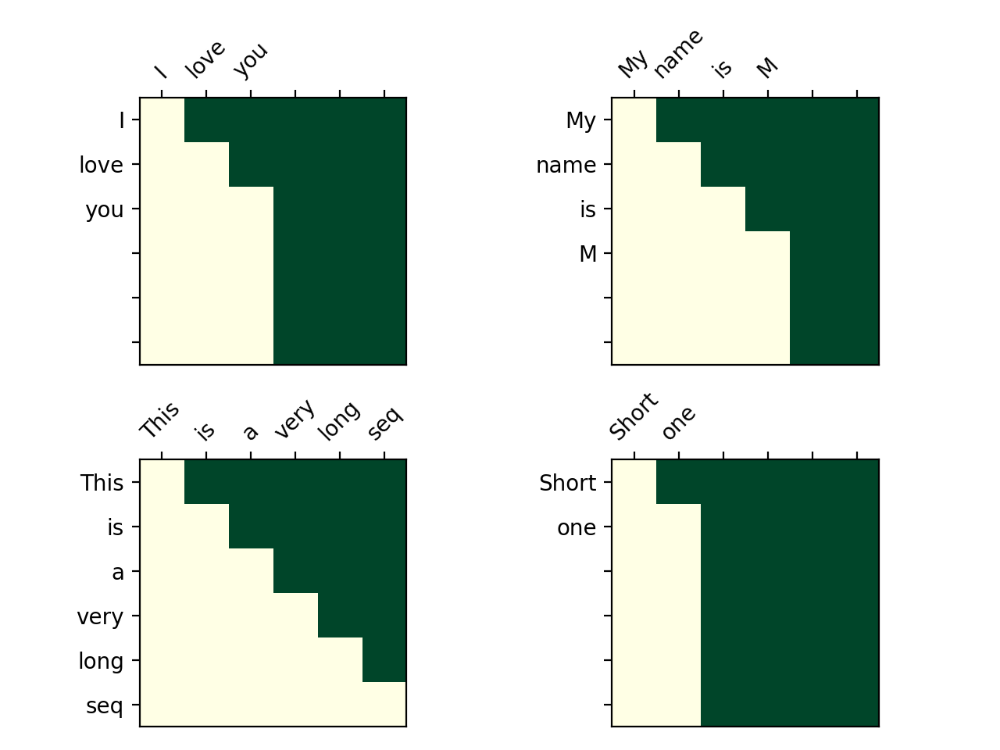

>关于 mask 机制的参考文章：
>
>1. ["让Keras更酷一些!": 层中层与 mask - Scientific Spaces](https://spaces.ac.cn/archives/6810#Mask)
>2. [NLP 中的 Mask 全解 - 知乎 (zhihu.com)](https://zhuanlan.zhihu.com/p/139595546)
>3. [Transformer 的矩阵维度分析和 Mask 详解 - CSDN博客](https://blog.csdn.net/qq_35169059/article/details/101678207)

## ELMo

> 参考文章：
>
> 1. [Deep contextualized word representations](https://arxiv.org/pdf/1802.05365.pdf)
> 2. [ELMo原理解析及简单上手使用 - 知乎 (zhihu.com)](https://zhuanlan.zhihu.com/p/51679783)
> 3. [ELMo 原理解析 - CSDN博客](https://blog.csdn.net/weixin_43269020/article/details/106027633)
> 4. [ELMo 模型（Embeddings from Language Models） - 博客园](https://www.cnblogs.com/yifanrensheng/p/13167787.html)
> 5. [The Illustrated BERT, ELMo, and co.【译】- CSDN博客](https://blog.csdn.net/qq_41664845/article/details/84787969)
> 6. [A Step-by-Step NLP Guide to Learn ELMo for Extracting Features from Text](https://www.analyticsvidhya.com/blog/2019/03/learn-to-use-elmo-to-extract-features-from-text/)

ELMo 是一个深度上下文相关的词嵌入言模型，使用了多层双向的 LSTM 编码器。ELMo 解决了 word2vec 不能表达一词多义的问题，并且能够在较低层捕获到语法信息，在较高层捕获到语义信息。ELMo 的框架如下所示：

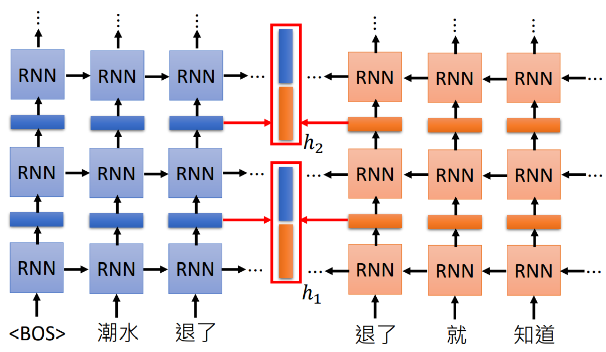

1. ELMo 由两个 LSTM encoder 组成，每个 encoder 都有多层，这两个 encoder 的任务就是预测下一个词。左边的 encoder 是一个正向预测模型，输入前一个词，预测后一个词。比如有序列"潮水 退了 就 知道 誰 沒穿 褲子"，当我们输入开始符"\<BOS\>"，这个正向预测模型就需要预测下一个词"潮水"，给出"潮水"，就预测"退了"，将预测的词与 label 相比较就可以得出它的 loss。右边的 encoder 是一个反向预测模型，输入后一个词，预测前一个词。比如给出"知道"，这个反向预测模型就需要预测前一个词"就"，给出"就"，就预测"退了"，将预测的词与 label 相比较就可以得出它的 loss。两种模型计算出来的 loss 相加就是 ELMo 最终需要优化的目标。

   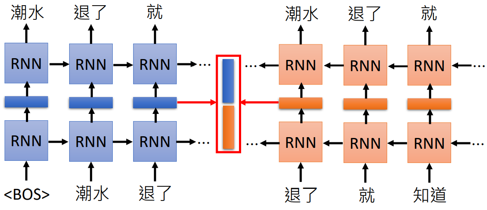

2. 对于正向预测的 encoder 来说，当输入一个词 w 去预测下一个词时，词 w 首先会通过 word2vec 的方式（查表）获得它的词向量，将这个词向量输入到多层的 Rnn 中进行预测，最后一层的 hidden state (即输出) 就会被拿去计算所有词的概率分布，并认为其中概率最高的词为预测的结果，然后将其与 label 做交叉熵运算得出 loss。在这个过程中，每一层 Rnn 的 hidden state (即输出) 都会作为输入词 w 的词向量。接着，我们就可以进行下一时间步 (继承上一时间步的状态) 的预测，即输入序列中词 w 的下一个词，预测词 w 的下下个词，反复上述过程直到输入序列的最后一个词 (由于序列存在 padding，因此需要 mask 矩阵来明确哪一个词才是最后一个词)。上述过程对于反向预测的 encoder 来说是完全相同的，区别仅仅在于输入的序列是反过来的。

3. 由第二点可知，假设 encoder 有 n 层 Rnn，经过训练后，对于输入序列中的每一个词，它就具有 2n+1 个词向量，包括正向 encoder 的 n 个 Rnn 层 的 hidden state、反向 encoder 的 n 个 Rnn 层 的 hidden state 和作为原始输入的通过查表得到的 embedding。但通常情况下，正向 encoder 和 反向 encoder 中同一层 Rnn 的 hidden state 会通过简单拼接的方式合并成一个。所以到最后，对于每一个词，我们都可以得到它的 n+1 个词向量。

   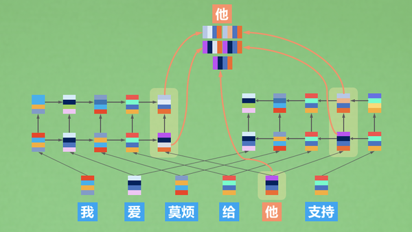

   >n+1 个词向量包含了以下信息：
   >
   >① 从前往后的前文信息；
   >
   >② 从后往前的后文信息；
   >
   >③ 当前词的词向量信息。

   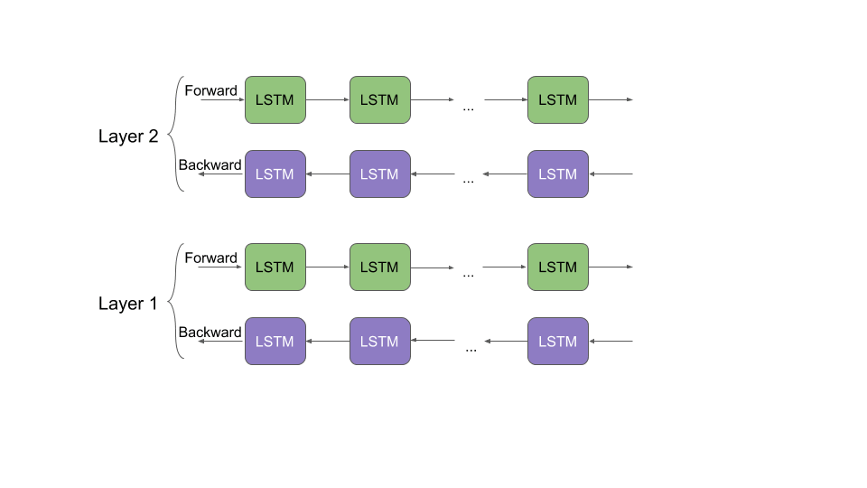

4. 通过训练 ELMo 模型后，我们就可以得到一个可以获得各个词的 2n+1 个词向量的预训练模型。这个预训练模型没有任何实际应用，需要将其接入到其他模型 model 中来进行下游任务。但训练好的 ELMo 模型可以为每个词提供多达 n+1 个的词向量 $vec_i$，那么要如何在 model 中使用它们呢？通常的做法是通过 weighted sum 的方式将它们合并成一个词向量 $vec_{final}$，即为每个词向量创建一个权重矩阵 $a_i$，然后进行运算 $vec_{final}=a_1vec_1+a_2vec_2+...+a_{n+1}vec_{n+1}$。得到合并向量 $vec_{final}$ 后，就可以将其作为对应词的特征输入到 model 中进行下游任务。注意，权重矩阵 $a_i$ 是作为下游任务的 model 的模型参数，与 model 的其他模型参数一起被学习的，权重矩阵 $a_i$ 并不是 ELMo 模型的一部分。

   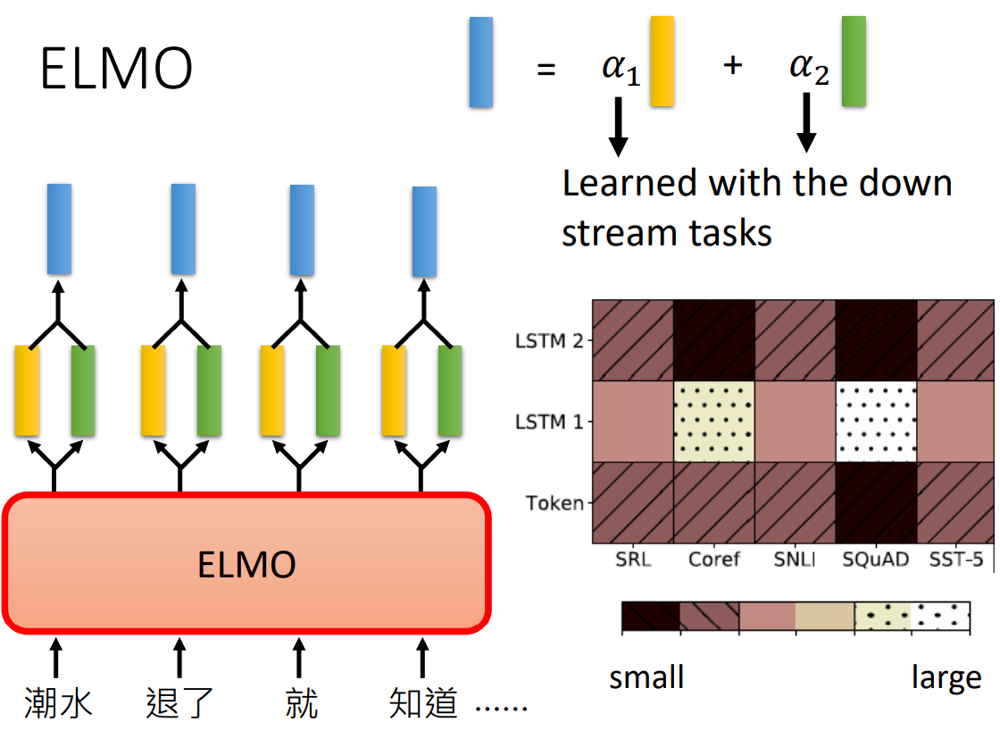

## GPT

>参考文章：
>
>1. [Improving Language Understanding by Generative Pre-Training](https://cdn.openai.com/research-covers/language-unsupervised/language_understanding_paper.pdf)
>2. [Language Models are Unsupervised Multitask Learners](https://cdn.openai.com/better-language-models/language_models_are_unsupervised_multitask_learners.pdf)
>3. [Language Models are Few-Shot Learners](https://arxiv.org/pdf/2005.14165.pdf)
>4. [完全图解GPT-2：看完这篇就够了（一） - 知乎 (zhihu.com)](https://zhuanlan.zhihu.com/p/79714797)
>5. [完全图解GPT-2：看完这篇就够了（二） - 知乎 (zhihu.com)](https://zhuanlan.zhihu.com/p/79872507)
>6. [[中译] How GPT3 Works - Visualizations and Animations - Acacess Lab](https://blogcn.acacess.com/how-gpt3-works-visualizations-and-animations-zhong-yi)

Generative Pre-Training (GPT) 是一种单向（仅从前往后进行预测）语言模型，是 Transformer 的一种变种。

1. GPT 是一种单向（仅从前往后进行预测）语言模型，因此它的任务也就是输入一个句子中的上一个词，预测句子中的下一个词。GPT 也是一种自回归（auto-regression）模型，即前面输出的词所形成的序列会变成下一步预测的输入。

   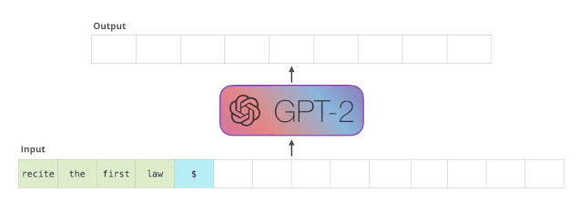

2. GPT 是 Transformer 的一种变种，即 GPT 是使用了 sequence mask （当然也有 padding mask）的 self attention 模型，它可以看成是 Transformer 中的 Encoder 加上了 sequence mask（因为是用前文信息去预测后文，因此不能让其看到未来的信息，所以要用 sequence mask），或者就是 Transformer 中 Decoder 的 self attention 层。

   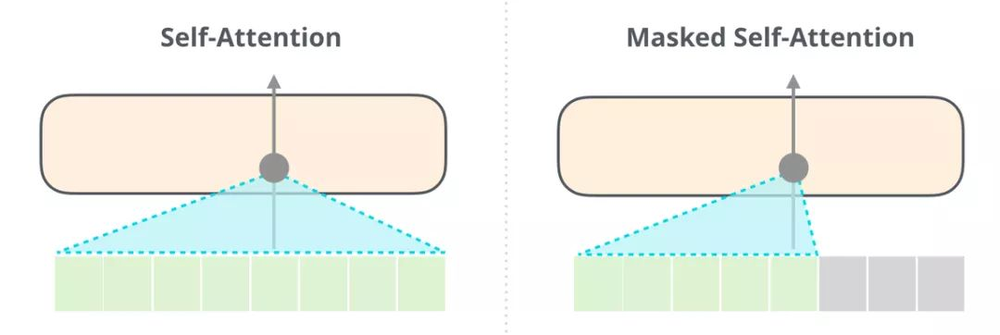

3. GPT 的训练结果中会出现"前面的预测比较不准确，而后面得预测比较准确"的现象：因为刚开始时前文信息量比较少，因此预测起来不是很准确，但当前文信息量多了以后，预测起来就会比较准确了。这种现象在 ELMo 中也会出现，其原因相同。

###  GPT 的实现原理

输入上一个词 w，GPT 就会预测它的下一个词，简单地说就是==将词 w 与之前预测生成的前文进行 attention 的计算==，然后将 attention 向量转化为概率分布，并取其中概率最大的词作为预测的结果，最后将预测的词与真实标签做交叉熵运算得到 loss。具体过程如下：

1. 一开始将开始符"\<BOS\>"作为输入，经过 word embedding 和 positional encoding 后，得到"\<BOS\>"的词向量，将这个词向量与三个共享 matrix （共享是指同一层 attention layer 中，每个词都是用相同的三个矩阵来得到自己的 Q,K,V）相乘，得到它的 Query、Key 和 Value 三个向量。由于这是第一个词，所以它没有前文，它只能和自己做 attention 的计算，得到关于自己的关注度向量，将其作为词"\<BOS\>"在第一层 attention layer 的结果（GPT 和 transformer 一样采用多层 attention layer，而且在一般情况下，attention layer 还会包括前馈网络，作用是用非线性变换将 attention 计算的结果转换一下，增强结果的非线性能力），然后将这个结果输入到第二层。在第二层中，会将第一层输出的 attention 向量继续乘上三个共享的 matrix，得到它在第二层的 Query、Key 和 Value 三个向量，然后做与第一层一样的 attention 计算，将计算得到的 attention 向量作为第二层的结果，以此类推，直到最后一层输出一个经过层层嵌套后的最终的 attention 向量。这个最终的 attention 向量会乘上一个矩阵，得到一个关于词汇表中每一个词的概率分布，取其中概率最大的词作为预测的结果。至此，第一个词的预测过程结束。

   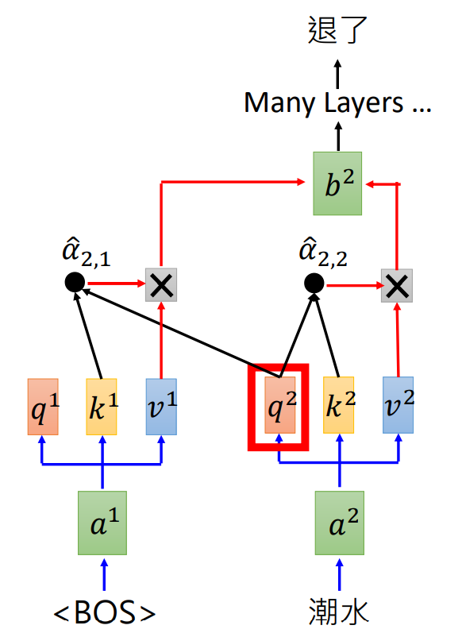

2. 假设开始符"\<BOS\>"预测得到的词为"潮水"，则 GPT 会将"潮水"这个词作为第二次预测的输入（上一个词预测的结果作为下一次预测的输入）。同样地，"潮水"这个词首先会经过 word embedding 和 positional encoding，得到"潮水"的词向量，将这个词向量与三个共享 matrix 相乘，得到它的 Query、Key 和 Value 三个向量。由于有一个前文单词"\<BOS\>"，因此它需要和"\<BOS\>"以及自己做 attention 的计算（GPT 会保存前文每一个词在预测时每一层产生的 Q,K,V，以便与后续的词进行 attention 的计算），经过计算就可以得到关于"\<BOS\>"和自己的关注度向量，将他们相加即可得到"潮水"这个词在第一层的 attention 向量。与第一个词预测的过程一样，也需要经过多层 attention layer 的计算，得到最终的 attention 向量，将其乘上一个矩阵，得到一个关于词汇表中每一个词的概率分布，取其中概率最大的词作为预测的结果。至此，第二个词的预测过程结束。

   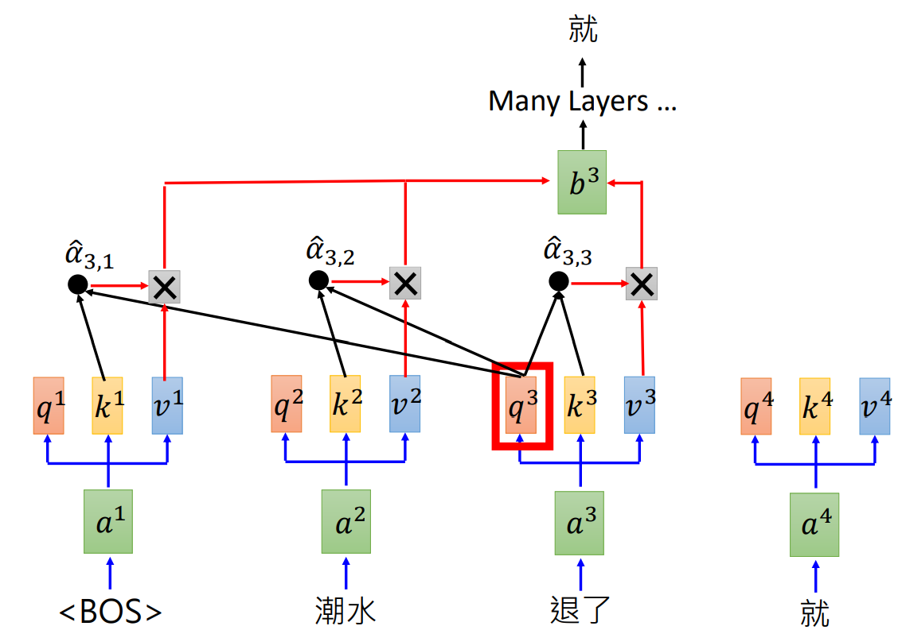

3. 后续每个词的预测过程均和上述一样，直到最后预测的长度等于序列的最大长度或者遇到一个预测的词为结束符，这时就会结束整个预测的过程。

4. 上述的过程是 inference，实际在训练时，它的 loss 通过将预测的词和真实标签做交叉熵运算来得到。而且在训练时，GPT 是用真实标签作为输入的，并且是同时输入所有标签，通过向量化同时预测出所有词的，因此在这个过程中，除了要用 padding mask 屏蔽无关词的干扰外，还需要用 sequence mask 屏蔽未来信息的干扰。

### 如何选择预测的词

在上述中，我们在计算出输入单词的 attention 向量后，用它得到了一个关于词汇表中每一个词的概率分布，这时我们采取了一个方法来挑选预测的词，即将概率最大的词作为预测的结果。实际上，如果模型考虑其他候选单词的话，效果会更好。所以，一个更好的策略是对于词汇表中概率较高的 top-k 个单词作为抽样的 list，比如将 top-k 设为 40，这样模型就会考虑注意力得分排名前 40 位的单词。

### Multi-headed 机制

在计算同一层的 attention 时，同时计算多次 attention（采用不同的 matrix 去计算 Q、K 和 V 即可），然后将它们进行汇总得到该层 attention 的输出。

### Mask 机制

GPT 在进行训练时采用正确的序列作为输入，同时将序列的所有词输入到模型中，由于 GPT 采用的方法是单向预测，因此不能在进行某个词的预测时，让它看见未来所要生成的词，因此需要使用 mask 矩阵对未来的词进行遮蔽。同时由于输入序列也是经过 padding 的，因此 GPT 也需要用 padding mask 来遮蔽 padding 部分的无效词，使其不会干扰输出的结果。具体的 mask 方法如 transformer 中一节所示的一样。

## BERT

> 参考文章：
>
> 1. [BERT: Pre-training of Deep Bidirectional Transformers for Language Understanding](https://arxiv.org/pdf/1810.04805.pdf)
> 2. [一文读懂 BERT（原理篇）- CSDN博客](https://blog.csdn.net/jiaowoshouzi/article/details/89073944)
> 3. [NLP的巨人肩膀 - 知乎 (zhihu.com)](https://zhuanlan.zhihu.com/p/50443871)
> 4. [[译] The Illustrated BERT, ELMo, and co.](https://blog.csdn.net/qq_41664845/article/details/84787969)
> 5. [BERT 可解释性 - 从"头"说起 - 知乎 (zhihu.com)](https://zhuanlan.zhihu.com/p/148729018)
> 6. [什么是BERT？ - 知乎 (zhihu.com)](https://zhuanlan.zhihu.com/p/98855346)
> 7. [BERT Explained: State of the art language model for NLP](https://towardsdatascience.com/bert-explained-state-of-the-art-language-model-for-nlp-f8b21a9b6270)

BERT 模型的内部结构就是 Transformer 的 Encoder，即多层的 self-attention layer。在训练时，就是把序列中的各个词的 embedding 丢进去，然后经过一层层与 Transformer 的 Encoder 完全一样的 attention 的叠加计算，每一层 attention layer 所计算出来关于各个词的 attention 向量都可以作为对应词的词向量，这些词向量就可以用于后续的下游任务。特别地，BERT 会将某个或某些词的最后一层输出的 attention 向量用于完成训练时的附加任务，这些附加任务就是 BERT 区别于其他语言模型的地方，一般来说有两个附加任务：Masked Language Model 和 Next Sentence Prediction，这两个任务会在 BERT 模型训练时同时进行。

> 我们可以将 BERT 模型的内部结构比作身体，而附加任务比作头，为了完成任务，我们只需要将"身体"接入"头"即可，如果要完成多个任务，就将"身体"同时接入这些任务的"头"就行了。

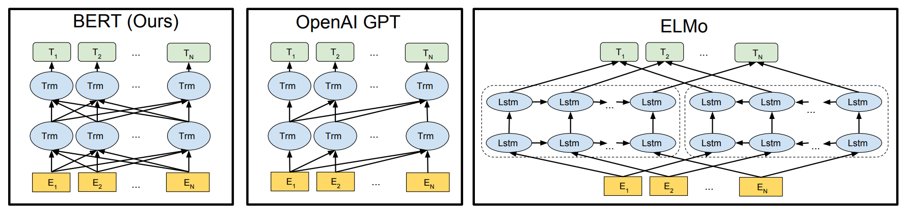

### Masked Language Model

因为 BERT 的内部结构（如下所示）完全和 Transformer 的 Encoder 一样，因此不再展示其内部结构，用一个黑匣子来代替。


MLM 可以理解为完形填空，BERT 会随机 mask 句子中 15% 的词（其实就是用特殊的符号 "[MASK]" 去替换掉这 15% 的词），然后根据这些被 mask 掉的词的上下文来预测这些词。例如 my dog is hairy → my dog is [MASK]，此处将 hairy 进行了 mask 处理，那么我们就要采用非监督学习的方法根据 "my dog is" 来预测 hairy 这个词。具体的方法（如下图所示）就是，将那些被 mask 掉的词的位置所输出的词向量分别用 (全连接层 + softmax) 的方式进行处理，得到关于词汇表中每个词的概率分布，取其中概率最大的那个词作为相应位置的词向量所预测的词，即一个被 mask 掉的位置输出一个词，该词就作为该 mask 掉的词的预测。

> mask 掉部分词做预测的原因：BERT 在预测时具有信息的穿越，它可以看到所要预测的信息在原句中的位置，因此会把原句的信息直接映射到输出，这样就没有办法很好的学习。比如在预测词 X 时，BERT 实际上是看着 X 来预测 X 的，这样并没有什么意义。所以 BERT 使用了一个 trick，即当 BERT 预测词 X 时，将原句中的 X 给遮住，不让模型看到 X，然后用前后文的信息来预测 X。这个 trick 就像完形填空：把句子的某些地方挖空，让模型来填充。


但是该方法有一个问题，对于句子中被 mask 掉的词，在没有被填入新的词的时候，它应该表示的是无或没有的意思，但模型不理解，它会认为这个地方就是一个叫做 "[MASK]" 的词，然后要根据这个词来预测另一个词。为了解决这个问题，BERT 做了这样的处理：在整个训练过程中，① 80% 的时间是采用 [mask] ，即 my dog is hairy → my dog is [MASK]；② 10% 的时间是随机取一个词来代替 mask 的词，即 my dog is hairy -> my dog is apple；③ 10% 的时间保持不变，即 my dog is hairy -> my dog is hairy。

> 也可以这样理解，每回合训练取 15% 的词进行处理，其中在这 15% 的词当中，取 80% 进行 mask，取 10% 进行替换，取 10% 保持不变。

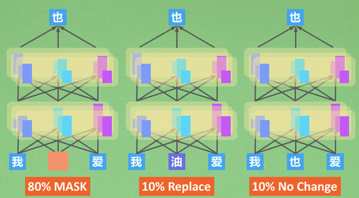

该策略令到 BERT 不再只对 [MASK] 敏感，而是对所有的 token 都敏感，以致能抽取出任何 token 的表征信息。

> 1. 用词还是用字？
>
>    上面说的都是用词作为序列的 token，实际上在用中文做 BERT 的训练时，用字作为序列的 token 会更好。因为在中文里，词的数量是非常多的，但字的数量却少很多，因此用字作为 token 时，会更为合理。
>
> 2. MLM 训练出来的 embedding 是怎样的 embedding？
>
>    如果两个词填在同一个地方没有违和感，那么这两个词就会有类似的 embedding。

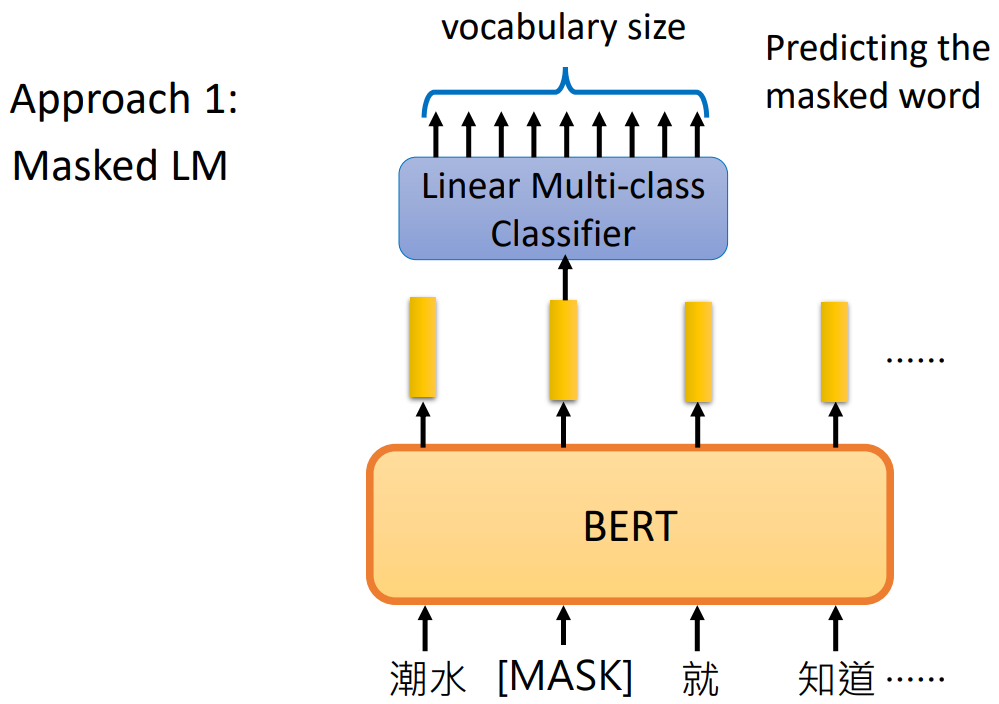

### Next Sentence Prediction

NSP 就是给出两个句子，然后判断这两个句子之间是否具有关联性（可以不可以接在一起或接在一起通不通顺）。如下图所示，BERT 首先会将两个句子拼接在一起（用一个特殊符号 "[SEP]" 来分割两个句子，表明前后分别是两个不同的句子），然后作为一个序列输入到模型中，为了可以完成这个分类任务（预测前后句是否可以相接），还要引入一个特殊符号 "[CLS]"（这个特殊符号表明要做分类任务）放在序列的开头，经过 BERT 的内部处理后，就会得到序列中每个词（包括 "[CLS]" 和 "[SEP]"。"[SEP]" 的 embedding 一般没有什么作用，"[SEP]" 本身就只是拿来区分前后句而已）的 embedding，接着将 "[CLS]" 输出的 embedding 用 (全连接层 + softmax) 的方式进行处理，得到一个二值概率分布（可以相接的概率和不可相接的概率），取其中概率最大的情况作为预测的结果。

> "[CLS]" 应该放在哪里？如果 BERT 的内部架构为 RNN，那么 "[CLS]" 应该放在序列的末端，因为要等模型看过整个序列后，模型才有能力对 "两个句子之间是否具有关联性" 进行判断。但现在 BERT 的内部架构不是一个 RNN，而是 self-attention（序列中任意两个词不会因为距离改变而变化），所以 "[CLS]" 放在序列中的任何位置都可以，但一般放在句首比较方便。


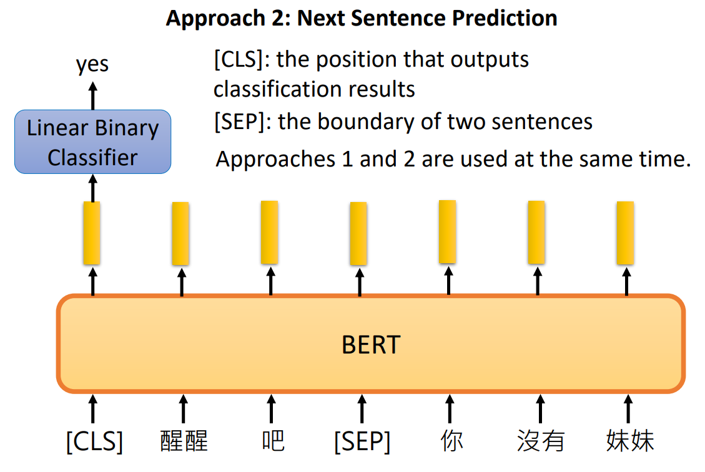

### BERT 的 loss

BERT 的训练样本：

```
Input1 = [CLS] the man went to [MASK] store [SEP] he bought a gallon [MASK] milk [SEP]
Label1 = IsNext

Input2 = [CLS] the man [MASK] to the store [SEP] penguin [MASK] are flight ##less birds [SEP]
Label2 = NotNext
```

把每一个训练样本输入到 BERT 中可以相应获得两个任务（MLM 和 NSP）对应的 loss，再把这两个loss加在一起就是整体的预训练 loss，也就是两个任务同时进行训练。

需要注意的是，在做 BERT 模型的预训练的时候，为了完成 MLM 和 NSP 这两个预训练任务，引入了两个分类器（一个用于输出预测的词，一个用于输出上下文关系判断的结果），这两个分类器都由全连接层组成，其中的参数是和  BERT 内部架构一起被训练的。当训练好 BERT 后，就可以把这两个分类器拿掉，只用 BERT 的内部架构去做下游任务。

### BERT 的输入

BEERT 的输入是 word embedding、segment embedding 和 position embedding 的相加，具体的操作如下图所示。

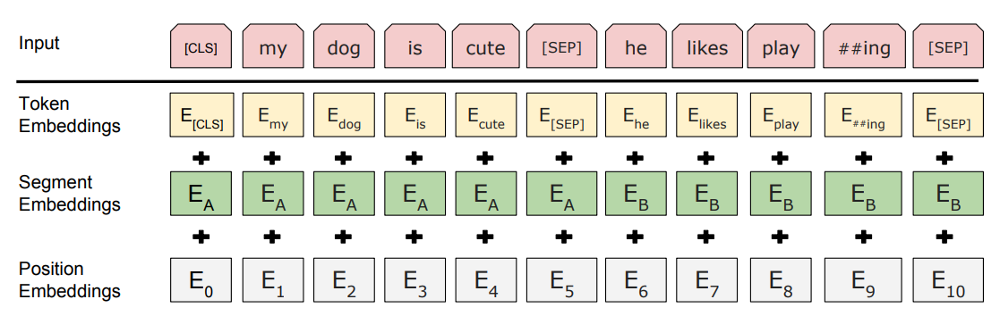

 ### Fine-tuning BERT

BERT 模型被预训练出来后，就可以把其中的内部架构拿出来做下游任务了。这时由两个方法，第一个方法就是将 BERT 当成一个特征提取器，只取它训练出来的各个词的 embedding 去做其他任务；另一个方法是将 BERT 接入到其他任务的模型当中，与任务的模型一起被训练，但 BERT 在训练时它内部的参数仅仅是做微调（Fine-tuning），而任务的模型是从头开始被训练的。下面提出了四种 Fine-tuning BERT 的下游任务：

#### 句子分类

输入一个句子，输出该句子的所属的类别。同样需要引入一个分类符号 "[CLS]" 到序列开头，表明这是做分类任务的，同时这个分类符号由 BERT 输出的 embedding 用于输入到任务模型中进行处理，然后输出一个类别作为预测的结果。

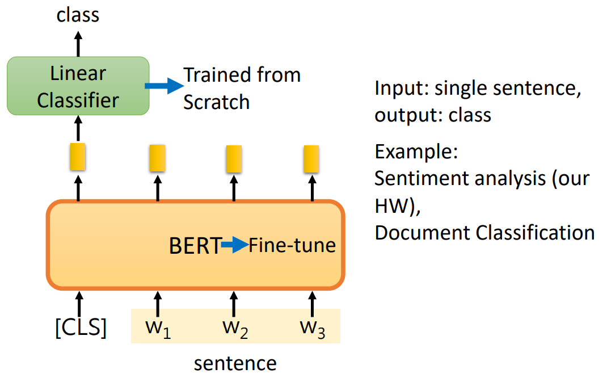

#### slot fitting

输入一个句子，输出该句子中每个词所属的类别。

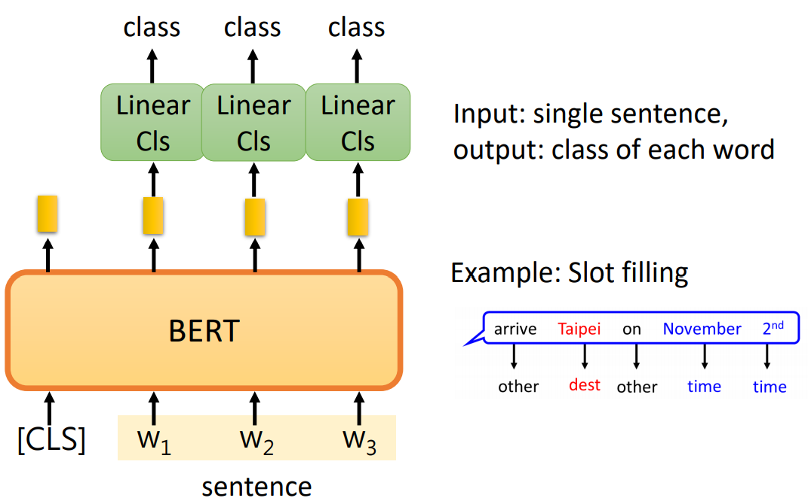

#### 文本推论

输入两个句子（前提、假设），输出一个类别（错、对、无法判断），该类别表示根据假设，这个前提是错的、对的，还是无法判断。

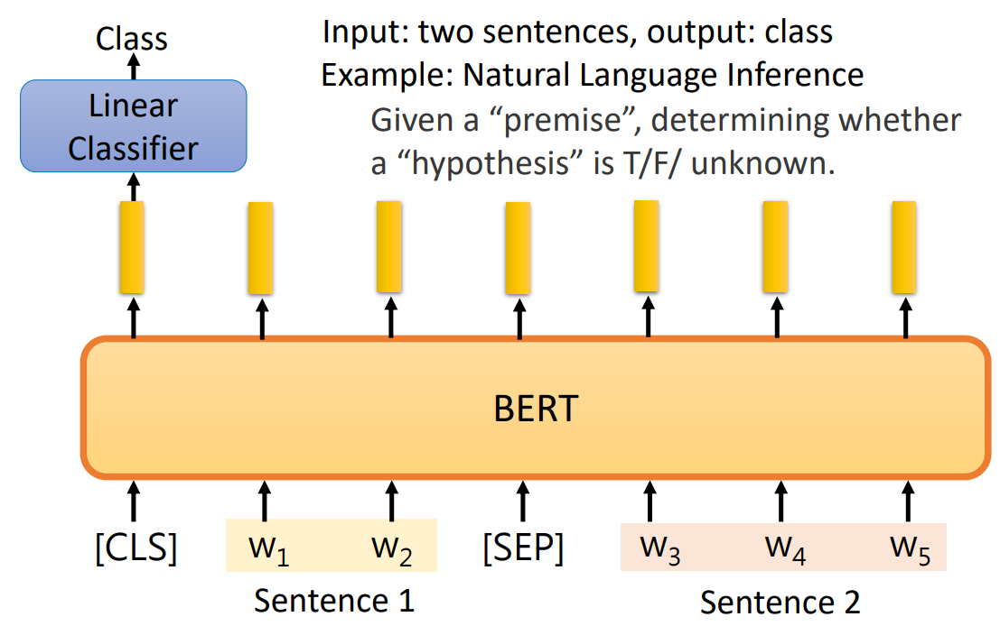

#### 阅读理解

输入两个句子（文章、问题），输出这个问题的答案。其中，答案必定在文章中出现，因此，模型返回的答案其实是答案在文章中的两个整数索引，即答案开始索引和答案结束索引。

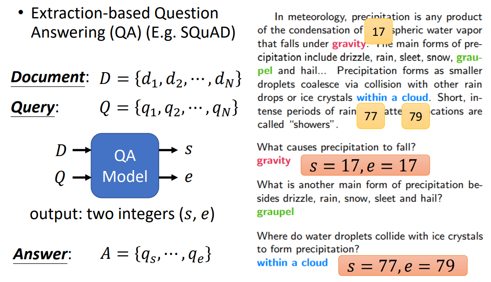

模型工作原理：

1. 首先输入两个句子，分别为问题和文章；
2. 初始化两个向量 $vec_s$ 和 $vec_e$，$vec_s$ 用于求答案的开始索引，$vec_e$ 用于求答案的结束索引；
3. （左图）将 $vec_s$ 与文章中每个词的 embedding（由 BERT 输出的）做矩阵相乘，然后用 softmax 进行处理，得到一个关于文章中每个词的概率分布，取其中概率最高的那个词在文章中的索引作为答案的开始索引；（右图）$vec_e$ 同理，可以得到一个答案的结束索引；
4. 如果结果是结束索引小于开始索引，则这种情况的输出就是 "此题无解"。

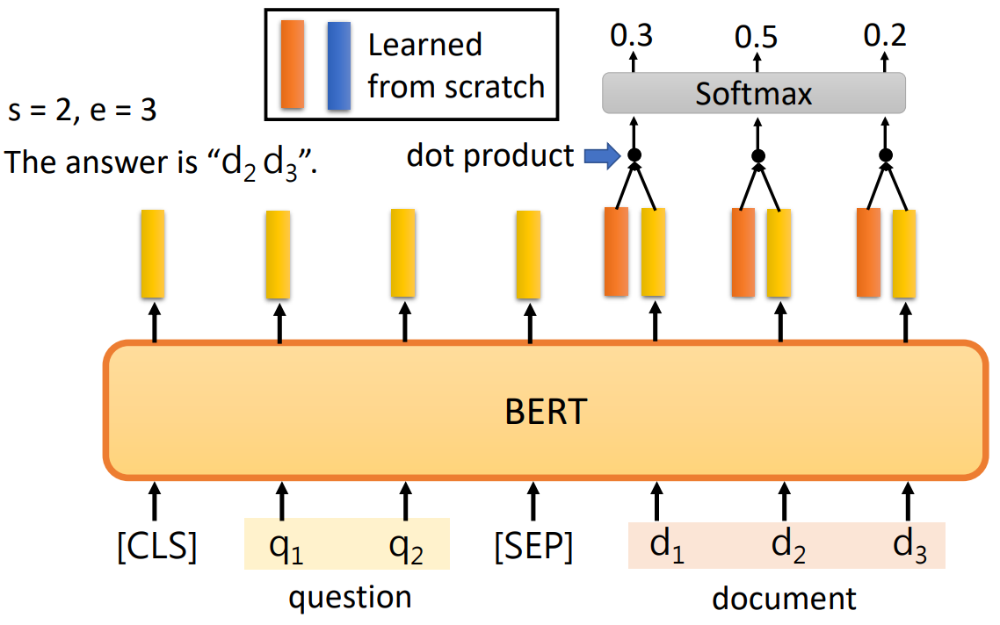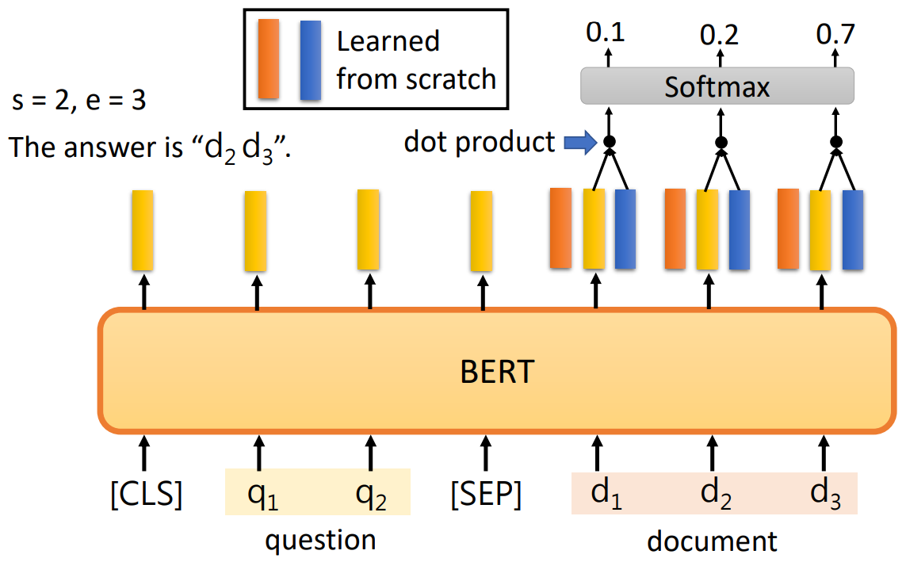

在上述中的两个向量 $vec_s$ 和 $vec_e$ 属于任务模型的参数，是从头开始学习的。

### 如何使用 BERT 训练出来的词向量？

BERT 训练处理的词向量有很多层，也就是说，BERT 中每一层 attention layer 输出的 embedding 都可以作为对应词的词向量，面对这么多的词向量，我们应该取哪一层或哪些层的 embedding 进行使用呢？实际上，BERT 每一层训练出来的 embedding 都有不同的含义，我们可以根据任务的类型取合适含义的那一层或哪些层的 embedding 进行使用。如下图所示：

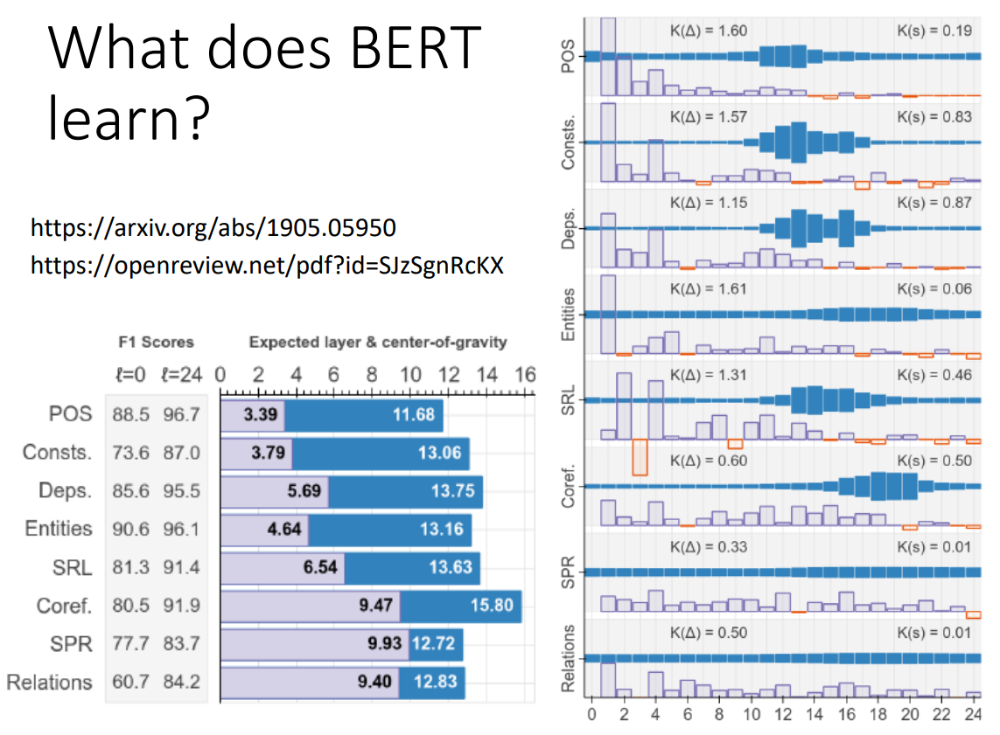

其中，左图表示的是 BERT 每一层 embedding 的含义，右图表示的是一些任务需要 BERT 的哪些层的 embedding 来完成。

### 其他版本的 BERT

1. ERNIE 是 BERT 的专门设计于汉字的版本。

   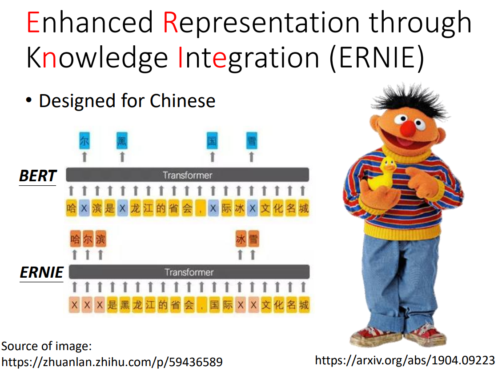

2. Multilingual BERT 是在 104 种语言上训练出来的 BERT 模型，具体参考文章 [Beto, Bentz, Becas: The Surprising Cross-Lingual Effectiveness of BERT](https://arxiv.org/abs/1904.09077)。

### 如何提速 BERT？

BERT 训练了 10000 步还收敛不到一个好结果，而 GPT 只需要 5000 步就能收敛得比较好了。这是为什么呢？ 最主要的原因是 BERT 每次的训练太没有效率了，每次输入全部训练数据，但是只能预测 15% 的词，而 GPT 能够预测 100% 的词，因此 BERT 的訓練會比 GPT 慢很多（如下图所示）。

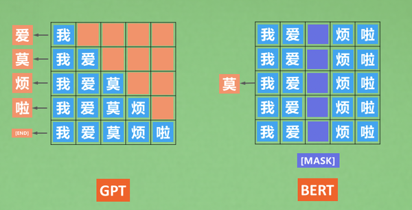

1. 莫烦提出的方法：在每回合训练中，当计算 attention 时固定 mask 掉对角线的 token，而不是在训练前随机 mask 掉序列中的 15% token。每行计算出来的 attention 就用于预测该行被 mask 掉的那一个词。这个方法表面上看，在预测某个 token 时所计算出来的 attention 不会携带被 mask 掉的那个 token 的信息（如果携带了被 mask 掉的词的信息，就相当于是看着正确结果进行预测了，这样进行训练就没有任何意义了），但实际上，每次计算完 attention 后还会用残差进行处理（即将计算出来的 attention 矩阵加上原始输入的词向量矩阵），这样第一行的 attention 就会加入关于 "我" 这个词的词向量，从而使 attention 被迫引入了被 mask 掉的那个词 "我" 的信息，其他行的 attention 都是一样的。因此，这个方法不太行。

   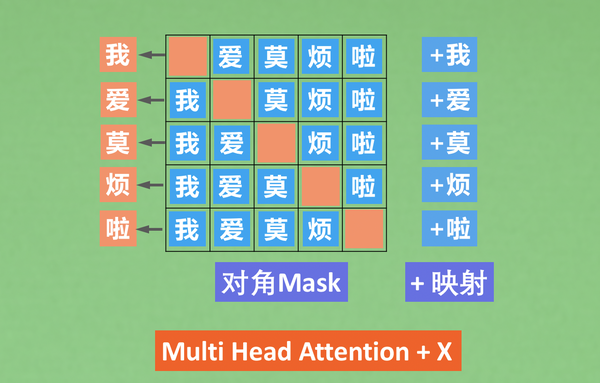

2. 莫烦提出的改进：为了解决由于残差导致的信息泄露，莫烦将 mask 的位置进行了偏移（如下图所示），这样即使通过残差处理后，由于第一行 attention 加入的是 "我" 这个词的信息，不会引入关于 "爱" 这个实际上被 mask 掉的词的信息，因此就不会出现预测信息的泄露了。实际上，这个偏移后的位置也可以在其他地方，只有不是在对角线就行了。

   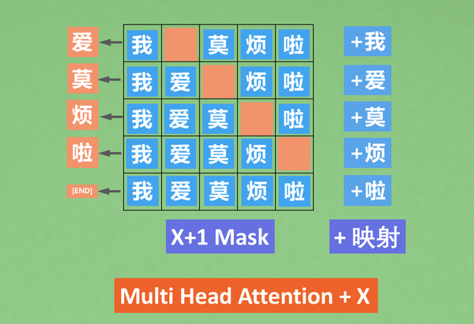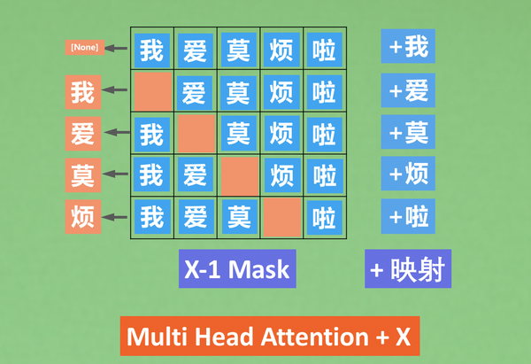

3. 还有一个问题：虽然上面看似解决了信息泄露的问题，但仔细一看，信息泄露还是存在的。因为 BERT 模型包含多层 attention layer，第一层 attention layer 所计算出来的 attention 确实不会包含被 mask 掉的那个词的信息，但到了第二层及第二层以上后，由于第一层所计算出来的 attention 混杂了被 mask 掉的那些词的信息，比如（左图）最后一行就包含了所有被 mask 掉的词的信息，第一行也有其他行中被 mask 掉的词的信息，因此在进行第二层及第二层以上的 attention 时，这些信息都会被混入到所有被计算出来的 attention 当中，所以到最后还是会出现预测信息泄露的情况。

4. 莫烦的思考：这种重组信息带来的信息穿越会有多大影响？会不会在任务上带来负面影响？在获得速度的基础上是不是会牺牲掉一些精确度？ 对比AutoEncoder的X预测X的方式是，它同样会遇到信息穿越的问题，但是它通过压缩和解压的方式，在信息穿越中加入了信息重组的概念，那么是否也可以引入这些概念来优化我这种 BERT 训练加速方案呢？

5. 与莫烦这个想法类似的方法：[Fast and Accurate Deep Bidirectional Language Representations for Unsupervised Learning](https://arxiv.org/pdf/2004.08097.pdf)。

## ULMFiT

[Universal Language Model Fine-tuning for Text Classification](https://arxiv.org/pdf/1801.06146.pdf)

[ULMFiT - CSDN博客](https://blog.csdn.net/triplemeng/article/details/82828480)

[ULMFiT 阅读笔记 - 博客园](https://www.cnblogs.com/dtblog/p/10471244.html)
