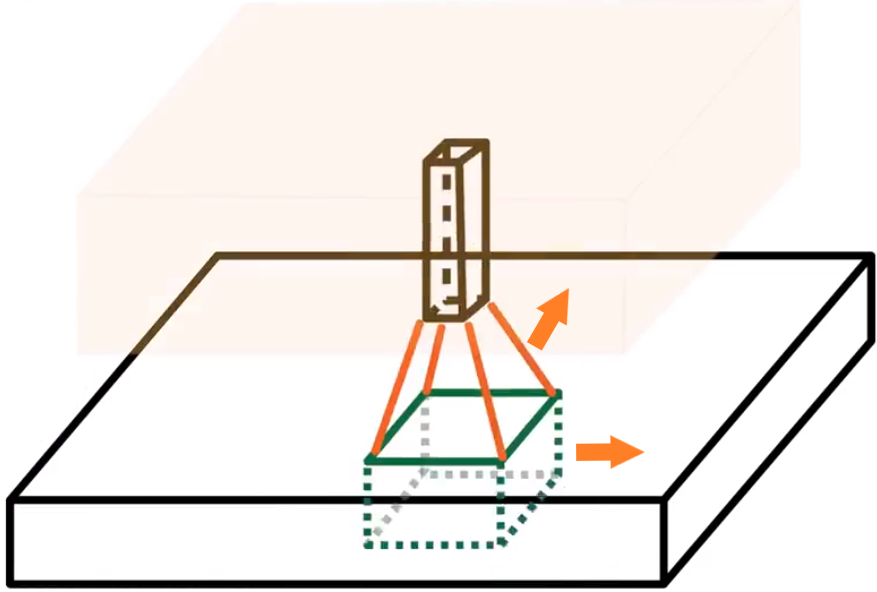
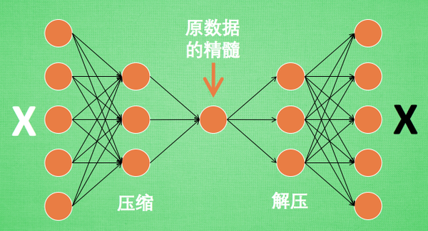
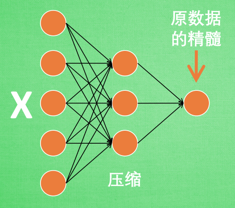
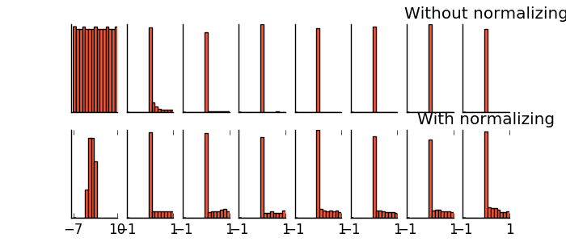

# 版本说明

> 其他机器学习框架：**PyTorch**、scikit-learn、CNTK、MXNet、Caffe/Caffe2、Keras、DL4J、**PaddlePaddle**、Lasagne
>
> 该仓库的 demos 所采用的 tensorflow 版本都采用下述安装说明指定的版本。

## 在Anaconda上安装TF

```bash
conda create --name tf2 python=3.7
conda activate tf2
pip install tensorflow==2.2
# 也可以使用 conda install tensorflow 来安装 TensorFlow，不过 conda 源的版本往往更新较慢，难以第一时间获得最新的 TensorFlow 版本
# 从 TensorFlow 2.1 开始，pip 包 tensorflow 包含 GPU 支持，无需通过特定的 pip 包 tensorflow-gpu 安装 GPU 版本。如果对 pip 包的大小敏感，可使用 tensorflow-cpu 包安装仅支持 CPU 的 TensorFlow 版本
# 如果对磁盘空间要求严格（比如服务器环境），可以安装 Miniconda ，仅包含 Python 和 Conda，其他的包可自己按需安装
# 如果在 pip 安装 TensorFlow 时出现了 "Could not find a version that satisfies the requirement tensorflow" 提示，比较大的可能性是使用了 32 位（x86）的 Python 环境。请更换为 64 位的 Python。可以通过在命令行里输入 python 进入 Python 交互界面，查看进入界面时的提示信息来判断 Python 是 32 位还是 64 位
```

## 检查TF是否安装成功

```python
import tensorflow as tf

A = tf.constant([[1, 2], [3, 4]])
B = tf.constant([[5, 6], [7, 8]])
C = tf.matmul(A, B)

print(C)
# tf.Tensor(
# [[19 22]
# [43 50]], shape=(2, 2), dtype=int32)
```

## 让TF支持GPU

1. 安装 NVIDIA 的驱动程序（一般自带）

2. 安装 CUDA Toolkit 和 cuDNN

   ```bash
   conda install cudatoolkit=10.1 # cudatoolkit 的版本根据驱动程序的版本来选择，具体查表 https://docs.nvidia.com/cuda/cuda-toolkit-release-notes/index.html
   conda install cudnn=7.6 # cudnn 的版本根据 cudatoolkit 的版本来选择，具体查表 https://developer.nvidia.com/rdp/cudnn-archive
   
   # 注意，tensorflow 的版本也应该按照 cudatoolkit 和 cudnn 的版本来选择，具体查表 https://tensorflow.google.cn/install/source_windows
   ```

3. 查看当前 Tensorflow 使用的是 CPU 还是 GPU

   ```python
   from tensorflow.python.client import device_lib
   print(device_lib.list_local_devices())
   ```

# 关于tf的注意事项

1. 如果要对一个 tf 变量赋以新的值，则应该用 tf.assign 函数，直接通过等号进行赋值，结果是把引用该 tf 变量的 python 变量的引用变成了其他 tf 张量，原来要赋新值的 tf 变量根本就没有改变。
2. 用 tf.assign 函数进行赋值是一个非即时性的 tf 操作，在 sess.run 之后才会被真正地执行。

# 卷积神经网络

## 什么是CNN?

卷积神经网络有一个批量过滤器，持续不断地在图片上滚动并收集图片里的信息，每一次收集的时候都只是收集一小块像素区域，然后把收集来的信息进行整理，这时候整理出来的信息有了一些实际上的呈现，比如这时的神经网络能看到一些边缘的图片信息，然后在以同样的步骤，用类似的批量过滤器扫过产生的这些边缘信息，神经网络从这些边缘信息里面总结出更高层的信息结构，比如说总结的边缘能够画出眼睛、鼻子等等。再经过一次过滤，脸部的信息也从这些眼睛鼻子的信息中被总结出来。最后我们再把这些信息套入几层普通的全连接神经层进行分类，这样就能得到输入的图片能被分为哪一类的结果了。

假设有一张图片，图片有长、宽、高三个参数，这里的高指的是计算机用于产生颜色使用的信息，如果是黑白照片的话，高的单位就只有1；如果是彩色照片，就可能有红绿蓝三种颜色的信息，这时的高度为3。我们以彩色照片为例子，过滤器就是影像中不断移动的东西，它不断在图片上收集小批小批的像素块，收集完所有信息后输出的值，我们可以理解成是一个高度更高，长和宽更小的"图片"， 这个图片里就能包含一些边缘信息。然后以同样的步骤再进行多次卷积，将图片的长宽再压缩，高度再增加，就有了对输入图片更深的理解，将压缩、增高的信息嵌套在普通的分类神经层上，我们就能对这种图片进行分类了。


在每一次卷积的时候，神经层可能会无意地丢失一些信息。这时，池化就可以很好地解决这一问题，而且池化是一个筛选过滤的过程，能将 layer 中有用的信息筛选出来给下一个层分析，同时也减轻了神经网络的计算负担。也就是说在卷积的时候，我们不压缩长宽，尽量地保留更多信息，压缩的工作就交给池化了，这样的一项附加工作能够很有效的提高准确性。


## 卷积的过程

卷积核可以看成是一个n×m个格子大小的滑动窗口，每个小格都有自己的权重参数。

卷积就是将卷积核覆盖的像素值与对应格子内的参数进行运算来得到一个新的值，这个值就可以作为描述该范围内像素值的特征。或者说，卷积将n×m个像素点的信息压缩成了一个可以囊括这些信息的点。




卷积核通过在图像上不断移动来进行采样，然后将采样到的n×m个像素点进行卷积，如果每次移动的步长只有1，即窗口（卷积核）每次只移动一个像素点，则相当于在每一个像素点上都会进行一次采样并卷积，每个像素点都会产生一个新的特征，在一个卷积核扫描完成后，就会将所有产生的新特征进行合并作为新的图像（feature map），而且卷积后的图像的长宽不会减小，因为新产生的特征数和原图像的像素点数一样。


如果每次移动的步长为2，即窗口（卷积核）每次移动2个像素点，则相当于每2个像素点进行一次采样并卷积，每2个像素点产生一个新的特征，因此，卷积后的图像的长宽会减小一半（新产生的特征数是原图像的像素点数的一半）。

一个卷积核扫描完后就产生一层图像（即经过整个卷积层处理后所产生图像的其中一个通道），多个卷积核就会产生多层，这样最后输出的特征图与最初输入的图像相比，其高度就是增加的。

## CNN如何识别图片

为什么可以用卷积核（或者说是少量参数、局部信息）来识别图片？

1. 识别一个图片并不需要去看完整的图片，比如我们识别一只鸟，那我们只需要看这张图的局部信息，比如有没有鸟嘴、鸟爪、翅膀等，这些信息整合起来，我们就可以认定这是不是一只鸟。因此我们完全可以只看一个卷积核大小的区域来识别一张图片，继续拿识别鸟的例子来说：我们可以让一个卷积核仅仅去识别一个特定的局部信息，比如我们拿一个卷积核去识别鸟嘴，一个卷积核去识别鸟爪，另一个卷积核去识别翅膀，将这些卷积核放到一起工作，它们就有能力去识别一只鸟。
2. 此外，对于鸟的一个局部（比如鸟嘴），它不会因为它在图片中的位置不同而展现出不同的特征，如果一个卷积核在图片的某个局部训练出了能识别鸟嘴的能力，那么它这个能力同样可以应用在图片的不同地方，也就是说，为了识别一张图中是否有鸟嘴，我们只需要用一个已经训练出可以识别鸟嘴的卷积核去扫描图片的不同地方，只要图片中有鸟嘴，这个卷积核就可以识别出来，这也就是一个卷积核在采样计算时可以使用同一套权重参数的原因。
3. 综上，由于图片局部特征的不变性以及可以通过叠加局部特征来识别整体的特点，我们完全可以用多个卷积核（且每个卷积核在每次采样计算时都采用同一套权重）来代替复杂的全连接层（参数巨多）去识别一整张图片中是否有鸟。

## NOTE

4. 如果卷积窗口移动的步长比较小，则每次采样的部分就有重叠。

5. 在一个卷积核的处理过程中，每次采样计算所使用的权重都来源于同一个卷积核，也就是说每次采样都用同一套权重，这种共同使用同一套权重的方法就叫做权重共享（[如何理解卷积神经网络中的权值共享?](https://www.zhihu.com/question/47158818)），权重共享大大减少了模型参数。

6. 同一卷积层的多个卷积核同时在同一个输入图像上进行采样处理，然后分别输出自己对这张图片的理解，最后叠加在一起作为该层卷积层的输出。

7. 卷积的作用不是为了降维，但有降维的效果，其主要作用是为了抓取主要信息，忽略次要信息。

8. 卷积在采样时有两种padding（填充）方式。一种叫valid，它保证每次采样的块都在图片上，如果图像边缘部分的像素点不足以被采样，则它会将这部分的像素点给舍弃，因此valid填充方式可能会使得图像在卷积后的长宽减小（步长为1的情况下）；另一种叫same，它与valid不同的是，它不会将不足以采样的部分舍去，而是将其进行填充（比如用0填充），使得这部分的像素点增加到可以被刚好采样的地步，因此same填充方式会使得图像在卷积前后保持长宽不变（步长为1的情况下）。

   

9. 池化的作用也不是降维，而是在卷积的基础上选取更加有用的特征，从而减小数量，也就是说池化后的图像的长宽会变，但高度不变。有两种池化方法，一种是max，它将池化范围（由ksize指定）内的最大值作为这部分的特征；一种是average，它将池化范围（由ksize指定）内的平均值作为这部分的特征。同样，池化后图像长宽会减小的原因还是在于步长大于1，由此使得总的采样数小于原图像的像素点数。（或者说，池化和卷积的过程是一样的，区别就在于它们提取特征的方式）

10. 池化的原理：对于一个image，通过做subsampling，比如把一个image的奇数行或偶数列的pixel拿掉，变成原来十分之一的大小，它其实不会影响人对这张image的理解。池化就是利用这个概念来缩小图片，同时不会破坏图片的可辨识度（甚至可以把更主要的特征抽取出来）。

11. 一般卷积后得到的结果要经过激活函数的处理，然后再交给池化层处理。这样做的目的是，卷积的过程还是线性的，增加激活函数，可以赋予其非线性的能力。

12. 对于卷积，处理后得到的图像，其长宽是否缩减取决于卷积的步长，其通道数（深度）取决于使用的卷积核数，卷积核的大小仅仅影响采样的窗口大小，它是指要在多大块的像素点上提取特征；对于池化，处理后得到的图像，其长宽是否缩减取决于池化的步长，其通道数（深度）不会改变，池化核的大小仅仅影响采样的窗口大小，它是指要在多大块的像素点上提取特征。

13. 标准的CNN框架：

    

    > ① 要生成一个pattern，不用看整张的image，你只需要看image的一小部分；
    >
    > ② 通用的pattern会出现在一张图片的不同的区域；
    >
    > ③ subsampling不会改变物体。

## 举个栗子

1. 左侧input图片是灰度图32×32像素，深度（颜色通道）是1。经过第一个卷积层后变成28×28的feature map，深度变为6，这说明第一个卷积层有6个卷积核，大小为5×5；

2. 接着经过池化层，feature map大小变为14×14，深度为6；

3. 然后经过第二个卷积层，第二个卷积层的有16个卷积核，且大小为5×5，因此得到了10×10深度为16的feature map；

4. 紧接着经过第二个池化层，feature map变为大小5×5，深度为16；

5. 最后面就是两个全连接层，用于将卷积池化得到的feature map进行具体的应用。

   

## 总结

假设输入图片的长宽为28x28，特征通道（深度）有3个（3个颜色通道），某一个卷积层有36个大小为5x5卷积核（窗口、patch、过滤器）。若步长为1，则经过该卷积层处理后，会产生长宽为28x28且特征通道为36个的特征图；若步长为2，则经过该卷积层处理后，会产生长宽为14x14且特征通道为36个的特征图。具体卷积过程如下：

1. 一个卷积核大小为5×5（看成5x5的格子，每个格子上都有一个权重参数） ，则一次采样的像素点为5×5个，将这些像素点的值与该卷积核的权重参数进行运算，则可以得到此次采样的特征，将所有采样计算出来的特征合并起来，就是一层特征图（feature map），该特征图也就是一个卷积核处理的结果。36个卷积核就会产生36个特征图，将这些特征图叠加起来，就是整个卷积层的输出特征图，原来的36个特征图就对应输出特征图的36个通道。（如何提取特征）
2. 卷积核通过在图像上不断移动来采样像素点。若步长为1，则是每移动一步（跨过一个像素点）对图像采样一次，这样就相当于每一个像素点采样一次，所以采样得到的总特征数和图像的总像素点数相同，这说明图像经过卷积核处理后产生的特征图和原图像的大小一样；若步长为2，则是每移动两步（跨过两个像素点）对图像采样一次，这样就相当于每两个像素点采样一次，所以采样得到的总特征数是图像总像素点数的一半，这说明图像经过卷积核处理后产生的特征图大小是原图像的一半。（如何采样）
3. 卷积核在图像上采样时，可能会遇见像素点不够5x5的情况（在图像的边缘部分进行采样），这时就需要用paddding（填充）技术来处理。若padding方式为valid，则是保证每次采样的像素点都在图像上，不足以采样的部分就舍去；若padding方式为same，则是对不足以采样的部分用0进行填充，这样就可以保证图像的每个像素点都能得到处理。（如何填充）
4. 池化的过程和卷积差不多，区别主要在于抽取特征的方式（卷积是通过权重计算来获取特征）。对于最大值池化，就是取采样窗口中的最大值作为此次采样的特征；对于平均值池化，就是取采样窗口中的平均值作为此次采样的特征。通常池化的步长要大于1，这样池化后的图像的大小就能缩减，以减少后续的计算量。（如何池化）

# 循环神经网络

## 什么是RNN？


这种具有记忆的neural network就叫做Recurrent Neural network(RNN)。在RNN里面，每一次hidden layer产生的output都会被存到memory里去(用蓝色方块表示)。当下一次有input时，这些neuron不只是考虑$x_1,x_2$，还会考虑存到memory里的值，也就是说，对它来说除了$x_1,x_2$以外，这些存在memory里的值$a1,a2$也会影响它的output。

举例说明：


另一个例子：这三个network都是同一个network在三个不同的时间点被使用了三次。


相同的输入值，由于不同的值存储在记忆中，其输出值也会不同。


RNN可以是deep的，比如有多个hidden layer，每次预测时都会把每个hidden layer的输出存到memory中，然后在下一次预测时，每个hidden layer都会把之前存在memory的值取出来，与输入一起运算。


Recurrent Neural Networ会有不同的变形：Elman network是把每个hidden layer的值存起来；Jordan network存的是整个network output的值。


Bidirectional neural network是一个双向的RNN：在这个network中，同时train一个正向的RNN，又可以train一个逆向的RNN，然后把这两个RNN的hidden layer拿出来，都交给一个output layer得到最后的output。这种双向的RNN在预测时可以兼顾前后的情况，比如预测某个句子中的一个单词时，可以看见该单词前面的其他词汇，也可以看见该单词后面的其他词汇，这样综合起来，就相当于先把整个句子看完了，然后在做出预测，这比单向RNN只能看到句子的一半要好得多。


## LSTM

### 什么是LSTM？

LSTM（长的短期记忆）的解释：之前讲的RNN，它的memory在每一个时间点都会被洗掉，只要有新的input进来，每一个时间点都会把memory洗掉，所以它的short-term是非常short的，但如果是Long Short-term Memory，它记得会比较久一点，只要forget Gate不决定要忘记，它的值就会被存起来。

LSTM是对之前讲的memory（每当有一个input进来，就把它记住，同时还会遗忘之前的input）的一种改进：

1. 增加了三个门控：input gate、output gate和forget gate。input gate用于控制外界的input是否应该被记住，如果这个gate关闭了，则input就不能被记住；output gate用于控制外界是否可以从memory cell中读取记忆，如果这个gate关闭了，则外界就得不到memory；forget gate用于决定什么时候应该把之前的记忆给格式掉，如果这个gate打开了，则之前的memory就会被删掉。
2. 这个memory有四个input和一个output。这四个input分别是控制三个gate的信号，用于决定这三个gate的打开和关闭，以及一个外界想要存到memory的值；这唯一的output就是输出给外界的记忆。
3. 这三个gate的打开和关闭完全是由RNN自己学习的，由它自己决定什么时候打开它们，什么时候关闭它们。


进一步讲解LSTM：

1. 假设Z是想要被存储的外界input，$Z_i$是控制input gate的signal，$Z_f$是控制forget gate的signal，$Z_o$是控制ouput gate的signal。
2. $f(Z_i)$、$f(Z_f)$和$f(Z_o)$分别是这三个信号经过activation function后的值，这里的activation function通常选择sigmoid，因为sigmoid是将值映射到0-1之间，可以用来表示gate被打开的程度（1表示打开，0表示关闭）。
3. 假设memory中已经存在记忆c，那么新的记忆c'可以由此得到：$c'=g(z)f(z_i)+cf(z_f)$（需要被存入的记忆g(z)由$f(z_i)$，$f(z_i)$的值决定了g(z)可以被存取多少，原来的记忆c由$f(z_f)$控制，$f(z_f)$的值决定了c可以被留下来多少）；此外，被输出到外界的值a可以由此得到：$a=h(c')f(z_o)$（$f(z_o)$用来控制有多少的记忆可以被输出到外界）。

（NOTE：空心圆代表activation function）


举个例子：

1. 对于一个LSTM的memory cell，它的输入是一个三维向量x，它的输出是y，蓝色的框表示它的memory，一开始是0；
2. x1是外界输入的想要存入memory cell的值；当x2=1，表示打开input gate；当x2=-1，表示关闭forget gate（忘记之前的记忆）；当x3=1，表示打开output gate；
3. 第一个输入是(1,0,0)，由于x2=x3=0，所以外界的输入不会被存入，原有的memory也不会被遗忘，memory cell的值还是0，同时也不会输出任何值到外界；
4. 第二个输入是(3,1,0)，由于x2=1，所以外界的输入被存入，且原有的memory也不会被遗忘，因此memory cell的值变为0+3=3，同时x3=0，所以也不会输出任何值到外界；
5. 其他输入依次类推。


具体的运算过程（接上例）：

1. 对于memory cell的四个input，它实际上就是输入的三维向量(x1,x2,x3)通过linear transform（x1,x2,x3分别乘以权重再加上bias）所得到的结果。比如input gate的signal，它linear transform的weights为(0,100,0)，bias为-10，将输入向量(3,1,0)与此进行计算得$z_i=0×3+100×1+0×0+(-10)=90$，再经过sigmoid的得$f(z_i)=sigmoid(90)≈1$，这就是input gate的signal；
2. 通过上述计算，就可以得到memory cell的四个input，由此就可以更新memory cell中的记忆，以及决定是否将memory输出到外界。
3. NOTE：上面说了LSTM可以通过学习来知道何时需要打开或关闭gate，这里学习的东西其实就是此处linear transform的权重和bias。


### LSTM如何在network中工作？

1. 对于一个原始的神经网络，它的样子就是如下图所示，将input输入，经过神经元简单的linear transform计算并加上activation function，就可以得到output；

   

2. 如果要使用LSTM，就只需要简单地将原始神经网络中的神经元替换为LSTM即可。如下图所示，将原来的两个神经元替换成两个LSTM，由于input还是只有一个，但一个LSTM需要四个input，因此就通过四个不同的linear transform（每个linear transform都有不同的weights和bias），将唯一的input分成四个不同的input，然后输入到LSTM中。也就是说，原始神经元只有一个input和一个output，LSTM就有四个input（由原始神经元的一个input分解为四个）和一个output，即用LSTM替换原始神经元后，其参数量会变成原来的四倍。

   

### LSTM在实际中如何运作？（如何向量化）

1. 假设某一层有一排的LSTM，所有LSTM的四个input可以分别组成四个向量（$Z^f$、$Z^i$、$Z$、$Z^o$），每个向量的每一维就代表了一个LSTM的其中一个input，比如向量$Z^f$的每一维就是每个LSTM用于控制forget gate的input，这四个输入向量分别由四个权重矩阵和实际输入向量$X^t$相乘得到（四个权重矩阵的每一维就是每个LSTM中将实际input通过linear transform分别转化为四个input的权重参数）。其中，所有LSTM的memory cell中保存的记忆值可以组成向量$C^{t-1}$，该向量的每一维就是一个LSTM的记忆值。（t-1表示在时刻t-1）

   

2. 所有LSTM的在时刻t的output可以组成向量$y^{t}$，该向量的每一维就代表一个LSTM的ouput。该向量可以通过上面得到的四个向量（$Z^f$、$Z^i$、$Z$、$Z^o$），直接通过运算得到，运算过程如下图所示（蓝色圆圈表示的相乘是指element-wise，即按元素相乘）。此外，图中相加的结果就是此刻t要存放在memory中的值。

   

3. 将这个process进行下去，下一个时间点 t+1 的运算就如下图所示。此外，LSTM的input其实不仅仅考虑当前时间点 t+1 的实际输入$X^{t+1}$，它还要考虑前一个时间点t的记忆向量$C^{t}$和输出$h^{t}$（peephole）。所以总的过程就是，将$C^{t}$、$h^{t}$和$X^{t+1}$这三个向量并在一起，然后通过四个transform矩阵得到四个操纵gate的向量，这四个向量经过运算得到输出$y^{t+1}$和当前memory cell要存储的记忆向量$C^{t+1}$。

   

4. 实际上LSTM可以不只有一层，将上一层的输入接入下一层，就可以组成多层的LSTM，如下图所示：

   

> LSTM的简化版本就是GRU（只有两个gate，性能与LSTM差不多，参数少了三分之一），最简单的版本就是SimpleRNN，也就是没有gate的版本。

## RNN如何train？

RNN的cost function就是所有时间点的output和reference vector（label）的cross entropy之和，通过minimize这个cost，然后使用gradient descent去更新network的每一个参数，这样就完成了RNN的train。具体过程采用的是BPTT（随时间反向传播）：

1. 如果将RNN网络按照每一个时间点的顺序进行unfold，比如序列长度为100，则可以unfold成100层的神经网络，则在反向传播时，我们就需要分别利用梯度下降的方法去更新每一层神经网络的参数，只不过这100层的神经网络的参数都是一样的。也就是说，对于每一个时间点对应的神经网络，我们都需要去更新它的参数，但因为每个时间点对应的神经网络的参数都一样，所以就相当于在不同时间点对同一组参数进行反复更新。那么如何求某个时间点t所对应的参数梯度呢？由于时刻t的状态不仅对当前时刻的损失有贡献，它还对它之后每一个时间点的损失都有贡献，因此时刻t对应的参数梯度就应该是当前时刻的损失和后续所有时刻的损失对该参数的偏导之和。这就是BPTT的整个过程，总结起来就是一个时间点更新一次，每次更新的梯度由当前及后续所有时刻的损失决定。

   

2. 对于BPTT，如果序列长度为1000，则相当于对1000层的网络进行反向传播，即一次反向传播就需要对参数进行1000次的更新，因此计算量贼大。对BPTT的一个改进就是TBPTT，TBPTT的做法就是每前向传播k1个时间点，就反向传播k2个时间点。也就是说，TBPTT不会像BPTT那样，前向传播到最后一个时间点后再进行反向传播，而是每前向传播k1个时间点就进行一次反向传播，而且在每次反向传播时，不会从当前时间点一直传播到第一个时间点，而是仅仅传播k2个时间点就结束了（也就是不会对从第一个时间点到当前时间点的参数都更新一次，而是仅更新当前时间点和前k2-1个时间点的参数），即每次反向传播只会更新k2个时间点的参数（NOTE：每个时间点的参数都是一样的）。

   > 参考论文：[An Efficient Gradient Based Algorithm for On-Line Training of Recurrent Network Trajectories](http://citeseerx.ist.psu.edu/viewdoc/download?doi=10.1.1.56.7941&rep=rep1&type=pdf)
   
   

## RNN存在的问题

RNN的问题：RNN的error surface的变化是非常陡峭的，有一些地方非常的平坦，一些地方非常的陡峭，就像是悬崖峭壁一样。


出现这个问题的原因（用例子讲）：

1. 方法原理：梯度检验（把某一个参数做小小的变化，看它对network output的变化有多大，你就可以测出这个参数的gradient的大小）
2. 假设network只有一个neuron，这个neuron是linear。input没有bias，input的weight是1，output的weight也是1，transition的weight是w。也就是说，从memory接到neuron的input的weight是w。
3. 如果给neural network的输入是(1,0,0,...,0)，那这个neural network在最后一个时间点的output将会是$w^{999}$。
4. 现在假设w是我们要learn的参数，我们想要知道它的gradient，即当我们改变w的值时候，对neural的output有多大的影响。现在假设w=1，则$y^{1000}$=1，假设w=1.01，则$y^{1000}\approx 20000$，可以看见w有一点小小的变化，会对它的output影响非常大，即w有很大的gradient。有很大的gradient，我们就把learning rate设小一点就好了。但我们把w设为0.99，则$y^{1000}\approx0$，那如果再把w设为0.01，那$y^{1000}\approx0$，也就是说在1的这个地方有很大的gradient，但是在0.99这个地方就突然变得非常非常的小，这个时候你就需要一个很大的learning rate。
5. 结果就是，设置learning rate很麻烦，你的error surface很崎岖，你的gardient是时大时小的，在非常小的区域内，gradient有很多的变化。从这个例子你可以看出来RNN出现问题的原因，RNN training的问题其实来自它把同样的东西在transition的时候反复使用，所以这个w只要一有变化，它可能完全没有造成任何影响，但一旦造成影响，影响都是天崩地裂的，即gradient大的时候非常大，小的时候几乎没有。所以，RNN不好训练的原因不是来自activation function，而是来自于它有time sequence，同样的weight在不同的时间点被反复的使用。


解决方法：

1. clipping：当gradient大于某一个threshold的时候，不要让它超过那个threshold。比如当gradient大于15时，让gradient等于15就结束。因为gradient不会太大，所以你要做clipping的时候，就算是踩着这个悬崖上，也不会飞出来。

2. LSTM：LSTM可以把那些平坦的地方拿掉，从而解决gradient vanish的问题，但不会解决gradient explode的问题，即有些地方还是非常的崎岖，也就是说，LSTM的做法使得有些地方仍然是变化非常剧烈的，但是不会有特别平坦的地方。因此，在做LSTM时，可以放心地把learning rate设置的小一点，保证在learning rate很小的情况下进行训练。

   

   那为什么LSTM可以解决梯度消失的问题呢，为什么可以避免gradient特别小呢？

   RNN跟LSTM在面对memory的时候，它处理的操作其实是不一样的。在RNN里面，在每一个时间点，memory里面的值都是会被洗掉，但在LSTM里面不一样，它是把原来memory里面的值乘上一个值，再把input的值加起来放到cell里面，所以它的memory input是相加的。

   对于RNN，如果今天你的weight可以影响到memory里面的值的话，一旦发生影响，则这个影响会永远都存在，不像RNN在每个时间点的值都会被format掉。但是在LSTM里面，一旦对memory造成影响，那影响一直会被留着，除非forget gate要把memory的值洗掉，不然memory一旦有改变，只会把新的东西加进来，不会把原来的值洗掉，所以它不会有gradient vanishing的问题。

   > RNN中的output在时间轴上不断累乘W，而LSTM记忆单元只是forget一部分后加上一部分，累加不会导致梯度消失，因为保存了参数的低阶项。

   LSTM的第一个版本其实就是为了解决gradient vanishing的问题，所以它是没有forget gate，forget gate是后来才加上去的。在训练LSTM的时候，你要给forget gate特别大的bias，你要确保forget gate在多数的情况下都是开启的，只要少数的情况是关闭的。

3. GRU：LSTM有三个Gate，而GRU有两个gate，所以GRU需要的参数是比较少的。因为它需要的参数量比较少，所以它在training的时候是比较鲁棒的。如果你今天在train LSTM，你觉得overfitting的情况很严重，你可以试下GRU。GRU的精神就是：旧的不去，新的不来。它会把input gate跟forget gate联动起来，也就是说当input gate打开的时候，forget gate会自动的关闭（format存在memory里面的值），当forget gate没有要format里面的值，input gate就会被关起来。也就是说，你要把memory里面的值清掉，才能把新的值放进来。

# AutoEncoder

## 什么是自编码？


AutoEncoder可以看成是将图片进行压缩再解压的一个神经网络（将有很多feature的数据进行压缩，之后再进行解压的过程）。当压缩的时候，原有的图片质量被缩减，解压时用信息量小却包含了所有关键信息的文件恢复出原本的图片。



有时神经网络要接受大量的输入信息，比如输入信息是高清图片时，输入信息量可能达到上千万，让神经网络直接从上千万个信息源中学习是一件很吃力的工作。所以，何不压缩一下，提取出原图片中的最具代表性的信息，缩减输入信息量，再把缩减过后的信息放进神经网络学习，这样学习起来就简单轻松了。所以，自编码就能在这时发挥作用，通过将原数据（白色的X）压缩，解压成黑色的X，然后通过对比黑白X，求出预测误差并进行反向传递，逐步提升自编码的准确性。训练好的自编码中间这一部分就是能总结原数据的精髓。可以看出，从头到尾,只用到了输入数据X，并没有用到X对应的数据标签，所以可以说自编码是一种非监督学习。



到了真正使用自编码的时候，通常只会用到自编码前半部分，这部分也叫作Encoder编码器。编码器能得到原数据的精髓，然后我们只需要再创建一个小的神经网络学习这个精髓的数据，不仅减少了神经网络的负担，而且同样能达到很好的效果。自编码和PCA主成分分析在提取主要特征时发挥类似的作用，甚至超越了 PCA。换句话说，自编码可以像PCA一样给特征属性降维。

# 批标准化

批标准化（Batch Normalization）和普通的数据标准化类似，都是将分散的数据统一的一种做法，而具有统一规格的数据能让机器学习更容易学习到数据之中的规律。

在神经网络中，数据分布对训练会产生影响，比如经过隐藏层的输出一个非常大，则该输出经过像tanh的激活函数，它的值只能是无限接近于1，无论输出的值再怎么扩大，激活函数的输出也不会发生多大的变化。换句话说，神经网络已经对那些比较大的输出不敏感了，这就像我对轻轻和重重地拍打自己的感觉没有什么差别，我的感官系统失效了。因此，如果我们通过批标准化将隐藏层的输出的变化范围不会太大，让输出值始终处于激活函数的敏感部分，那么神经网络学习起来也会更好。

批处理化也可以看成神经网络的一层，通常放置在全连接层和激励函数之间，对全连接层的输出进行规范化。


假设全连接层的输出如下图的下方所示，可以看出，采用无批标准化的输出分布会非常宽泛，而使用批标准化的输出分布会集中在激活函数的输入敏感区间。


这两种输出分布经过激活函数所形成的输出分布如下所示，无批标准化的输出分布大部分都到了饱和阶段，也就是激活值不是-1，就是1，而经过批标准化后，大部分激活值在每个分布区间都还是存在的，将这个激活后的分布传递到下一层神经网络进行后续计算，可以发现每个区间都有分布的这一种对于神经网络就会更加有价值。


批标准化不仅仅是标准化了一下数据，它还在最后进行了反标准化的步骤（如下算法所示）。为什么要这样呢？这是为了让神经网络自己去学着使用和修改扩展参数$\gamma$和平移参数β，这样神经网络就能自己慢慢琢磨出前面的标准化操作到底有没有起到优化的作用，如果没有起到作用，那么就使用$\gamma$和β来抵消一些标准化的操作。


最后我们来看看一张神经网络训练到最后，代表了每层输出分布的图，这样我们就能一眼看出批标准化的功效了。批标准化的目标就是让每一层输出值在有效的范围内传递下去，也可以说，批标准化就是用来解决深度神经网络层数太多，而没办法有效前向传递的问题的一种有效方法。


下图是8层神经网络的每层输入分布（采用relu激活函数），可以看出，上排由于没有使用批标准化，所以每层的输入很快变成零0，也可以说所有的神经元都已经死了（没有效果了），而下排使用批标准化过后，每层的值都能有一个比较好的分布效果，大部分神经元都还活着。



# 迁移学习

"站在巨人的肩膀上"这句话放在机器学习中，就是所谓的迁移学习（transfer learning）。就像已有的事业，不用自己完全从头做，借鉴别人的经验，往往能节省很多时间。有这样的思路，我们也能偷偷懒，不用花时间重新训练一个无比庞大的神经网络，借鉴一个已经训练好的神经网络就行。

比如这样一个神经网络，我花了两天训练完之后，它已经能正确区分图片中具体描述的是男人、女人，还是眼镜。这说明这个神经网络已经具备对图片信息一定的理解能力，这些理解能力就以参数的形式存放在每一个神经节点中。不巧，领导下达了一个紧急任务，要求今天之内训练出来一个预测图片里实物价值的模型。我想这可完蛋了，上一个图片模型都要花两天，如果要再搭个模型重新训练，今天肯定出不来呀。这时，迁移学习来拯救我了。因为这个训练好的模型中已经有了一些对图片的理解能力，而模型最后输出层的作用是分类之前的图片，对于现在计算价值的任务是用不到的，所以我将最后一层替换掉，变为服务于现在这个任务的输出层。接着只训练新加的输出层，让理解力保持始终不变，即前面的神经层庞大的参数不用再训练，这节省了我很多时间，我也在一天时间内将这个任务顺利完成。

一般而言，迁移来的模型要么固定住已训练好的参数，要么使用更小的学习率来更新这些参数。

总结起来，迁移学习就是在训练好了的模型上接着训练其他内容，充分使用原模型的理解力。但如果对于一个模型，迁移前的数据和迁移后的数据差距很大，那么这个迁移来的模型并不会起多大作用，还可能干扰我后续的决策，因此我们就没有必要去迁移该模型。

拿CNN来举个例子，假如我训练好了一个区分男人和女人的CNN，接着来了个任务，说我下个任务是区分照片中人的年龄。这看似完全不相干的两个模型，但是我们却可以运用到迁移学习，让之前那个CNN当我们的初始模型，因为区分男女的CNN已经对人类有了理解，基于这个理解开始训练总比完全重新开始训练强。但是如果你下一个任务是区分飞机和大象，那么这个CNN可能就没那么有用了，因为这个CNN可能并没有对飞机和大象有任何的理解。

