# 概率统计

## 朴素贝叶斯算法

> 参考文章：
>
> 1. [带你理解朴素贝叶斯分类算法 - 知乎 (zhihu.com)](https://zhuanlan.zhihu.com/p/26262151)
> 2. [朴素贝叶斯分类器的应用 - 阮一峰的网络日志 (ruanyifeng.com)](https://www.ruanyifeng.com/blog/2013/12/naive_bayes_classifier.html)
> 3. [算法杂货铺——分类算法之朴素贝叶斯分类(Naive Bayesian classification) - T2噬菌体 - 博客园 (cnblogs.com)](https://www.cnblogs.com/leoo2sk/archive/2010/09/17/1829190.html)

朴素贝叶斯算法就是根据事物的特征来利用贝叶斯定理对事物进行分类的算法。该算法的流程如下：

1. 设 $x=\left\{a_{1}, a_{2}, \ldots, a_{m}\right\}$ 为待分类项，其中的每个 $a$ 为 $x$ 的一个特征。
2. 有类别集合 $C=\left\{y_{1}, y_{2}, \ldots, y_{n}\right\}$ 。
3. 计算 $x$ 属于每一类的概率，即 $P\left(y_{1} \mid x\right),P\left(y_{2} \mid x\right),\ldots,P\left(y_{n}\mid x\right)$  。
4. 如果  $P\left(y_{k} \mid x\right)=\max \left\{P\left(y_{1} \mid x\right), P\left(y_{2} \mid x\right), \ldots, P\left(y_{n} \mid x\right)\right\}$，则 $x \in y_{k}$。

其中在第三步时需要利用贝叶斯定理来计算概率：

1. 贝叶斯定理：$P(B \mid A)=\frac{P(A \mid B) P(B)}{P(A)}$，在朴素贝叶斯算法中等同于：

   $\mathrm{p}(类别|待分类项)=\mathrm{p}(类别|特征1,特征2,...,特征m)=\frac{p(特征1,特征2,...,特征m|类别)p(类别)}{\mathrm{p}(特征1,特征2,...,特征m)}$

2. 朴素贝叶斯算法假定待分类项中的每个特征都是相互独立，因此贝叶斯定理可以进一步变换为：

   $\mathrm{p}(类别|特征1,特征2,...,特征m)=\frac{p(特征1|类别)p(特征2|类别)...p(特征m|类别)p(类别)}{\mathrm{p}(特征1)\mathrm{p}(特征2)...\mathrm{p}(特征m)}$

3. $\mathrm{p}(类别c|待分类项d)$ 表示待分类项 d 属于类别 c 的概率。

4. $p(特征a|类别b)$ 表示属于类别 b 的项具有特征 a 的概率，可以通过统计来计算。

   - 当特征 a 是离散值时，这个概率等于属于类别 b 的所有样本中具有特征 a 的项占这些样本的比例；

   - 当特征 a 是连续值时，有两种计算方法：

     ① 转换为散值：为特征 a 划分区间，用区间代替特征 a 来计算概率，此时概率就等于属于类别 b 的所有样本中其特征 a 的值处于某个区间的项占这些样本的比例；

     ② 利用分布概率密度：找到属于类别 b 的所有样本中其特征 a 满足的分布，此时概率就等于该分布的概率密度函数值。

> 先验概率 P(x)：可以通过统计或已有经验得到的概率，比如从箱子中取出黑球的概率，我们可以通过计算黑球在箱子中的占比来得到，而掷硬币正面朝上的1/2概率，我们是根据已有经验来判断的。
>
> 条件概率 P(x|y)：假定在条件 y 下，出现 x 这种情况的概率。
>
> 后验概率 P(x|y)：已经发生了结果 y，我们推测由事件 x 造成这种结果的概率是多少。

# 概念解析

## 定义和量纲

1. 量纲的解释

量纲表示的是一个物理量的属性，而不是大小，比如速度是距离除以时间，这个 "距离除以时间" 描述的就是速度的量纲，因此量纲可以简单地理解为不同类型单位之间的组合。再比如加速度的量纲就是速度除以时间，但也可以描述为距离除以时间的平方，因此速度的量纲和加速度的量纲是不一样的，但区别仅在于时间这个单位上，我们只要给速度补上时间这个单位后，它们的量纲就相同了，但此时速度就应该被描述为加速度了。

需要注意的是，单位是衡量物理量大小的一种标准，比如 m/s 和 m/h，但它们的量纲是一样的。

参考链接：[量纲和单位的区别是什么？ - 知乎 (zhihu.com)](https://www.zhihu.com/question/41003655)

2. 定义的解释

定义（符号为:=）一个东西，就像是为这个东西建立一个坐标系，有了这个定义，我们就可以衡量这个东西在不同方面的大小。那么定义到底有什么作用呢？我们为什么需要定义一个东西呢？

比如牛顿对力的定义为 F:=ma（即用惯性力去定义力，量纲为质量乘以加速度），有了这个定义，就可以去描述万有引力，使得万有引力可以在惯性力这个基准上有了自己的定量解释（即 $F=G\frac{m_1m_2}{r^2}$）。（作用①：衡量不同的物理量）

但实际上万有引力的本质就是 $\frac{m_1m_2}{r^2}$（量纲为质量除以距离的平方），可以发现它的量纲和力的定义的量纲不一样，如果我们从力的定义的角度来看，这个所谓的万有引力就不是一个力，因此我们需要给这个万有引力补齐量纲，补齐的方式就是在它的前面乘上一个带有量纲的常数 G，使得万有引力的量纲和力的定义（即惯性力）的量纲一致，这时这个万有引力才真正被称为一个力。这个补齐量纲的过程就可以称为自洽。（作用②：使同类型的物理量的量纲保持一致，使得整个系统自洽）

同样地，我们也可以不用牛顿的定义，我们可以将万有引力作为力的定义（即 $F:=\frac{m_1m_2}{r^2}$），这时力的定义的量纲就发生了变化，因此惯性力的式子也同样要像上述那样补齐量纲（即 F=K·ma，K假设为补齐量纲的常数），使得惯性力的量纲和力的定义的量纲一致。（作用③：以不同的基准作为定义，可以产生不同的量纲）

当然，牛顿对力的定义是最成功的，因为它可以使整个系统很容易被自洽。

## 方差、分布和回归

1. 方差

   方差可以理解为数据之间的离散程度（差异程度），方差越大，则数据之间的平均距离越大，数据整体的分布越广，数据之间的轮廓越清晰，可以更清楚看见数据之间的差异。

2. 分布

   概率分布指的是一个随机变量所有取值的概率。也可以说，分布是指某个事件可能出现的所有结果的概率，画在坐标轴上，横轴就是该事件的所有结果，纵轴就是这些结果的出现概率。也就是说，分布指示了一个随机变量的两重信息：① 可以得到哪些值；② 得到这些值的概率分别是多少。

   常用分布见：[常用分布 - 知乎 (zhihu.com)](https://zhuanlan.zhihu.com/p/94181395)。

3. 回归

   回归具有多重含义：

   ① 用观察使得认知接近真值的过程，即回归本源；

   ② 让数据回归到模型（即模型拟合，比如机器学习中进行曲线的拟合，通过不断训练，可以让我们自己定义的函式尽量接近真实曲线，换句话说，就是让我们自定义的函式回归到真实的曲线）。

## 卷积

>参考视频：
>
>1. [彻底理解卷积 - bilibili](https://www.bilibili.com/video/BV1yg4y1b7dC)
>2. ["卷积" 意义的3次改变 - bilibili](https://www.bilibili.com/video/BV1VV411478E)

卷积公式：① 离散形式 $y(n)=\sum_{x=-∞}^{∞} f(x)g(n-x)$；② 连续形式：$y(n)=\int_{-∞}^{∞} f(x)g(n-x)dx$

卷积就是（卷+乘+积）的过程：① f(x) 和 g(n-x) 这两者的关系就对应"卷"；② f(x)g(n-x) 这两者相乘就对应"乘"；③ 做积分（离散下就是求和）就对应"积"。

举个例子：

1. 假设函数 f(x) 和 g(y) 分别是关于随机变量 X 和随机变量 Y 的两个独立的概率密度函数，函数值分别是随机变量 X 取值为 x 时的概率和随机变量 Y 取值为 y 时的概率。

2. 现在我们的问题是求随机变量 X 和随机变量 Y 取值总和为 n 时的概率 P。要求这个概率 P，我们就得找出随机变量 X 和随机变量 Y 取值总和为 n 时的所有情况，即 x+y=n 时的情况。
3. 此时，我们假设其中的一种情况就是随机变量 X 的取值为 k（对应的概率为 f(k)），那么随机变量 Y 的取值就应该是 n-k（对应的概率为 g(n-k)），所以在这种情况下随机变量 X 和随机变量 Y 取值总和为 n 时的概率就是 f(k)g(n-k)。
4. 由此可知，我们要求随机变量 X 和随机变量 Y 取值总和为 n 时的概率 P，就是把所有情况下求得的概率 $f(k)g(n-k)$ 加起来，也就是 $\sum_{k=-∞}^{∞} f(k)g(n-k)$（k 取尽所有随机变量 X 的取值就可以得到所有的情况）。但由于函数是连续的，因此我们应该改写成积分的形式，即 $P=\int_{-∞}^{∞} f(k)g(n-k)dk$。

从上面的例子可以知道，卷积的过程就是求两个概率函数的乘积的积分，其解决的问题就是求随机变量 X 和随机变量 Y 取值总和为 n 时的概率 P，实际意义就是求两个独立事件满足一定条件时的概率（比如求小明在语文和数学得到的总分为 n 时的概率）。其中，卷的含义体现为两个概率函数的输入是以 n/2 为轴对称的，如果将其中一个函数以 n/2 为轴卷过来（如下图所示），那么两个函数的输入就是平行对应的（而不是像原来那样交叉对应的，如下下图所示）；乘的含义不言而喻（乘积的对象就是下图中每条线两端对应的函数值）；积的含义也不言而喻（积分的对象就是下面的每一条线）。

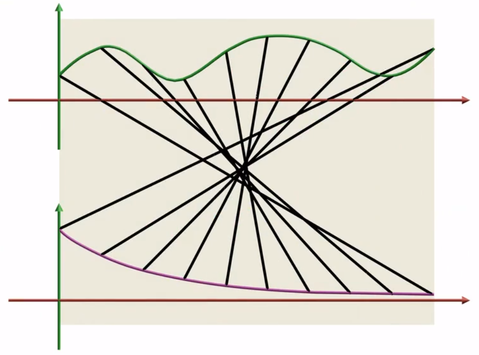

上面是卷积在概率上的应用，卷积也可以用在其他地方，比如求小明某一时刻 n 肚子里还剩下的食物总量，此时函数 f(x) 就是小明在时刻 x 的进食量，g(x) 就是食物在时刻 x 的消化比例。

卷积的物理意义：如果一个系统的输入（对应 f(x) 函数）是不稳定的，输出（对应 g(x)  函数）是稳定的，那么我们就可以用卷积来求这个系统的存量。比如小明就是一个系统，输入 f(x) 就是小明吃的东西，输出 g(x) 就是小明消化的东西，卷积就是求小明肚子里还剩下的食物量（系统的存量）。

卷积的另一种意义：过去对现在的影响的累加，或者是周围对中心的影响的累加。继续拿小明吃饭举例，卷积就可以理解为小明在过去每一时刻吃的食物对现在 n 肚子里还剩下的食物量的影响，过去每一时刻 x 所吃的食物就是 f(x)，由于吃下去的食物会随着时间被消化，因此需要对过去吃下去的食物乘上一个衰减因子，也就是 g(n-x)（n-x 是因为越后面吃的食物的影响力会越大，而 g(x) 是一个单调递减函数），因此过去某一时刻 t 所吃的食物 f(t) 对现在肚子里的食物量的影响就是 f(t)g(n-t)，将过去每一时刻的影响相加（或积分）起来就是对现在肚子里还剩下的食物量的总影响，即 $\int_{-∞}^{∞} f(x)g(n-x)dx$。

### 卷积在CNN中的两层意义

#### 周围对中心的影响的累加

卷积中的意义 "周围对中心的影响的累加" 可以用卷积神经网络中对图像进行的平滑卷积操作来理解。

平滑卷积操作：平滑卷积就是考虑了周围所有像素点对当前像素点的影响，即取所有像素点的平均作为当前像素点的值。如果当前像素点太高了，它就会被周围像素点给拉低；如果当前像素点太低了，它就会被周围像素点给拉高。

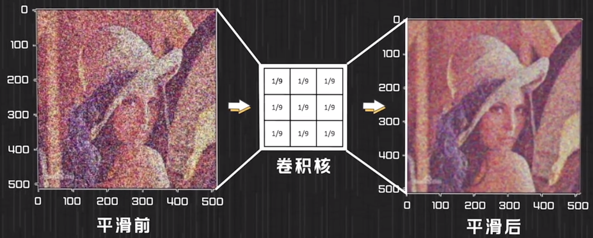

平滑卷积操作就是利用了卷积中的其中一层含义（即卷积是周围对中心的影响的累加），也就是综合考虑周围像素点的影响，以此来达到修饰图像的目的。其中，卷积核（对应翻转后的 g(m-x,n-y)）就规定了周围像素点应该如何影响当前的像素点。

#### 主动对周围像素点进行试探和选择

卷积在卷积神经网络中还有一层含义，即 "主动对周围像素点进行试探和选择"，这时的卷积核就被称为过滤器，它用于提取图像的局部特征，以此来交给后续的神经网络进行图像识别等工作。比如下图所示的边界过滤器，它通过过滤器的卷积操作去试探周围像素点，然后将边界的特征给提取出来（或者说将边界的特征保留下来，而将其他不必要的特征给过滤掉）。

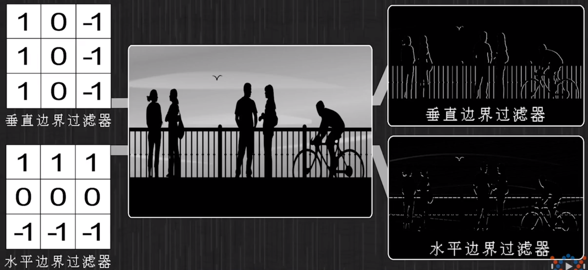

把卷积核当作过滤器时，卷积核本身其实就可以看成是如何对周围像素点进行试探的模板，当我们不想试探某个位置时，就可以把该位置的值设成 0，如果想重点试探某个位置，就可以把该位置的值设得比较高。也就是说，==通过设置卷积核的样子，我们可以主动选择我们希望从周围像素点提取出来的特征是怎么样的==。

比如下图所示的三个过滤器模板，最上面那个就是用于提取对角特征的模板，它希望可以从图像中提取出局部的对角特征；中间那个就是用于提取交叉特征的模板，它希望可以从图像中提取出局部的交叉特征；最下面那个就是用于提取反对角特征的模板，它希望可以从图像中提取出局部的反对角特征。

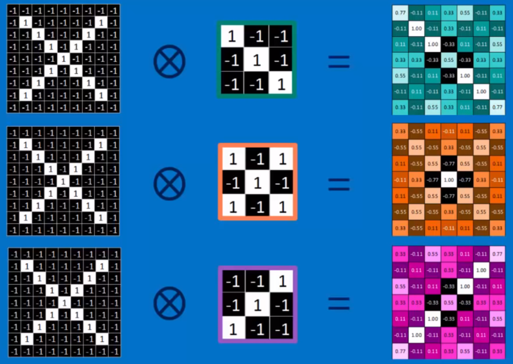

拿第一个过滤器举例，当我们用这个过滤器去试探绿色框包围的像素（下面第一幅图）时，就会得到完美的匹配分数，因为这些像素的特征就和过滤器希望提取的特征是完全一样的；当我们用这个过滤器去试探绿色框包围的像素（下面第二幅图）时，就会得到较差的匹配分数，因为这些像素虽然具有过滤器希望提取的特征，但也存在部分过滤器不想要的特征。

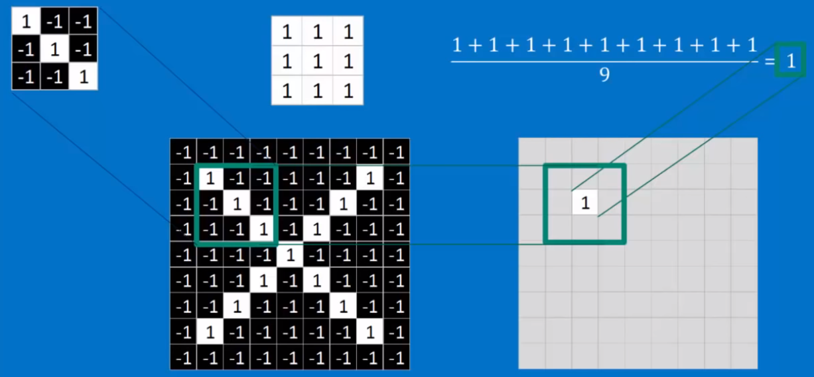

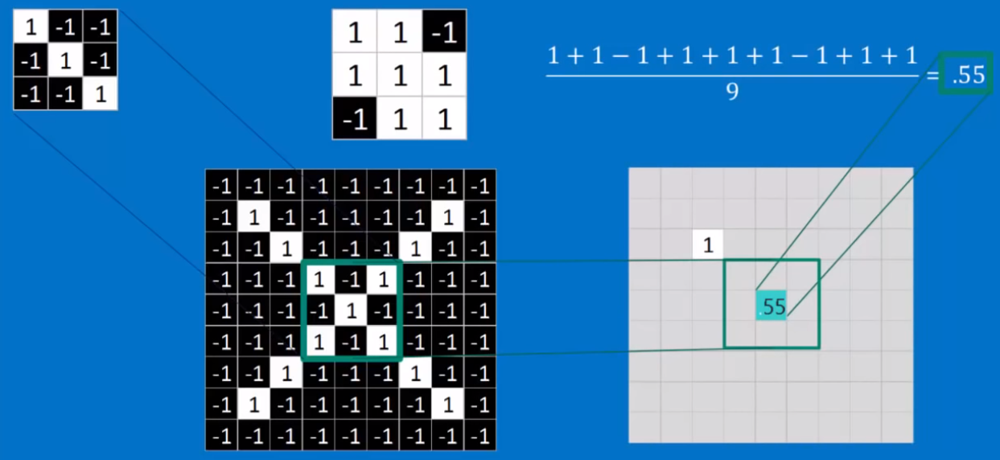

当过滤器对图像所有地方都进行试探后，就可以得出图像的每个地方的特征匹配分数（通过卷积操作得出），然后后续的神经网络就可以根据过滤器得出的这些匹配分数（这些匹配分数就说明了图像的每个地方是否具有过滤器所希望的那种特征）去判断图像的类型。

需要注意的是，我们可以通过多个过滤器的叠加来得到复杂特征的提取，比如有三个过滤器，分别提取眼睛、鼻子和嘴巴的特征，如果这三个特征在同一个地方的匹配分数都很高，那么我们就可以认为这个地方具有"脸"这个特征。此外，过滤器也可以在前一个过滤器过滤后的结果上进行过滤，在已提取的特征上继续提取更为复杂的特征，比如我们在一个图像的上下两个地方分别提取到 "o" 的特征，那么我们在这个提取到的特征的基础上用另一个过滤器进行试探，发现这两个 "o" 的特征组合起来就是一个数字 "8" 的特征。

### 如何在CNN中进行卷积操作

在卷积神经网络中的卷积操作属于离散卷积，即图像（对应 f(x,y)）与卷积核（对应翻转后的 g(m-x,n-y)）所有对应位置上的乘积的总和，即 $\sum f(x,y)g(m-x,n-y)$。3×3卷积核的一次卷积操作如下图所示：

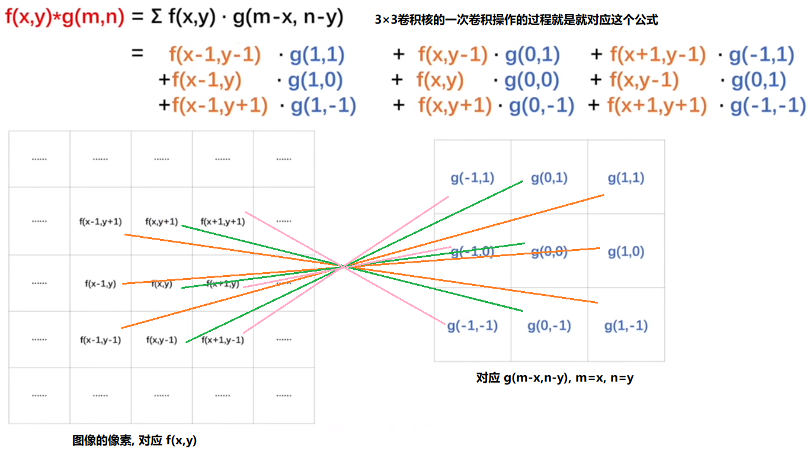

在上图中的卷积操作中，f(x,y) 是与 g(m,n) 交叉位置上的元素进行相乘，如果我们将 g(m,n) 翻转过来，g(m,n) 就变成了卷积核，那么卷积操作就变成了 f(x,y) 和卷积核上对应位置的元素进行相乘再求和。那么在这里，将g(m,n) 翻转过来就对应了卷积中"卷"的含义，将 f(x,y) 和 g(m,n) 相乘就对应了卷积中"乘"的含义，将所有乘积进行求和就对应了卷积中"积"的含义。

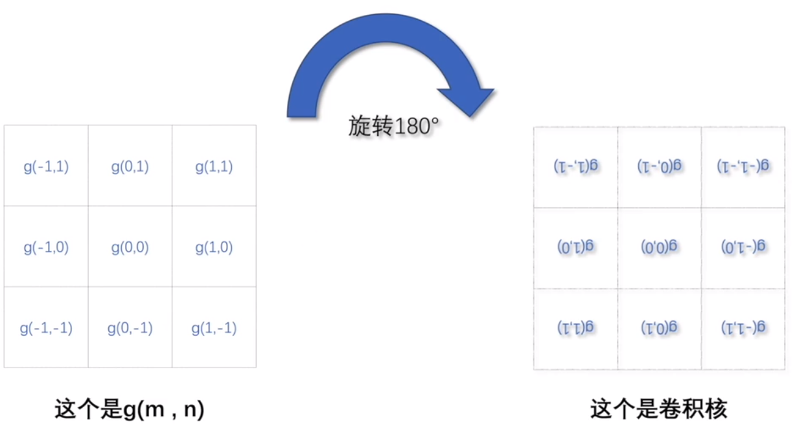

多次卷积操作的过程如下图所示：

## 损失函数

### 什么是最小二乘法

> 参考文章：[最小二乘法的本质是什么？ - 知乎 (zhihu.com)](https://www.zhihu.com/question/37031188)

如果将 loss 定义为预测值（假设由函式 y 求得）和真实值之差的平方和（即均方误差 MSE），则求使得 loss 最小的函式 y  就是最小二乘法（二乘指的就是平方，最小就是指最小化）。

最小二乘法可以使得预测值和真实值之间的误差最小。

### 什么是极大似然

> 参考文章：[如何通俗地理解"最大似然估计法"? (matongxue.com)](https://www.matongxue.com/madocs/447/)

似然是指某种现象出现的可能性，极大似然就是指通过调整概率分布，使得这种现象出现的可能性最大，而且可能性越大，概率分布就越接近真实分布。换句话说，极大似然可以说是求真实分布（通常是近似解）的一种方法。

比如抛 10 次硬币，假设出现的现象是 7 个正面和 3 个反面，如果我们令硬币抛出正面的概率为 p，则硬币抛出正面的概率就是 (1-p)，则这个现象出现的可能性（似然值）就是 $p^7(1-p)^3$，此时我们可以用极大似然法来求抛硬币的概率分布，即最大化 $p^7(1-p)^3$，可以得到 p=0.7，因此抛硬币的概率分布（即在这种现象出现的情况下最接近真实分布的概率分布）为抛出正面的概率为 0.7，抛出反面的概率为 0.3。可以发现这个结果并不正确，这是因为统计的次数不够多，使得出现的现象不符合真实分布时的情况。

将极大似然应用在机器学习中，它指的就是通过调整机器模型的概率分布（通过调整参数实现），使得输入样本的情况所出现的可能性最大，而且可能性越大，机器模型的概率分布就越接近理想模型的概率分布。因此在机器学习中，极大似然的目的就是使得机器模型和理想模型之间的概率分布最接近。

比如识别猫，则每个样本的标签只能是 "是猫" 或 "无猫"，因此我们可以写出它的似然值为：

$P(x_1,x_2,...,x_n|y_i)=P(x_i|y_i)=\prod_{i=1}^{n} y_{i}^{x_{i}}(1-y_{i})^{1-x_{i}}$

（其中，$x_i$ 为图片的标签，$y_i$ 为模型对该图片计算出来的概率）

转换成连乘的形式就是两边加上 log，因此改写为：

$P'=log(P)=\sum_{i=1}^{n}\left(x_{i} \cdot \log y_{i}+\left(1-x_{i}\right) \cdot \log \left(1-y_{i}\right)\right)$

由于极大似然求得是最大化，而模型训练需要求得是最小化，因此可以在两边加上符号，因此可以得到由极大似然推导出来的损失函数为：

$loss=-\sum_{i=1}^{n}\left(x_{i} \cdot \log y_{i}+\left(1-x_{i}\right) \cdot \log \left(1-y_{i}\right)\right)$

通过最小化这个损失函数，我们就可以求得最接近真实分布的那个模型。

### 什么是交叉熵

> 参考视频：["交叉熵" 如何做损失函数？- bilibili](https://www.bilibili.com/video/BV15V411W7VB)

1. 信息量

描述一个事件出现某种结果（从不确定到确定）有多么得令人震撼，这个结果出现的难度越大则信息量越大。这里的难度可以用概率来代替，因此信息量的表达式可以写为 $f(x)=-log_2x$（其中 x 表示概率）。举例来说，假设法国队夺冠的概率为 0.5，中国队夺冠的概率为 0.001，则法国对夺冠这件事的信息量就是 $f(0.5)=1$，中国队夺冠这件事的信息量就是 f(0.001)=9.966。再举一个例子，假设法国队进入决赛的概率 0.5，法国队在决赛中胜利的概率为 0.5，则法国队夺冠的信息量可以由法国队进入决赛和法国队在决赛中胜利这两者的信息量叠加得到，即 $f(0.5×0.5)=f(0.5)+f(0.5)$。

2. 熵

熵和信息量类似，只不过熵描述的是一个系统出现某种结果（从不确定到确定）有多么得令人震撼（熵也可以用来描述一个系统的不确定性，即这个系统想要从不确定的状态转移到确定的状态的困难有多大），由于描述的是一个系统，因此熵会由系统中各种事件的信息量共同来构成，但熵不是各种信息量的简单相加，而是加权求和，而其中的权重可以用概率表示（权重表示对应信息量对于系统的熵有多大的贡献）。举例如下：

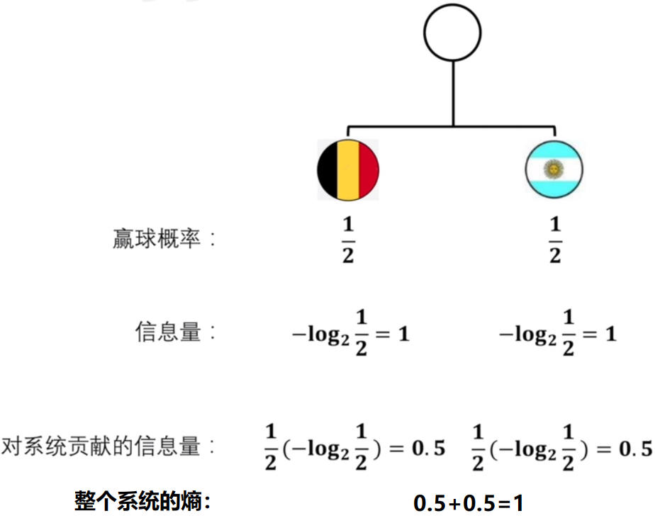

因此，熵可以定义为整个概率系统中信息量的期望，如下所示：

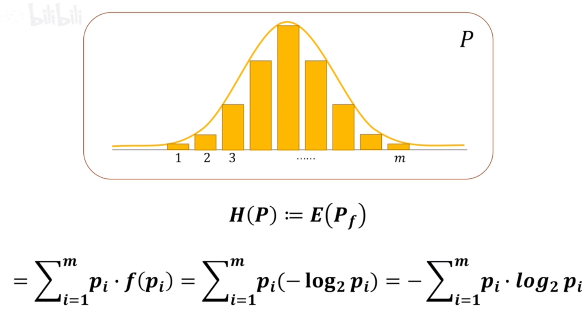

3. 相对熵（KL散度）和交叉熵

相对熵（$D_{KL}(P||Q)$）用来比较两个概率系统之间的差异，如果相对熵等于0则说明两者是一样的。交叉熵就是相对熵的前半部分（如下图所示），由吉布斯不等式，P 的交叉熵大于等于 P 的熵，因此交叉熵越小，则说明系统 Q 和系统 P 越相同（交叉熵和 P 的熵都是大于 0 的）。

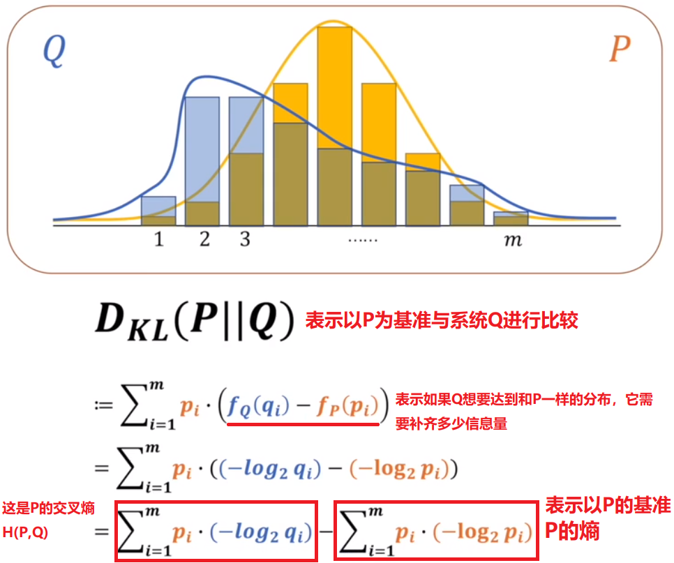

3. 将交叉熵作为损失函数

把理想模型作为基准系统 P，将其与机器模型的系统 Q 进行比较，则可以得到 P 的交叉熵 H(P,Q) （如下图所示）。用这个交叉熵就可以比较机器模型和理想模型之间的差异，只要最小化这个交叉熵，就可以使得机器模型接近理想模型。

（其中 $x_i$ 就是样本 $i$ 的标签，n 就是样本数，$y_i$ 就是由机器模型对样本 $i$ 计算出来的概率）

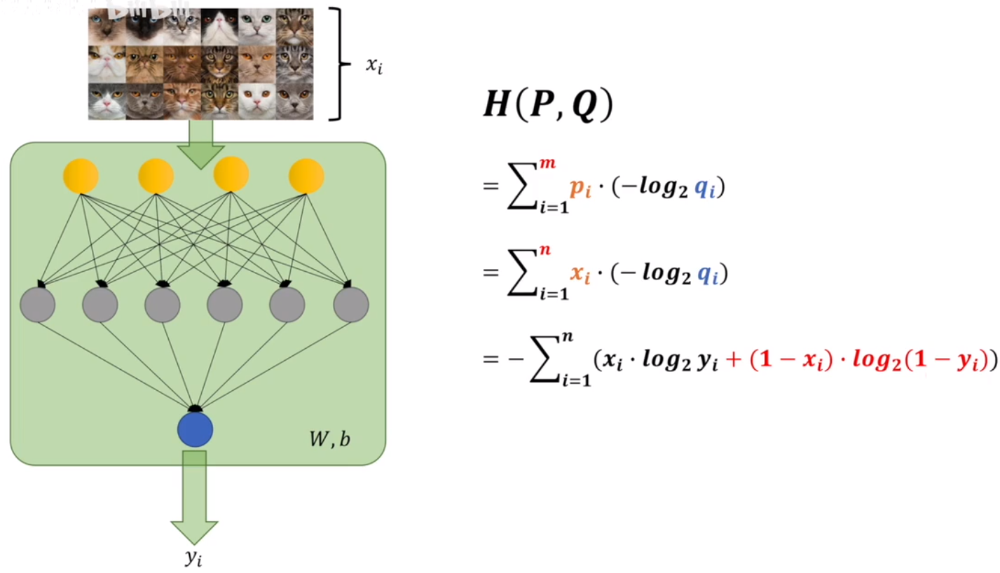

### 三种损失函数的比较

1. 最小二乘法

   尽量使机器模型和理想模型所计算出来的东西之间的误差最小（比如拟合曲线）。

2. 极大似然

   尽量使机器模型和理想模型两者的概率分布最接近。

3. 交叉熵

   先把模型换成熵这种数值，然后用这种数值去比较不同模型之间的差异。

   > 为什么要用熵绕一圈再来比较模型呢？不能直接比较模型吗？
   >
   > 想要直接比较模型，那么这两个模型就必须是相同类型的，比如两个模型都是高斯分布，那么我们就只需要比较它们的期望和方差就行了，但如果它们的类型不一样，比如高斯分布和泊松分布，那么就无法直接比较了。所以这种绕一圈的方法就是为了让不同类型的模型可以转换成同一种东西来衡量，进而可以进行相互比较。

## 感知机

感知机是一种用于分类的模板，可以用于解决线性的二分类问题。其数学表达式为：

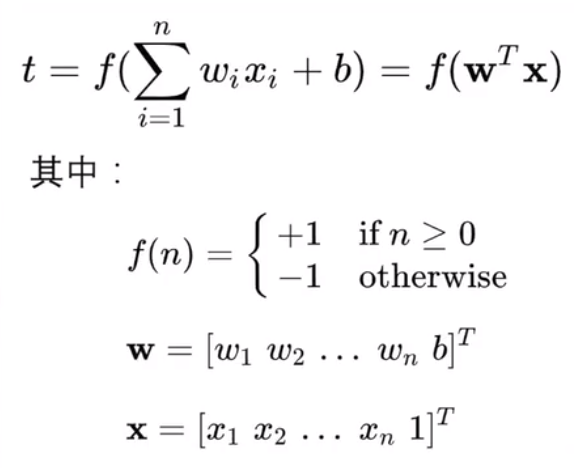

用流程图的形式可以描述为如下图所示：

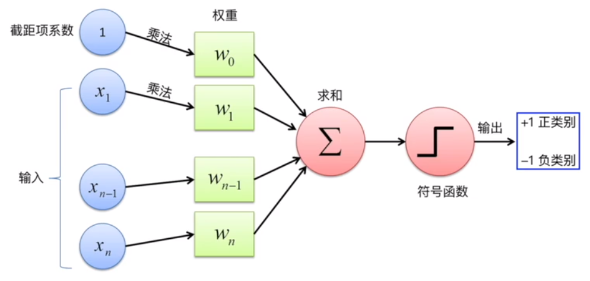

可以看出，感知机就是由线性函数（对应分界线本身）+判断函数（也就是激活函数，感知机这里采用的是单位阶跃函数作为激活函数，用于判断输入是在分界线的哪边）。感知机的原理就是找出一条分界线（对于输入是二维数据）或分界面（对于输入是三维数据），用这个分界线或分界面可以将输入的数据分成两类，如下图所示。

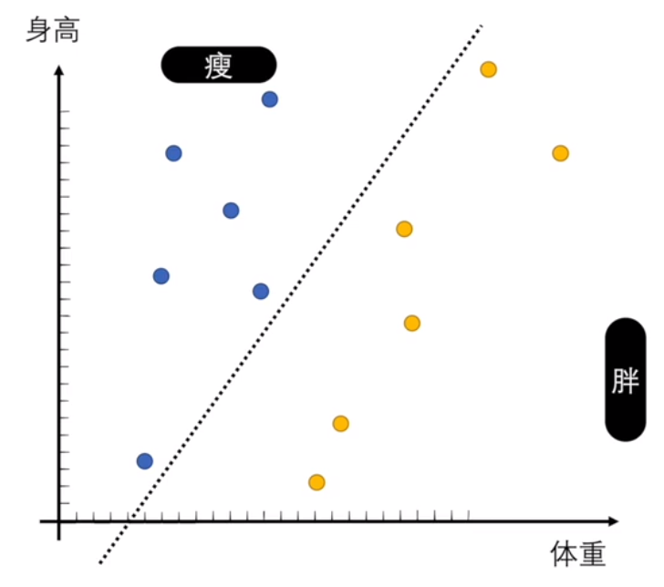

感知机的优点在于它提供了一种用于二分类的简单的统一模板。一般而言，只要输出的数据是线性可分的，那么就可以用感知机对这些数据进行二分类。但感知机的缺陷同样是明显的，也就是它不能用于解决非线性问题或者异或问题（异或问题其实就是非线性问题）。如下图所示，感知机可以解决与、与非、或三种情况，都可以在其中找到用于分类的分界线，但对于异或的情况，感知机就不知道如何找到用于分类的分界线了，因为用于分类的线不再是一条直直的线，而是一个椭圆了。

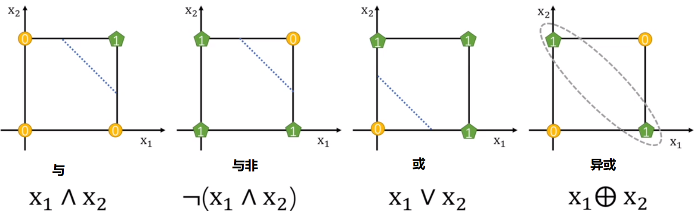

同样地，感知机对于非线性的分类问题也是解决不了的，如下图所示。

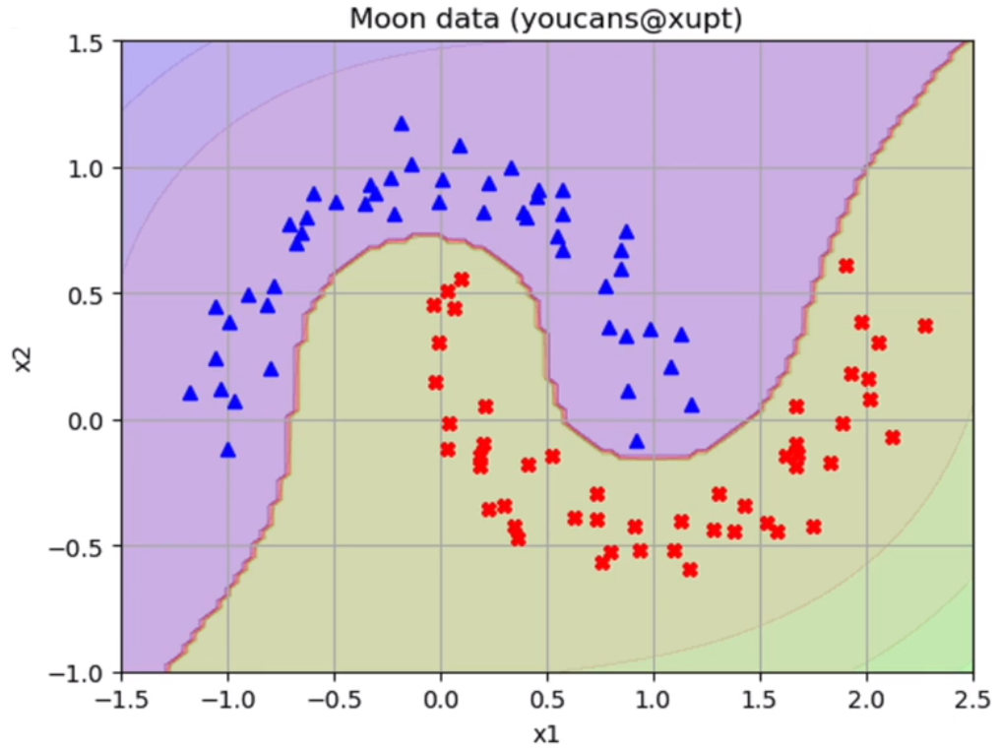

如何解决感知机的这种缺陷呢？这里我们就看如何解决感知机无法处理异或的问题（对于非线性的问题，也是用同样的方法进行解决）。如下图所示，解决异或问题的关键就在于把将原始的异或问题进行分解，分解为等价的两个可以线性分割的问题（即分解为两个与问题），然后用两个感知机分别去解决这两个被分解后的问题，接着把两个感知机的输出结果再交给另一个感知机，由这个感知机综合考虑两个问题的答案，它的输出就对应了原始的异或问题的答案。

简单地说，就是将非线性问题分解为线性可分的问题，然后分别用感知机去单独解决每个小问题，接着将每个解决的结果都输入给另一个感知机，这个感知机就相当于把分解后的问题重新组合成原来的非线性问题，它的输出就是原始非线性问题的解。再简单地说，从问题的角度就是将问题分解后再组合，从感知机的角度就是对感知机进行嵌套组合。

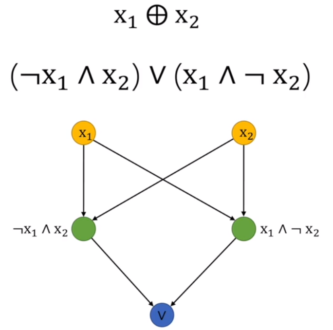

我们可以进一步来看是如何解决异或问题的。如下图所示，上面两个是被分解后的问题，下面是将分解后的两个问题重新组合的情况。可以发现，重新组合后，原始异或问题中右上角那个输出为 0 的情况消失了，这是因为通过分解为上面两种情况后，异或中输出为 0 的情况都被归纳为左下角处了，并不是真正地消失了。也就是说，把非线性问题分解为多个线性问题，然后将这些线性问题的输出重新组合的结果也会变成一个线性可分的情况，这就是用叠加感知机的方法解决感知机无法处理非线性问题的原理。

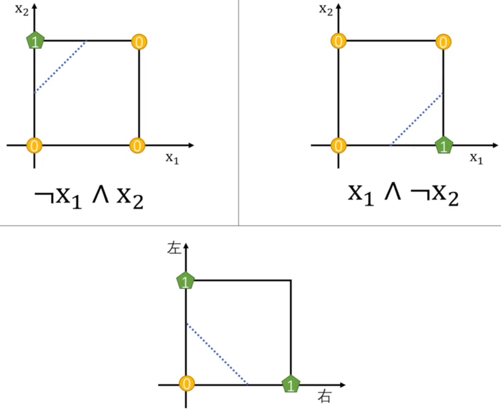

除了用叠加感知机的方法来解决感知机的缺陷，其实还有另一个解决感知机缺陷的方法，也就是支持向量机的方法，即把输入数据进行升维，因为升维之后就可以进行线性分割了，如下图所示。

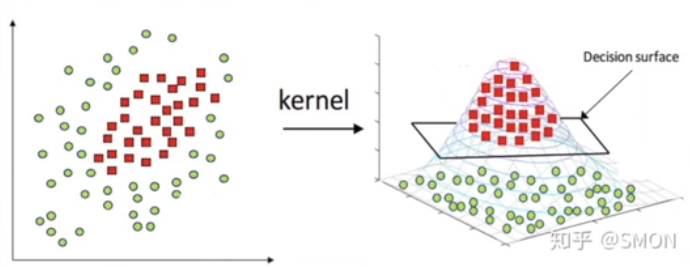
