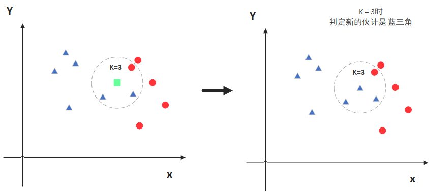

# 聚类算法

## K-means

> 参考文章：[【机器学习】K-means（非常详细） - 知乎 (zhihu.com)](https://zhuanlan.zhihu.com/p/78798251?utm_source=qq)

假设将集合X中的N个数据$x_n$分成K类：

1. 初始确定聚类中心：首先从N个数据$x_n$中随机取出K个作为聚类中心$c_i$；
2. 对数据进行分类：将N个数据$x_n$分类到K个类别$c_i$上，分类标准为：如果认为$x_n$与类别$c_i$比较接近，则将$x_n$分到$c_i$类中；
3. 更新聚类中心：将属于类别$c_i$中所有数据的平均值作为新的$c_i$；
4. 重复分类和更新：依据新的聚类中心对N个数据重新进行分类，然后继续更新聚类中心，重复这两个步骤，直到所有数据与其所关联的聚类中心之间的距离之和最小。

## KNN

> 参考文章：
>
> 1. [欧几里得度量_百度百科 (baidu.com)](https://baike.baidu.com/item/欧几里得度量/1274107?fromtitle=欧几里得距离&fromid=2701459&fr=aladdin)
> 2. [深入浅出KNN算法（一）KNN算法原理 - 博客园 (cnblogs.com)](https://www.cnblogs.com/listenfwind/p/10311496.html)

KNN 的原理就是当预测一个新的值 x 的时候，根据它距离最近的 K 个点是什么类别来判断 x 属于哪个类别，如果最近。

图中绿色的点就是我们要预测的那个点。假设 K = 3，那么 KNN 算法就会找到与它距离最近的三个点（这里用圆圈把它圈起来了），看看哪种类别多一些，比如这个例子中是蓝色三角形多一些，因此新来的绿色点就归类到蓝三角了。

但是当 K = 5 的时候，判定就变成不一样了，这次变成红色的圆多一些，所以新来的绿点被归类成红圆。从这个例子中，我们就能看得出 K 的取值是很重要的。此外，如何选择点距离的计算方法也是影响 KNN 算法判定的一个重要因素。

## Hierarchical Agglomerative Clustering

假设有5个数据：

1. 首先对这些数据建一个树结构，方法为（与哈夫曼树相似）：

   ① 创建一个未处理集合，并将所有数据都丢到其中；

   ② 从未处理集合中找到两个最相似的数据，然后将它们合并成一颗子树，子树的根就是它们合并的结果，接着将这两个被合并的数据从未处理集合中移除，并将它们的合并结果加入到未处理集合；

   ③ 重复步骤②，直到未处理集合为空。

2. 挑选一个分类基准：如下图所示，在已创建好的树中切一刀，如果这一刀是红色这条线，则它会把原始的5个数据分成两类（如红色框所示）；如果这一刀是蓝色这条线，则它会把原始的5个数据分成三类（如蓝色框所示）；如果这一刀是绿色这条线，则它会把原始的5个数据分成四类（如绿色框所示）。

# Dimension Reduction

## Distributed Representation

对于某个物品，如果一定要把它分为某一类，则这个就叫 Cluster；但通常情况下某个物品可以是属于多个方面的，它不一定只能属于某一类，因此这时候我们就可以用 Distributed Representation 来表示它。

有时候， Distributed Representation 的维度会非常大，这时候我们就需要用 Dimension Reduction 来对其进行降维。高维数据 data 可以被降维的原因：data 在其空间中仅仅占了一小部分，也就是说，在这个高维空间中，只有一小部分的地方是属于 data 的，其他地方都没有被使用，完全浪费了。因此，完全没有必要用高维的空间去表示 data，我们只需要用低维空间就可以表示 data 了，低维空间的数据量已经完全可以包裹住 data 了。

下面就是一些常用的降维方法。

## 特征选择

将 data 的分布拿出来看一下（比如下面的二维分布），你会发现数据都集中在轴x2上，也就是说，x1这个轴完全没有用，因此把它拿掉就可以了，这就完成了 dimension reduction 这件事了。但通常情况下，特征选择没有什么用，因为大部分情况是任何维度都不能拿掉。

## 主成分分析

> 参考文章：
>
> 1. [[机器学习] 降维 — PCA - 知乎 (zhihu.com)](https://zhuanlan.zhihu.com/p/77151308)
> 2. [奇异值分解（SVD） - 知乎 (zhihu.com)](https://zhuanlan.zhihu.com/p/29846048)

### 降维即投影

降维就是找到一个 function，给这个 function 输入高维数据 x，它就能吐出维度低于 x 的数据 z。

假设这个 function 是一个 linear function，则可以表示为 z=Wx，因此找 function 就变成了找到一个矩阵 W，这个矩阵 W 与高维数据 x 相乘的结果就是 x 被降维后的数据 z。

假设数据 x 是一个 n 维列向量，我们要将其转化为维度更低的 m 维列向量 z，则 W 就是一个 m×n 的矩阵（称为投影矩阵），其中 W 的每一行 $w^i$ （称为投影向量）就可以把 x 映射到 z 中的每一维。换句话说，z 中每一个元素其实就是 x 在 W 每一行向量上的投影，比如 z 的第一个元素 z1 就是 x 在 w1 上的投影。

举个例子，假设 x 是一个二维数据（如下图所示。其中，每个点代表一个数据，每个数据表示一个宝可梦，横轴表示它的攻击力，纵轴表示它的防御力），我们要将它降维成一维数据 z，那么 W 就是只有一行的二维行向量。W 在图中可以表示为某一个方向上的线（如图中所示的两条线），那么 z 就是各个数据 x 在这条线上的投影。进一步扩展，假设 x 是一个三维数据，我们把它降为二维数据 z，则 W 就是包含两行的矩阵，每一行都可以表示为一条线，因此 z 中的两个元素分别就是 x 在 W 的两条线上的投影（或者说，整个 z 就是 x 在由 W 的两条线所形成的平面上的投影）。

### PCA 如何投影

由上述可知，降维函式 z=Wx 就是将 x 投影在 W 上，比如把三维的点投影到二维平面上或者把二维的点投影到一条直线上。PCA 也是通过投影的方式进行降维，但它对投影的线（即 W 中的每一行的投影向量 $w^i$）有如下要求：

1. 投影在 $w^i$ 上的数据要有尽量大的分布（尽量分散开来），即投影后的数据之间的方差尽量大。换句话说，高维数据在投影到 $w^i$ 后还要尽量可以分辨出它们之间的差异。如下图所示，数据投影在红色线上比投影在橙色线上要有更大的分布，因此选择红色线作为投影线更为合适；

   

2. 投影向量 $w^i$ 的长度（模）必须为1，即 $\|w^i\|_2=1$；

3. 每个投影向量 $w^i$ 之间必须正交，因此投影矩阵 W 是一个正交矩阵。

根据 PCA 对于 W 每一行投影向量的要求，我们可以得到在 PCA 下的投影矩阵 W 的求法：（假设将 m 条 n 维数据降为 k 维）

1. 将原始数据按列组成 n 行 m 列的矩阵 X；
2. 将 X 的每一行进行零均值化，即减去这一行的均值；
3. 求出 X 的协方差矩阵：$C=\frac{1}{m}XX^T$；
4. 求出协方差矩阵 C 的特征值及对应的特征向量；
5. 将特征向量按对应特征值大小从上到下按行排列成矩阵，取前 k 行组成矩阵 W；
6. W 即为要求的投影矩阵，$Z=WX$ 即为降维到 k 维后的数据。

因此，PCA 的投影矩阵就是取高维数据 X 的协方差矩阵的特征值最大的前 k 个特征向量（假设降维为 k 维）。

### PCA 的推导过程

PCA 的目的是找到一个投影矩阵 W，它可以使得 z=Wx 的每一个元素（投影后的每一维）具有尽可能大的方差，即最大化 $Var(z_{i})=\frac{1}{N}\sum_{z_{i}}(z_{i}-\bar{z_{i}})^{2}$。为了推导简便，我们假设降维后的数据 z 只有两维（更高维的计算都是相似的），所以我们的目的就是找到符合 PCA 要求的两个投影向量 $w^1$ 和 $w^2$。

#### 求 $w^1$ 的推导过程

① 对于 $w^1$，PCA 要求它能使投影后的 $z_1$ 具有尽量大的方差 $Var(z_{1})=\frac{1}{N}\sum_{z_{1}}(z_{1}-\bar{z_{1}})^{2}$，且 $\|w^1\|_2=1$。

② 化简 $Var(z_{1})$ 为 $(w^1)^TCov(x)w^1$，其中 $Cov(x)$ 为输入的高维数据的协方差矩阵（这个矩阵是对称和半正定的，因此它的特征值都是非负的，且不同特征值的特征向量正交）。化简过程如下：

③ 化简后，PCA 的条件变为最大化 $(w^1)^TCov(x)w^1$ 和 $\|w^1\|_2=(w^1)^Tw^1=1$，运用拉格朗日乘子法进行求解：

④ 由拉格朗日乘子法可得 $Sw^1=αw^1$，可知系数 α 是 S 的特征值，$w^1$是 S 的特征值 α 对应得特征向量。将结果 $Sw^1=αw^1$ 代入 $(w^1)^TSw^1$ 可得 $(w^1)^TSw^1=α$，因此条件变为最大化 α。因此可以解得，α 就是 S 的最大特征值，$w^1$ 就是这个最大特征值对应的特征向量。

#### 求 $w^2$ 的推导过程

对于 $w^2$，PCA 要求它能使投影后的 $z_2$ 具有尽量大的方差 $Var(z_{2})=\frac{1}{N}\sum_{z_{2}}(z_{2}-\bar{z_{2}})^{2}$，且 $\|w^2\|_2=1$，以及 $w^2$ 和 $w^1$ 正交。因此，可以通过与上述相同的计算（只不过是增加了一个正交的条件），过程如下所示：

可以解得：$w^2$ 就是输入数据 x 的协方差矩阵的第二大特征值对应的特征向量。

### PCA 的 decorrelation 特性

输入数据经过 PCA 处理后所得到的数据 z 的各个维度之间是 decorrelation 的，也就是说，不同的 dimension 间的协方差是 0。

> 如果我们把 z 的协方差矩阵 D 求出来，则这个矩阵 D 就是一个对角矩阵。这个对角矩阵的推导过程如下图所示。其实，D 就是实对称矩阵 S 通过正交变换进行合同对角化后的结果，参考二次型化为标准型的过程。
>
> 协方差表示两个随机变量之间的线性相关性。这里的 decorrelation 就是说，z 的不同维度之间不具有线性相关性。

当我们把这样处理后的数据 z 再丢给其他的 model 时，其它的 model 就可以直接假设现在的 input data 的 dimension 之间没有 decorrelation，它们就不需要再对 input data 进行规范化等数据处理的过程，从而减少了 model 的参数量。同时，由于数据已经规范化，model 也可以用比较简单的 model，因此也可以避免 overfitting 的情形。

### 从 SVD 角度看 PCA

假设有如图所示的 component（用符号 $u_i$ 表示），其他任何数字图片 x 都可以看成是由这些 component 组成（component 的数量远比图片 x 的像素点要小），用表达式表示就是 $x≈c_1u^1+c_2u^2+...+c_ku^k+\bar x$，每个 component 前面的系数 $c_i$ 就可以用来代替原始像素来表示图片。比如数字 "7" 这个图片可以由 u1、u3 和 u5 组成，那么我们就可以用向量 [1,0,1,0,1,...] （向量中值为1的元素表示了图片由哪些 component 组成）来代替原始像素来表示数字 "7" 这个图片。

那么如何定义这些 component 的标准呢？这个标准就是，我们希望由 component 组合而成的图片与原图片尽量相似，也就是它们之间的误差尽量小，这个标准可以用如下图所示的式子 L 表示。

那么如何根据这个标准找到这些 component 呢？我们一步一步来找。首先将数字图片 x 用 component 表示的表达式用矩阵进行表示（矩阵 X 是包含多个图片的原始像素数据，右边两个分别是 component 矩阵和 representation 矩阵）：

接着我们用 SVD 对矩阵 X 进行分解，得到矩阵 U、Σ 和 V，其中 U 就是上面的 component 矩阵，Σ 和 V 的相乘就是上面的 representation 矩阵：

由 SVD 分解可知，如果要想让表达式左右两边的差距最小，那么 U 的每一列就应该是矩阵 $XX^T$ （就是 X 的协方差矩阵）的前 k 个最大特征值对应的特征向量，即每一个 component 就是 X 的协方差矩阵的前几个最大特征值对应的特征向量。这个结论和 PCA 推导出来的结果是一致的，也就是说，由 PCA 得到的投影矩阵 W 就是这个 component 矩阵，W 的每一行投影向量就是其中的每一个 component。换句话说，通过 PCA 得到的投影矩阵 W 就是使得降维后的数据可以最大相似度地还原成原数据的解。

### PCA 与 Autoencoder

我们的目标就是找到一组 component，以这组 component 为度量，使得我们可以用更加简短的向量 $[c_1,c_2,...,c_k]$ 来表示输入数据，并且要求 $[c_1,c_2,...,c_k]$ 可以通过 component 以最大相似度还原成原数据。通过 PCA，我们已经找到这些 component 就是由 PCA 计算出来的投影向量 $w^k$，而 $c_k$ 可以通过原数据与 $w^k$ 相乘（原因如注释所示）的方式得到。

> 为什么 $c_k=(x-\bar x)·w^k$？
>
> $\hat x=\sum_{k=1}^kc_kw^k=c_1w^1+c_2w^2+...+c_kw^k=W\hat c≈x-\bar x$
>
> 其中，$c_k$ 为标量，代表降维后第 k 维度的元素；$w^k$ 为行向量，代表一个 component；$\hat x$ 为行向量，代表还原后的数据；$\hat c$ 表示 $[c_1,c_2,...,c_k]^T$；W 表示 $[w^1,w^2,...,w^k]$；$x-\bar x$ 为列向量，代表原数据（减去平均值为规范化处理）。
>
> $\hat c=W^{-1}(x-\bar x)=W^T(x-\bar x)\\
> => c_k=w^k(x-\bar x)=(x-\bar x)·w^k$
>
> 其中，W 是正交矩阵，它的逆矩阵等于 $W^T$；符号 "·" 表示两个向量进行内积计算。

我们可以用仅有一个 hidden layer 的神经网络来描述上面的过程：

假设输入数据为 3 维，降维到 K=2 维。其中每条线的权重都来自于投影矩阵的每个元素，hidden layer 的输出就是降维后的数据，整个网络的输出就是将降维数据还原后的数据，这个神经网络的优化目标就是要让整个网络的输入数据和输出数据尽量一致。

可以看出，这个神经网络已经是一个最佳的网络，因为由 PCA 求出来的投影参数就是最佳的参数，它可以使得优化目标达到最佳。由此可以引出一个问题：如果让这个网络随机初始化参数从头开始训练，这个网络最后训练出来的参数会和 PCA 计算出来的参数一样吗？答案是不一样的。因此，比起用神经网络进行训练，直接用 PCA 求取投影矩阵是更合适的。但使用神经网络来进行训练，它可以是 deep 的，它可以有很多个 hidden layer，这是 PCA 给不了的优势。

特别注意的是，从 PCA 推出的这个神经网络就叫做 AutoEncoder。

### PCA 的缺点

1. PCA 是非监督的，因此如果给出的数据具有不同的类别，则 PCA 可能会把它们都挤压在一起，从而无法很好的分辨。比如下图左边所示，橙色和蓝色是两种 label，如果使用 PCA，则它会把这两种数据都挤压在一起，虽然这样做使得它们可以有很大的分布；
2. PCA 是线性的，因此如果给出像右上角这样的数据，PCA 的做法是直接压扁它们，使得各类数据之间相互参杂，而比 PCA 更好的做法其实是将它们进行拉平，这样各类数据之间就可以很好分辨，但这种做法属于 Non Linear Dimension Reduction。

### 从应用实例看 PCA

#### PCA 在宝可梦

假设有 800 Pokemons，每个宝可梦有 6 features（HP, Atk, Def, Sp Atk, Sp Def, Speed），即每个宝可梦可以用 6 维的向量进行表示。我们现在要用 PCA 将这个 6 维的数据进行降维压缩，那么我们应该选取多少个 component 呢（即压缩到多少维）？一个有效的方法是计算每个 component 对应的特征值 λ 的占比（计算公式如下所示），将哪些占比小的维度进行剔除。

> λ 就是对应 component （即特征向量）所在的维度下的方差。

每个 component 对应的特征值的占比的计算结果如下所示，因此我们可以选择 4 个 component 进行压缩。

接下来，我们就可以通过 PCA 获得这四个 component 的结果：

可以看出，每个 component 都由原来的 6 个 feature 组合得到，不同的组合表示了这个 component 的不同含义，比如说 PC1 在每个 feature 上都有一定的占比，这就表示 PC1 是综合实力（强度）的意思；PC2 在防御力上占比大，而在速度上占比为负，这就表示 PC2 是用速度换取防御力的意思。

现在，每个宝可梦都是由这四个 component 通过 linear combination（线性组合）得到。如果某个宝可梦在 PC1 上的系数非常大，则说明这个宝可梦实力很强，比如超梦；如果某个宝可梦在 PC2 上的系数非常大，则说明这个宝可梦的防御力很高，但速度很低，比如壶壶。

#### PCA 在 MNIST

假设 component 有 30 个，则这些 component 可以长得如下图所示那样。由这些 component 做 linear combination 就可以得到 0-9 这 10 个数字图片。

可以发现，这些 component 都不是一些比较 basic 的图形（比如一些简单的横、竖笔画等），而是比较复杂的图形。为什么会这样呢？这是因为在这些 component 的 linear combination 中，PCA 允许它们的系数可负可正的。也就是说，当我们用这些 component 组成一张图片的时候，既可以把这些 component 相加，也可以把这些 component 相减，这就导致用 PCA 找出来的 component 不需要是 basic component，因为我们完全可以通过用复杂的 component 减去一些其它一些 component 来得到 basic component。比如我们画一个 9，那我可以先画一个8，把下面的圈圈减掉，然后把一撇加上去。也就是说，你可以先画一个复杂的图，然后再把多余的减掉。

如果我们使得找出来的 component 是 basic，那我们就得用 NMF 这个技术。因为 NMF 要求所有 component 前面的 weight 都是正的，这就使得一张图片必须是由 component 叠加得到，因此这些 component 就必须是 basic（如下图所示）。此外， NMF 还要求所有 component 的 dimension 也必须是正的，这个是有好处的，因为由 PCA 找出来的 component 的 dimension 可以是负的，如果我们要把 component 画出来，那这些负值就需要进行额外的处理（比如把负值置 0 ，但这会使图片缺失信息，更常用的做法是将整体进行偏移），而 NMF 就不需要这些操作，因为它的 component 的 dimension 是正的。

## 流形学习

如下图左边所示，data point 可能是在高维空间里面的一个 manifold，即 data point 的分布其实是在低维的一个空间里，只是被扭曲塞到高维空间里。比如地球的表面就是一个 manifold （一个二维的平面被塞到一个三维的空间里面）。在 manifold 里面只有很近距离的点，它们之间的欧氏距离才会成立，如果点之间的距离很远时，欧氏距离就不一定成立（如左图的 5 个点所示），此时就应该使用测地距离（即在不离开 manifold 的情况下从 A 点走到 B 点的最短距离）来描绘它们之间的相似度。

Manifold Learning 要做的事情就是把 S 型的这块东西展开，把塞到高维空间的低维空间摊平（即降维）。摊平的好处就是：把这个塞到高维空间里的 manifold 摊平以后，那我们就可以在这个 manifold 上面用直接用欧式距离来算点和点之间的距离，这会对接下来你要做的 supervised learning 有帮助。

一个形象的流形降维（摊平）过程如下图。我们有一块卷起来的布，我们希望将其展开到一个二维平面，并且在展开后的布能够在局部保持布结构的特征，这个展开的过程就像两个人将其拉开一样。

## 局部线性嵌入

> 參考文章：[局部线性嵌入 (LLE) 原理总结](https://www.cnblogs.com/pinard/p/6266408.html)

LLE 属于流形学习（Manifold Learning）的一种。基于流形的降维算法就是将流形从高维到低维的降维过程，在降维的过程中我们希望流形在高维的一些特征可以得到保留。对于 LLE 来说，它就是在降维时保持了样本在高维时的局部线性特征。

假设我们有一系列的点，每个点都是一个高维向量，我们的目的就是把这些点降维到低维空间中（把这些点变成低维向量）。现在我们用 Locally Linear Embedding（局部线性嵌入）来做：

1. 计算局部权重：假设任意点 $x^i$，我们先通过一些算法（比如通过欧式距离度量来选择 k 个最近邻）来找到它的 k 个邻居点 $x^j$（k 是超参数），然后依照最小化特定式子的目标去计算（使用拉格朗日乘子法）这 k 个邻居点与点 $x^i$ 之间的权重 $w_{ij}$（即 weight ）。LLE 将这个式子定义为：要求这 k 个邻居点与 $w_{ij}$ 做 weighted sum 的结果与点 $x^i$ 尽量相同，具体的表达式如下图所示。

   

2. 根据局部权重计算低维表示：LLE 的核心思想就是将高维数据转换为低维数据后，需要保持降维前后数据点与周围 k 个邻居的 weight 不变（即降维前后局部关系不变）。也就是说，低维数据点 $z^i$ 在低维空间中与周围 k 个邻居的 weight 就是我们在步骤 1 中求出来的 weight，即我们已经有低维数据点 $z^i$ 在低维空间中与周围 k 个邻居的 weight 了，但我们不知道这 k 个邻居是什么，我们现在就需要根据这些 weight 去求出这 k 个邻居点。怎么求呢？同样地，LLE 要求这 k 个邻居点 $z^j$ 与 weight 做 weighted sum 的结果与低维数据点 $z^i$ 尽量相同，将这个要求转化为式子如下图所示。依照最小化这个式子我们就可以计算出（使用拉格朗日乘子法）高维数据 $x^i$ 被降维在低维空间中的表示 $z^i$。

   

总结一下流程：

1. 找出任意高维数据点 $x_i$ 的最邻近的 k 个邻居；
2. 通过最小化 $\sum_{i}\left\|x^{i}-\sum_{j} w_{i j} x^{j}\right\|_{2}$，计算出每个高维数据点和它们邻居的权重 $w_{ij}$；
3. 根据已知的权重系数 $w_{ij}$，通过最小化 $\sum_{i}\left\|z^{i}-\sum_{j} w_{i j} z^{j}\right\|_{2}$，重构出高维数据点的低维表示 $z_i$。

也就是说，在高维空间我们的目的就是求出权重系数，在低维空间我们的目的就是根据权重系数重构数据，这两个过程都是通过最小化指定式子来实现的，可以看成是求两个函数在取得最小值时未知量（分别为权重系数和低维表示）的取值，而且都可以使用拉格朗日乘子法来解决。特别注意的是，使用 LLE 进行降维，如果我们不知道原始数据是什么，但我们只要有权重系数，我们都可以通过系数重构出低维数据。

下面是选择不同数量的邻居时 LLE 的降维结果。只有 k 选取适当时，LLE 才能得到好的降维结果。k 太大时结果不太好的原因：k 太大时会考虑一些很远的点作为邻居，而我们选取这些点都是采用欧氏距离来做，而欧式距离仅在点之间距离很近时才有效，因此当 k 太大时，由于邻居点的选取范围变大，用欧式距离选取的邻居就可能并不是真正的邻居（比如测地距离很远的两个点，用欧式距离来算可能是很短的，它们就会被认为是邻居，但实际上并不是）。

## 拉普拉斯特征映射

> 参考文章：
>
> 1. [LE (拉普拉斯映射) 特征提取方法 - 知乎 (zhihu.com)](https://zhuanlan.zhihu.com/p/100002630)
> 2. [拉普拉斯特征映射（Laplacian Eigenmaps）- CSDN博客](https://blog.csdn.net/qrlhl/article/details/78066994)
> 3. [拉普拉斯矩阵特征映射_煎饼加鸡丝 - CSDN博客](https://blog.csdn.net/jianbinzheng/article/details/81229051)
> 4. [理解拉普拉斯特征映射中的优化问题的约束条件 - 知乎 (zhihu.com)](https://zhuanlan.zhihu.com/p/103808629)

Laplacian Eigenmaps 是一种基于图的流形降维算法，其主要思想是 "If $𝑥^1$ and $𝑥^2$ are close in a high  density region, $𝑧^1$ and $𝑧^2$ are close to each other"，即如果两个数据点在高维时很相近，则它们被降维后应该保持这种相近性。LE 算法的实现过程如下：

1. 假设在高维的空间里存在 n 个 g 维的数据，我们的目的是将其降维到 d 维的低维空间。

2. 为 n 个数据建立图结构，有两个方法：

   ① 如果两个点之间的欧氏距离小于设定的阈值，则将它们相连。

   ② 采用 KNN 算法，若点 $x_i$ 在 $x_j$ 的 k 个近邻中或 $x_j$ 在 $x_i$ 的 k 个近邻中，则将它们相连。

3. 计算图中各个点之间的权重系数，有两个方法：

   ① $w_{i j}=\left\{\begin{array}{ll}
   \exp \left(-\frac{\left\|x_{i}-x_{j}\right\|^{2}}{t}\right) & \text { 节点 } x_i \text { 与 } x_j \text { 相连 } \\
   0 & \text { 不相连 }
   \end{array}\right.$

   ② $w_{i j}=\left\{\begin{array}{ll}
   1 & \text { 节点 } x_i \text { 与 } x_j \text { 相连 } \\
   0 & \text { 不相连 }
   \end{array}\right.$

4. 根据权重系数构建出数据的低维表示：LE 要求降维前后的相近性尽量保持一致。其中，高维空间中的相近性我们用权重系数 $w_{ij}$ 表示，如果权重系数越大，则说明点 $x_i$ 和点 $x_j$ 越相近；低维空间中的相近性我们可以直接用点之间的距离来表示，比如 $||y_i−y_j||^2$（其中 y 为数据的低维表示）。我们可以用一个式子来表示这两种相近性，即 $\sum_{i, j} w_{i j}\left\|y_{i}-y_{j}\right\|^{2}$（这个式子表示，如果 $w_{ij}$ 很大，则 $y_i$ 和 $y_j$ 就应该很相似；如果 $w_{ij}$ 很小，则 $y_i$ 和 $y_j$ 之间是怎样的都可以）。因此，LE 的优化目标就是最小化这个式子，通过最小化这个式子得到的 d 维向量 y 就是我们所要求的数据在低维空间的低维表示。

> NOTE：
>
> 1. 加入约束条件
>
>    在进行 $Y=argmin \sum_{i, j} w_{i j}\left\|y_{i}-y_{j}\right\|^{2}$ 时，我们完全可以令所有的低维向量 y 都是一样的，这样获得的低维矩阵 Y 完全可以满足这个式子。但这样的结果是无意义的，因此我们要在这个式子上增加一个约束条件，即 $Y^{T} D Y=I$（D 为权重矩阵 W 的度矩阵）。这个约束条件要求：由最小化这个式子所得到的 $Y=\{y_1,y_2,...,y_n\}$ 所构成的空间的秩应该和 Y 中各个向量的维度保持一致。也就是说，被降为后的数据不应该是一个流形（嵌入在高维空间的低维数据）。
>
> 2. 什么是低维数据被嵌入在了高维空间？
>
>    假设一个 n 维的高维空间，总共包含 m（m>>n）个向量，这 m 个向量所组成的矩阵的秩等于 k（k＜n），则这 m 个向量中必定存在 k 个线性无关得向量，且这 m 个向量都可以由这 k 个向量通过线性组合进行表示，也就是说，只需要 k 个向量就可以完全表示这个 n 维的空间了，根本用不着 n 个，即这个空间有 n-k 维被浪费了。这就叫低维数据嵌入了高维空间，这时候就需要将这些数据降维到属于它们的低维空间上（流形学习、维度回归），这样才不会造成空间浪费。

由注释可知，LE 算法的最终优化目标为 $min \sum_{i, j} w_{i j}\left\|y_{i}-y_{j}\right\|^{2},s.t.Y^{T} D Y=I$，我们可以采用拉格朗日乘子法来解决这个问题，推导并化简后的结果就是：对于每个低维向量 y，有 $Ly=λDy$。也就是说，降维后的低维表示 y 其实就是矩阵 $D^{-1}L$ 的特征向量。其中，D 为权重矩阵 W 的度矩阵，L 为权重矩阵 W 的拉普拉斯矩阵，这也就是这个方法被叫做拉普拉斯特征映射的原因。

总结一下流程：

1. 构建数据点的图结构；
2. 根据图计算权重系数；
3. 根据权重系数，通过最小化 $\sum_{i, j} w_{i j}\left\|y_{i}-y_{j}\right\|^{2},s.t.Y^{T} D Y=I$ 得到低维表示（可以通过直接对矩阵 $D^{-1}L$ 进行特征分解得到）。

我们可以发现，LE 和 LLE 是非常相似的，差别就在于 ① 求高维空间中的权重系数的方法不同；② 求低维空间中的最小化式子不同。这两个算法都可以看成是 (求权重系数 + 最小化式子) 的一类方法。具体来说，这两个算法都是在高维空间中找到数据的局部相似性，然后在嵌入低维空间时尽量保持这种相似性的一类矩阵分解型的降维算法，只不过它们在计算相似性和保持相似性这两个方面上的方法有所不同。

## T-分布随机邻域嵌入

> 参考文章：[T-SNE 原理与实现 - CSDN博客](https://blog.csdn.net/wchstrife/article/details/103292158)

LE 和 LLE 算法的缺陷：只假设了相邻的点要接近，却没有假设不相近的点要分开。因此这两个算法都可以让相同 class 的点聚集在一起，却没有办法避免不同 class 的点重叠在一起，这就会导致无法区分不同 class 的现象，如下图所示。而 T-SNE 算法就可以弥补上述的缺陷。

T-SNE 算法同样是用于降维，这里假设将高维数据 x 降维成低维数据 z：

1. 在高维的原始数据 x 的分布空间上，计算所有点之间的相似度 $S(x_i,x_j)$，然后对其进行归一化，即 $P\left(x^{j} \mid x^{i}\right)=\frac{S\left(x^{i}, x^{j}\right)}{\sum_{k \neq i} S\left(x^{i}, x^{k}\right)}$（表示 $x_j$ 与 $x_i$ 的相似度占所有与 $x_i$ 相关的相似度的比例）；
2. 将 x 降维成 z 后，我们同样可以在 z 的分布空间上做上述的事情 。也就是在 z 的分布空间上，计算所有点之间的相似度 $S'(z_i,z_j)$，然后对其进行归一化，即 $Q\left(z^{j} \mid z^{i}\right)=\frac{S^{\prime}\left(z^{i}, Z^{j}\right)}{\sum_{k \neq i} S^{\prime}\left(z^{i}, z^{k}\right)}$；
3. T-SNE 算法的目的就是找出一组低维向量 z，可以使得由步骤 1 和 2 计算出来的两个分布（即 $P\left(x^{j} \mid x^{i}\right)$ 和 $Q\left(z^{j} \mid z^{i}\right)$）越接近越好，具体的做法就是采用梯度下降。这个梯度下降的优化目标被 T-SNE 定义为$\begin{aligned}
   L&=\sum_{i} \operatorname{KL}\left(P\left(* \mid x^{i}\right) \| Q\left(* \mid z^{i}\right)\right) \\
   & =\sum_{i} \sum_{j} P\left(x^{j} \mid x^{i}\right) \log \frac{P\left(x^{j} \mid x^{i}\right)}{Q\left(z^{j} \mid z^{i}\right)}
   \end{aligned}$，这个式子表示每个原始数据 $x_i$ 的相似度分布与对应低维表示 $z _i$ 的相似度分布的 KL 散度的总和，描述地就是两个分布之间地差距，梯度下降的目标就是让这个差距越小越好。整个过程如下：① 首先随机初始化 z，然后分别在 x 和 z 所在的空间分布上计算它们的相似度分布（如步骤 1 和 2 所示）；② 将它们的相似度分布代入式子 L 中，得出两个分布之间的差距，然后根据这个差距对 z 做微分，最后拿着这个微分对 z 进行梯度更新。不断循环这个过程，直到差距变得足够小，这时候得到的 z 就是 x 在低维空间的表示。

> 要注意的地方：
>
> 1. 做归一化的原因
>
>    因为我们无法判断在 x 和 z 所在的空间里，它们两者计算出来的相似度（即 $S(x_i,x_j)$ 和 $S'(z_i,z_j)$）的取值范围是否一致，如果我们对其做归一化后，它们就都会被映射到一个统一的 0-1 的概率区间中，那么它们的取值范围就变得一致了。
>
> 2. T-SNE 的实际做法
>
>    因为通常原始数据会非常多，直接用 T-SNE 进行降维，会有非常大的计算量，因此通常的做法是先将原始数据用其他算法（比如 PCA）进行初步的降维，然后再用 T-SNE 对其继续降维，得到最后的结果。
>
> 3. T-SNE 的实际用途
>
>    像 LE、LLE 和 T-SNE 这类算法，有一个明显的缺陷：无法对新的数据点进行处理，因为一旦出现新的数据点，就需要重新跑一遍算法。因此，T-SNE 通常不是用来训练模型的，它更适合用于做基于固定数据的可视化。比如将高维数据用 T-SNE 降维到 2 维后，就可以把它们放到坐标轴上进行展示。

计算相似度的方法：

1. 对于原始高维数据的相似度，我们用 (欧氏距离+RBF函数) 来计算，即  $S(x^{i}, x^{j})=\exp (-\|x^{i}-x^{j}\|_{2})$ ；

2. 对于低维表示后的数据的相似度，我们有两个方法：

   ① 一是 SNE 算法的做法，即采用和计算原始高维数据的相似度一样的方法；

   ② 二是 T-SNE 算法的做法，即采用 T 分布中的一种计算方法，即 $S^{\prime}\left(z^{i}, z^{j}\right)=\frac{1}{1+\left\|z^{i}-z^{j}\right\|_{2}}$。

SNE 和 T-SNE 做法的区别可以用下图来解释。假设横轴代表了在原先 x 空间上的欧氏距离或者做降维之后在 z 空间上的欧氏距离，红线代表 RBF function，是降维前的分布；蓝线代表了 t-distribution，是降维后的分布。你会发现，降维前后相似度从 RBF function 到 t-distribution：

- 如果原先两个点的距离比较近，则降维转换之后，它们的相似度依旧是比较接近的；
- 如果原先两个点的距离比较远，则降维转换之后，它们的相似度就会被拉得更远。

这就是说，如果原始数据点之间的距离比较近，那么这个相近性在低维空间中会被 T-SNE 保留；如果原始数据点之间的距离比较远，那么 T-SNE 就会在低维空间中把这个距离强化，变得更远。

也就是说，T-SNE 可以让相同 class 的点在一起，也能让不同 class 的点被拉得很远，这个特点可以让 T-SNE 降维后的可视化效果非常好，这个效果（如下图所示）就是不同的 class 分别聚集在不同地方，而且这些地方之间都相距比较远。

## AutoEncoder

> 参考笔记：[Unsupervised Learning Deep Auto-encoder (sakura-gh.github.io)](https://sakura-gh.github.io/ML-notes/ML-notes-html/22_Unsupervised-Learning-Deep-Auto-encoder.html)

AutoEncoder 本质上就是一个自我压缩和解压的过程，我们想要获取压缩后的 code，它代表了对原始数据的某种紧凑精简的有效表达（即降维结果），这个过程中我们需要：

- Encoder (编码器)，它可以把原先的图像压缩成更低维度的向量；
- Decoder (解码器)，它可以把压缩后的向量还原成图像。

注意到，Encoder 和 Decoder 都是 Unsupervised Learning，由于 code 是未知的，对 Encoder 来说，我们手中的数据只能提供图像作为 input，却不能提供 code 作为 output；对 Decoder 来说，我们只能提供图像作为 output，却不能提供 code 作为 input。因此，Encoder 和 Decoder 单独拿出来都无法进行训练，我们需要把它们连接起来，这样整个神经网络的输入和输出都是我们已有的图像数据，就可以同时对 Encoder 和 Decoder 进行训练，而降维后的编码结果就可以从最中间的那层 hidden layer 中获取。

实际上PCA用到的思想与之非常类似，PCA的过程本质上就是按组件拆分，再按组件重构的过程。在PCA中，我们先把均一化后的 x 根据组件分解到更低维度的 c，然后再将组件权重 c 乘上组件的反置 $W^T$ 得到重组后的 $\hat x$，同样我们期望重构后的 $\hat x$ 与原始的 x 越接近越好。

如果把这个过程看作是神经网络，那么原始的 x 就是 input layer，重构 $\hat x$ 就是 output layer，中间组件分解权重 c 就是 hidden layer，在 PCA 中它是 linear 的，我们通常又叫它瓶颈层 (Bottleneck layer)。由于经过组件分解降维后的 c，维数要远比输入输出层来得低，因此 hidden layer 实际上非常窄，因而有瓶颈层的称呼。对比于 AutoEncoder，从 input layer 到 hidden layer 的按组件分解实际上就是编码 (encode) 过程，从 hidden layer 到 output layer 按组件重构实际上就是解码 (decode) 的过程。

这时候你可能会想，可不可以用更多层 hidden layer 呢？答案是肯定的。对 Deep AutoEncoder 来说，实际上就是通过多级编码降维，再经过多级解码还原的过程。此时：从 input layer 到 bottleneck layer 的部分都属于 Encoder；从 bottleneck layer 到 output layer 的部分都属于 Decoder；而 bottleneck layer 的 output 就是自编码结果。

注意到，如果按照PCA的思路，则 Encoder 的参数需要和 Decoder 的参数保持一致的对应关系，这可以通过给两者相同的初始值并设置同样的更新过程得到，这样做的好处是可以节省一半的参数，降低 overfitting 的概率。但这件事情并不是必要的，实际操作的时候，你完全可以对神经网络进行直接训练而不用保持编码器和解码器的参数一致。

下图给出了分别采用 PCA 和 Deep AutoEncoder 对手写数字进行编码解码后的结果，从 784 维降到 30 维，可以看出，Deep AutoEncoder 的还原效果比 PCA 更好：

如果将原始数据降到二维平面做可视化，不同颜色代表不同的数字，可以看到：① 通过 PCA 降维得到的编码结果中，不同颜色代表的数字被混杂在一起；② 通过 Deep Auto-encoder 降维得到的编码结果中，不同颜色代表的数字被分散成一群一群的。

### 文本检索

AutoEncoder 也可以被用在文字检索上，很简单的一个做法是Vector Space Model。把每一篇文章都表示成空间中的一个 vector，假设查询者输入了某个词汇，那我们就把该查询词汇也变成空间中的一个点，并计算 query 和每一篇 document 之间的内积 (inner product) 或余弦相似度 (cos-similarity)（余弦相似度有均一化的效果，可能会得到更好的结果），选出跟 query 向量最接近的几个 document 向量，然后从这几篇文章中去检索。

实际上这个模型的好坏，就取决于从 document 转化而来的 vector 的好坏，它是否能够充分表达文章信息。最简单的 vector 表示方法是 Bag-of-word，该方法的 vector 维数等于所有词汇的总数，某一维等于 1 则表示对应词汇在这篇文章中出现，此外还可以根据词汇的重要性将其加权。但这个模型是非常脆弱的，对它来说每个词汇都是相互独立的，无法体现出词汇之间的语义 (semantic)。

虽然 Bag-of-word 不能直接用于表示文章，但我们可以把它作为 Auto-encoder 的 input，通过降维来抽取有效信息，以获取所需的 vector。同样为了可视化，这里将 Bag-of-word 降维到二维平面上，下图中每个点都代表一篇文章，不同颜色则代表不同的文章类型。如果用户做查询，就把查询的语句用相同的方式映射到该二维平面上，并找出属于同一类别的所有文章即可。下图右下角是用 LSA 算法做同样的事情的对比。

### 图片检索

AutoEncoder 同样可以被用在图像检索上。以图找图最简单的做法就是直接对输入的图片与数据库中的图片计算 pixel 的相似度，并挑出最像的图片，但这种方法的效果是不好的，因为单纯的 pixel 所能够表达的信息太少了。我们需要使用 AutoEncoder 对图像进行降维和特征提取，并在编码得到的 code 所在空间做检索。下图展示了 Encoder 的过程，并给出了原图与 Decoder 后的图像对比：

使用 AutoEncoder 对图像进行降维和特征提取的好处如下：

- AutoEncoder 可以通过降维提取出一张图像中最有用的特征信息，包括 pixel 与 pixel 之间的关系；
- 降维之后数据的 size 变小了，这意味着模型所需的参数也变少了，同样的数据量对参数更少的模型来说，可以训练出更精确的结果，一定程度上避免了过拟合的发生；
- AutoEncoder 是一个无监督学习的方法，数据不需要人工打上标签，这意味着我们只需简单处理就可以获得大量的可用数据。

下图给出了分别以原图的 pixel 计算相似度和以 AutoEncoder 后的 code 计算相似度的两种方法在图像检索上的结果。可以看到，通过 pixel 检索到的图像会出现很多奇怪的物品，而通过 code 检索到的图像则都是人脸（可能有些人脸在原图的 pixel 上看起来并不像，但把它们投影到 256 维的空间中却是相像的，因此能够被检索出来）。

### Pre-training DNN

在训练神经网络的时候，我们一般都会对如何初始化参数比较困扰，预训练 (pre-training) 是一种寻找比较好的参数初始化值的方法，而我们可以用 AutoEncoder 来做 Pre-training。以在 MNIST 数据集构建一个 DNN 为例，我们要对这个 DNN 各层的 hidden layer 的参数进行初始化，现在我们就通过 AutoEncoder 预训练来获得这些参数的初始化值。具体的做法就是，我们对每层的 hidden layer 都做一次 AutoEncoder 训练，使每一层都能够提取到上一层最佳的特征向量，然后固定住训练后的参数来作为该层 hidden layer 的初始化参数：

1. 首先使 input 通过一个 784-1000-784 的自编码器，当该自编码器训练稳定后，就把参数 $W^1$ 固定住。此时，数据集中的图像都转化为了 1000 维的 vector。

   > 这里做的不是降维而是升维，当编码后的维数比输入维数要高时，就可能会出现编码前后原封不动的情况，为此需要额外加一个正则项，比如L1 regularization，强迫使 code 的分布是分散的。

   

2. 接下来再让这些 1000 维的 vector 通过一个 1000-1000-1000 的自编码器，当其训练稳定后，再把参数 $W^2$ 固定住。此时，数据集中的图像都转化为了另一种形式的 1000 维的 vector。

   

3. 接下来再用转换后的数据集去训练第三个 10000-500-1000 的自编码器，训练稳定后固定参数 $W^3$。此时，数据集再次更新转化为 500 维的 vector；

   

4. 此时三个隐藏层通过预训练固定下来的参数 $W^1$、$W^2$、$W^3$ 就是训练整个 DNN 神经网络时的参数初始值；

5. 然后随机初始化最后一个隐藏层到输出层之间的参数 $W^4$；

6. 最后再用反向传播去调整一遍参数。因为 $W^1$、$W^2$、$W^3$ 都已经是很好的参数值了，因此这里只需要做一些微调，这个步骤也因此得名为 Find-tune。而对于最后一层的参数 $W^4$ 就需要从头开始进行训练。

   

由于现在训练机器的条件比以往更好，因此 Pre-training 并不是必要的，但它也有自己的优势。如果你只有大量的 unlabeled data 和少量的 labeled data，那你可以先用这些 unlabeled data 把参数 $W^1$、$W^2$、$W^3$ 先初始化好，最后再用 labeled data 去做微调即可。因此 Pre-training 在有大量 unlabeled data 的场景下（如半监督学习）是比较有用的。

### 去噪声自编码器

De-noising Auto-encoder 的基本思想是，把输入的 x 加上一些噪声 (noise) 变成 $x'$，再对 $x'$ 依次做编码 (encode) 和解码 (decode)，得到还原后的 y。

值得注意的是，一般的自编码器都是让输入输出尽可能接近，但在去噪自编码器中，我们的目标是让解码后的 y 与加噪声之前的 x 越接近越好。

这种方法可以增加系统的鲁棒性，因为此时的编码器 Encoder 不仅仅是在学习如何做编码，它还学习到了如何过滤掉噪声这件事情。

### 收缩自动编码器

Contractive Auto-encoder 的基本思想是，在做 Encode 编码的时候，要加上一个约束，它可以使得 input 的变化对编码后得到的 code 的影响最小化。

这个描述跟去噪自编码器很像，只不过去噪自编码器的重点在于加了噪声之后依旧可以还原回原先的输入，而收缩自动编码器的重点在于加了噪声之后能够保持编码结果不变。

### AutoEncoder  for CNN

处理图像通常都会用卷积神经网络 CNN，它的基本思想是交替使用卷积层和池化层，让图像越来越小，最终展平，这个过程跟 Encoder 编码的过程其实是类似的。理论上要实现自编码器，Decoder 只需要做跟 Encoder 相反的事即可，那对 CNN 来说，解码的过程也就变成了交替使用去卷积层和去池化层即可。

那什么是去卷积层 (Deconvolution) 和去池化层 (Unpooling) 呢？

#### Unpooling

做 pooling 的时候，假如输入的是一个 4×4 的matrix，就把每 4 个pixel分为一组，从每组中挑一个最大的留下，此时图像就变成了原来的四分之一大小。

如果要做 Unpooling，就需要提前记录 pooling 所挑选的 pixel 在原图中的位置，即下图中用灰色方框标注得地方。然后在做 Unpooling 时，就是把 pooling 后的 2×2 matrix 放大到原来的四倍，也就是把 2×2 matrix 里的 pixel 按照原先记录的位置插入到放大后的 4×4 matrix 中，其余项补 0 即可。

当然这不是唯一的做法，在 Keras 中，pooling 并没有记录原先的位置，做 Unpooling 的时候就是直接把 pixel 的值复制四份填充到扩大后的 matrix 里即可。

#### Deconvolution

实际上，Deconvolution 就是 convolution。

这里以单通道的卷积为例，假设输入是 5 维，过滤器 (filter) 的大小是 3。卷积的过程就是每三个相邻的点通过过滤器生成一个新的点，如下图左侧所示。

在你的想象中，去卷积的过程应该是每个点都生成三个点，不同的点对生成同一个点的贡献值相加。但实际上，这个过程就相当于在周围补 0 之后再次做卷积，如下图右侧所示，这两个过程是等价的。在卷积和去卷积的过程中，它们得不同点在于，去卷积需要补零且过滤器的 weight 与卷积是相反的：

- 在卷积过程中，依次是橙线、蓝线、绿线；
- 在去卷积过程中，依次是绿线、蓝线、橙线。

因此在实践中，做去卷积的时候直接对模型加卷积层即可。

### Generate Image

在用自编码器的时候，通常是获取 Encoder 之后的 code 作为降维结果，但实际上 Decoder 也是有作用的，我们可以拿它来生成新的东西。以 MNIST 为例，训练好编码器之后，取出其中的 Decoder，输入一个随机的 code，就可以生成一张图像。

假设将 28×28 维的图像通过一层 2 维的 hidden layer 投影到二维平面上，得到的结果如下所示，不同颜色的点代表不同的数字。然后在红色方框中，等间隔的挑选二维向量丢进 Decoder 中，就会生成许多数字的图像。

此外，我们还可以对 Encoder 得到的 code 加上 L2 regularization，以限制 code 的分布范围集中在 0 附近，此时我们要用  Decoder 生成图像时，就可以直接以 0 为中心去随机采取样本点。观察生成的数字图像，可以发现横轴的维度表示是否含有圆圈，纵轴的维度表示是否倾斜。

> 加上 L2 regularization 的好处：可以省略分析哪些 code 生成的图像是正常的，因为某些位置采样的点可能并不会产生有用的数字图像，可能产生的结果是不三不四的，因此我们就需要观察 Encoder 生成的 code 的分布，然后尽量在 code 分布的地方进行采样，这样采样得到的点所生成的图像才会像是一个数字。如果我们对 code 加上 L2 regularization，则 code 的分布就会集中在 0 附近，那么此时我们就不需要再观察 code 的分布，直接在 0 附近采样就行了，这样采样的结果必定可以产生有用的图像。

### More About AutoEncoder

#### What is good Embedding？

如何判断由 AutoEncoder 训练出来的 Embedding 是一个好的 Embedding 呢？一个评判标准就是这个 Embedding 可以很好地代表对应的 Object。那么如何实施这个标准呢？一个方法是构建一个二元分类器，用这个二元分类器来判断由 AutoEncoder 训练出来的 Embedding 是否符合标准。

拿图像嵌入来说，这个二元分类器（如上图所示）的输入就是一个图像和一个 Embedding，输出就是这个图像和这个 Embedding 的匹配分数，标签就是图像和输入的 Embedding 是不是同一对。因此，这个二元分类器的任务就是判断输入的图像和 Embedding 是不是一对的（如下图所示）。

这个二元分类器的损失函数 $L_D$ 就可以定义为输出的匹配值和标签值的交叉熵，然后通过训练调整二元分类器的参数 Ф，使得这个二元分类器的损失值达到最小值，即 $L^*_D=min_Ф L_D$。如果这个训练出来的最小的损失值 $L^*_D$ 很小，则说明由 AutoEncoder 训练出来的 Embedding 可以很好地代表图像，即二元分类器可以很好地区分不同图像之间的 Embedding 并判断出 Embedding 对应的图像；如果 $L^*_D$ 很大，则说明由 AutoEncoder 训练出来的 Embedding 不能很好地代表图像，即二元分类器不能区分出不同图像之间的 Embedding ，它认为不同图像之间的 Embedding 都很相似（如下图所示，由 AutoEncoder 训练出来的 Embedding 都是颜色相近的 Embedding）。

如果 $L^*_D$ 很大，那么我们就应该调整 Encoder 的参数 θ，使得 $L^*_D$ 能够变得更小。所以现在，我们训练 Encoder 的目标就变成了最小化 $L^*_D$，即 $θ^*=arg\space min_θ L^*_D$。

实际上，典型的 AutoEncoder 中的 Decoder 就对应这个二元分类器的功能，如下图所示。只不过这个 Decoder 是一个简化的二元分类器，因为这个 Decoder 的输入只有 positive sample，而没有 negative sample。

有了这个更好地判断 Embedding 好坏的方法，我们就可以设计出不同的二元分类器，不同的二元分类器所训练出来的 Encoder 所输出的 Embedding 就会有不同的效果。

#### Sequential Data

序列型数据在 AutoEncoder 中的应用。

Skip thought：按序输入一个句子的各个词，Encoder 输出这个句子的 Embedding，Decoder 用这个 Embedding 去预测这个句子的上一句和下一句。

Quik thought：是 Skip thought 极速版。在这个版本中，模型没有 Decoder，取而代之的是一个 Classifier。这个模型的输入是一个 current 句子、一个 next 句子和多个 random 句子，Encoder 会为每个句子都输出一个 Embedding，然后将这些 Embedding 都输入到 Classifier 中，Classifier 要做的事情就是根据 current 句子从 next 句子和多个 random 句子中挑选出 next 句子，挑选的方法就是将 current 句子的 Embedding 和其他句子的 Embedding 做 inner product，然后选择结果最大的那个句子作为 next 句子。如果 Classifier 可以正确地选择出 next 句子，就说明 current 句子和 next 句子的 Embedding 是好的 Embedding。

> Quik thought 模型的想法就是让 current 句子和 next 句子的 Embedding 尽量相似，而和其他 random 句子尽量不相似。如果我们只输入 current 句子和 next 句子，那么训练出来的 current 句子和 next 句子的 Embedding 将会是一样的，因此需要加入一些 random 句子，要求 current 句子和这些 random 句子的 Embedding 越不像越好。

Contrastive Predictive Coding (CPC)：用于音频序列的 AutoEncoder。它的想法就是先用 Encoder 获得语音序列前面多个小段的 Embedding，然后用最后一个 Embedding 去预测同一个 Encoder 在输入语音序列后面多个小段时会输出的 Embedding。

#### Interpretable Embedding

如何让 AutoEncoder 编码出来的 Embedding 中各个维度的含义更容易被解读？

##### Feature Disentangle

AutoEncoder 编码的对象可能是影像、音频或文本，而这些对象中不仅仅包含了一种信息，比如一段语音中包含 speaker 的信息、content 的信息和 environment noise 的信息，一段文本中包含语义的信息和语法的信息等等。因此，由 AutoEncoder 编码出来的 Embedding 也会包含这些多种多样的信息，但我们不知道其中哪些维度是 speaker 的信息，哪些维度是 content 的信息，所以 Feature Disentangle 要做的事情就是使得 Encoder 可以自动告诉我们哪些维度包含了哪些信息。

Feature Disentangle 有两种实现方式，一个是指定让 Encoder 输出的 Embedding 的某些维度代表固定的信息；另一个是使用多个 Encoder，每个 Encoder 输出指定的信息。

第一种方式可以用 Adversarial Training 实现：利用 GAN 的方法。假设 Embedding 有 200 维，要求前 100 维是关于 content 的信息。我们可以训练一个 speaker 鉴别器，输入 Embedding 的前 100 维让这个鉴别器去判断语音的 speaker 来自于谁，而 Encoder 的任务就是欺骗鉴别器，让这个鉴别器判断的准确率越低越好。Encoder 为了欺骗鉴别器，就会学到说把关于 speaker 的信息不放到前 100 维，而是将其放到后 100 维，这样前 100 维的信息就会只剩下关于 content 的信息。如此一来，就成功做到了 Feature Disentangle。

第二种方式可以用 Designed Network Architecture 实现：这个方法的原理就是分别在 Encoder1 和 Encoder2 的处理过程中增加一些操作（比如 IN 和 AdaIN），使得 Encoder1 和 Encoder2 可以分别抹除掉其他信息，而只保留自身需要的信息。如此一来，就成功做到了 Feature Disentangle。

Feature Disentangle 的用途之一：变声器。

##### Discrete Representation

另一个让 AutoEncoder 编码出来的 Embedding 中各个维度的含义更容易被解读的想法就是 Discrete Representation，即把 Embedding 原本的连续表示变成离散表示。比如我们可以将图片的 Embedding 变成 one-hot vector 的形式（将 Embedding 中值最高的维度变为1，其余变为0即可），这样我们光看哪个维度是 1，我们就可以知道这个图片代表的是什么。但 one-hot vector 有个缺点，那就是图片有多少类，它就需要有多少个维度，因此我们可以采用 Binary vector 的方法进行改进（将 Embedding 中值大于0.5的维度变为1，其余变为0即可），这样就能大大减少离散表示的维度。

除了上面两个方式，我们还可以用 VQ-VAE 来实现 Embedding 的离散化。VQ-VAE 除了 Encoder 和 Decoder 外，还有一个 Codebook，Codebook 存放了一系列的离散向量（也是学习得来的）。VQVAE 的训练流程就是：输入某个图片，经过 Encoder 得到相应的 Embedding，然后将 Embedding 与 Codebook 中的每一个离散向量计算相似度，取出 Codebook 中相似度最高的那个离散向量作为 Decoder 的输入，以此还原输入的图片，接着就是相同的流程，即计算损失并梯度下降。

将 Embedding 进行离散化的用途之一：过滤连续型信息。假如输入的是语音数据，那么通过将 Encoder 输出的 Embedding 离散化，就可以将 Embedding 中除了文本内容之外的信息给剔除掉。这是因为离散化的 Embedding 比较容易存储离散化的信息，而像文本这些信息就是离散化的，像环境噪音和说话者这类信息就是连续型的，因此文本内容会被保留，而其他信息会被过滤掉。所以，Embedding 离散化可以用于像语音识别这类应用的模型的预处理，先把其中关于文本的信息过滤出来，然后再进行下一步的处理。

##### 其他形式

1. 将 Embedding 转化为 Sequence：

   如下图所示的 Seq2seq2seq 模型，它输入一个文章，通过 Encoder 输出一个由 word 组成的 Sequence，然后 Decoder 将这个 Sequence 还原回原来的文章。由输出的 Sequence 可以看成是一个对于输入文章的总结，但实际上这个总结不是人可以看得懂的。为了可以让这个 Sequence 构成的总结可以被读懂，我们可以利用 GAN 的概念，比如我们可以增加一个鉴别器（如下下个图所示），这个鉴别器用于判断输入的句子是不是人类写的，然后我们让 Encoder 学习如何让编码出来的 Sequence 可以骗过鉴别器，使得鉴别器认为编码出来的 Sequence 不是机器写的。经过这样的处理，Encoder 编码出来的 Sequence 所构成的总结就可以被人读懂。

   > Seq2seq2seq 模型是不能微分的，因此就不能进行梯度下降，但为了使其可以被训练，我们可以利用强化学习来训练这个模型。

   

   

2. 将 Embedding 转化为 tree：

   

# Matrix Fatorization

> 参考文章：[推荐系统与矩阵分解 - 知乎 (zhihu.com)](https://zhuanlan.zhihu.com/p/76486764)

矩阵分解是用来挖掘数据中隐藏信息的一种方法，比如 PCA 认为投影矩阵和降维后的数据就隐藏在原数据矩阵中，因此将原数据矩阵按一定要求进行分解后，就可以得到这两种信息。此外，矩阵分解也可以用于推荐系统中，通过矩阵分解挖掘所给数据矩阵中的潜在因素，进而利用这些因素去分析用户对于目标事物的倾向程度，从而完成推荐（如果用户对于某个事物非常喜欢，则推荐之）。矩阵分解用在推荐系统的例子：

比如我们有如下图所示的数据（称为用户推荐值矩阵），图中每行表示一个用户，每列是对应用户对于某个动漫任务的喜爱程度（也称为推荐值，这个值越高说明越应该推荐对应的动漫人物给这个用户）：

对此，我们可以认为用户和这些动漫人物的背后存在 k 个属性（比如傲娇和呆萌，k 的大小是超参数），这 k 个属性导致了用户对于某个动漫人物的喜爱程度，比如某个用户在傲娇这个属性上数值比较高，而在呆萌这个属性上数值比较小，这时刚好有两个动漫人物，一个在傲娇这个属性上数值比较高，在呆萌这个属性上数值比较小，而另一个相反，则我们有理由相信这个用户对于较为傲娇的动漫人物的喜爱程度会高于较为呆萌的动漫人物。如下图所示，较为傲娇的用户肯定更倾向于较为傲娇的动漫人物，它们之间的匹配度会更高。

如果我们用这 k 个属性去描述每个用户和动漫人物，那么我们就可以得到每个用户和每个动漫人物的描述向量（向量中的每个元素对应一个属性，元素的值就表示了对应用户或动漫人物在这个属性上的程度）。将每个用户的描述向量和每个动漫人物的描述向量分别组合起来就可以得到两个矩阵，即用户特征矩阵和内容特征矩阵（内容指代动漫人物），而且这两个矩阵必定隐藏于用户推荐值矩阵中，也就是说，我们没办法直接得到这两个特征矩阵。

现在我们假设用户对于某个动漫人物的喜爱程度（即推荐值）来自于用户的描述向量与该动漫人物的描述向量的 inner product，那么用户推荐值矩阵 X 就可以看成是用户特征矩阵 U 和内容特征矩阵 V 的 dot product，即 X=UV。这时候要注意，由 U 和 V 的 dot product 是无法得到完全和用户推荐值矩阵 X 一样的结果，因此我们的目标就是要使得 U 和 V 的 dot product 和用户推荐值矩阵 X 之间的误差尽量小。要得到 U 和 V，可以通过分解已知的用户推荐值矩阵 X 来得到，具体的分解方法可以采用 SVD 分解，可以得到三个分解矩阵，我们将中间那个矩阵 Σ 归并到左边或者右边（由你决定），那么就可以得到两个分解矩阵，这两个矩阵就分别对应了 U 和 V。

但通常的时候，我们是不知道用户推荐值矩阵 X 中的某些值的，而这些不知道的值恰恰是我们推荐系统最需要直到的一些东西，因为有了这些东西（即推荐值），我们才能知道这个动漫人物是不是用户喜欢的，应不应该推荐给他。此时就出现了两个问题：① 我们需要预测这些未知的推荐值，而这些未知的推荐值可以由对应用户的描述向量和对应动漫人物的描述向量的 inner product 得到；② 由于某些推荐值不知道，我们无法直接通过 SVD 分解的方法直接获得用户特征矩阵 U 和内容特征矩阵 V，也就是我们无法得到用户的描述向量和动漫人物的描述向量。这两个问题看起来就是矛盾的，如何解呢？

解决方法：我们可以先随机初始化用户特征矩阵 U 和内容特征矩阵 V，然后用这两个矩阵相乘去拟合用户推荐值矩阵 X，而这个拟合的过程可以通过神经网络的方式进行，而其中的损失函数可以定义为已知推荐值对应的描述向量的 inner product 和该推荐值的均方误差，接着通过梯度下降的方法来更新 U 和 V。

当通过不断迭代计算到损失最小时，我们就可以得到用户特征矩阵 U 和内容特征矩阵 V。此时，将 U 和 V 相乘就可以得到拟合矩阵 $\hat X$，那么用户推荐值矩阵 X 中的未知推荐值就可以用拟合矩阵 $\hat X$ 中相同位置的值代替，有了这个推荐值，就可以进行推荐了。

在上面的推导过程中，我们只考虑了每个用户和动漫人物的描述向量，用它们的 inner product 表示推荐值。实际上，我们还可以考虑除了描述属性之外会影响用户推荐值的诱导因素 $b_A$ 和 $b_1$，其中 $b_A$ 表示用户本身对于动漫人物的倾向程度（有些人本身就喜欢动漫），$b_1$ 表示动漫人物本身对用户的吸引程度（有些动漫人物本身就很吸引人），加入了这两个因素，我们就可以把拟合表示式和损失函数改写成如下形式，其它计算过程不变。

